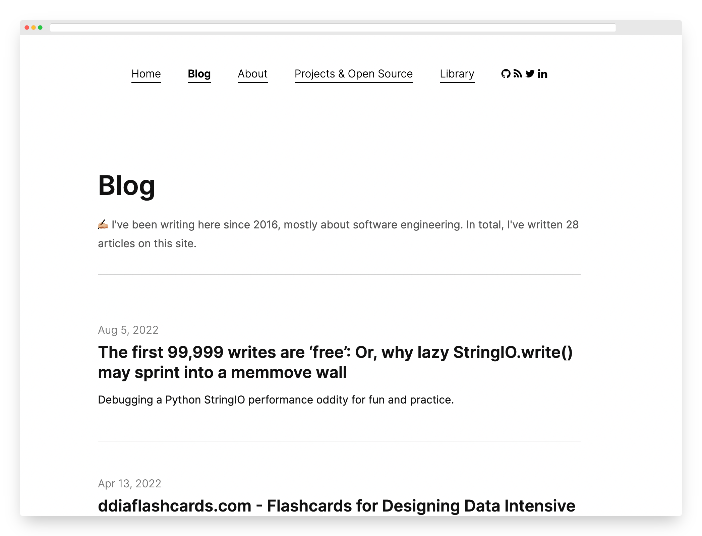

# akisonlyforu.github.io

My website, [akisonlyforu.com](https://akisonlyforu.com). A Jekyll site on GitHub Pages: a technical blog, reading lists, interview notes, and a growing set of reproducible benchmarks.

### What it looks like



### What you can find there

* [Blog posts](https://akisonlyforu.com/) — systems, databases, and infrastructure war stories, most of them backed by a benchmark you can run yourself
* [Interview prep](https://akisonlyforu.com/interview/) — data structures, system design, low-level design, and multithreading notes
* [Library and antilibrary](https://akisonlyforu.com/library/) — books read, and the [ones I haven't](https://akisonlyforu.com/anti-library/) yet
* [Bookmarks](https://akisonlyforu.com/bookmarks/) — a curated set of links worth keeping
* [Search](https://akisonlyforu.com/search/) — client-side search across every post
* [About me](https://akisonlyforu.com/about/)

### Benchmarks

Most of the technical posts are measured, not asserted. The [`benchmarks/`](benchmarks/) directory holds the harness behind each one: a digest-pinned Docker setup, a runnable script, and the raw result CSVs. Pick a directory, read its `README.md`, and reproduce the numbers on your own machine. They are laptop measurements meant to show a mechanism, not capacity planning for your service.

### Running locally

```bash
bundle install
bundle exec jekyll serve
```

The site regenerates on save at `http://localhost:4000`. GitHub Pages builds and deploys `master` automatically.
