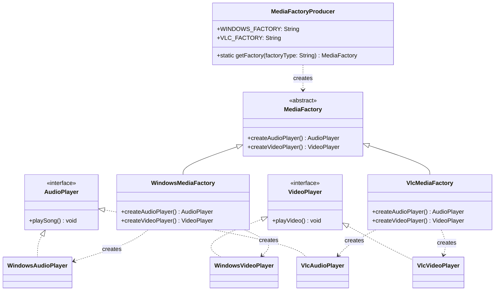

Picture pairing a VLC audio player with a Windows video player because two separate factory calls got made in two different places and nobody enforced they came from the same platform. Individually each call is correct, together they're a mismatched pair that behaves badly in ways that are annoying to trace back to "these two objects were never supposed to be used together." Abstract Factory is what stops that pairing from being possible in the first place.

## The problem

Sometimes creating one object isn't the problem, creating a consistent family of objects is. If you pick "Windows" as your platform, every related object you construct after that, audio player, video player, whatever else belongs to that family, needs to actually be the Windows variant. Two separate Factory Method calls can't guarantee that, there's nothing stopping you from calling one factory for audio and a different one for video.

## How it's built

There are two abstract products here, AudioPlayer (playSong()) and VideoPlayer (playVideo()), each with a Windows implementation and a VLC implementation, WindowsAudioPlayer/WindowsVideoPlayer and VlcAudioPlayer/VlcVideoPlayer.

The abstract class MediaFactory declares two creation methods, createAudioPlayer() and createVideoPlayer(), and doesn't implement either. WindowsMediaFactory extends it and implements both to return the Windows pair, VlcMediaFactory does the same for the VLC pair. That's the actual guarantee the pattern buys you: once you're holding a WindowsMediaFactory, every product it hands you is a Windows product, there is no code path where WindowsMediaFactory.createAudioPlayer() returns anything VLC-flavored.

MediaFactoryProducer.getFactory(String factoryType) sits one level above that, it's a factory that returns a factory, same normalize-then-switch shape as MediaPlayerFactory, same null and unknown-type guards throwing IllegalArgumentException. That's the layer client code actually talks to, pick a platform once, get back a MediaFactory, pull every related product through that one object.

## When to reach for it

Reach for it when the products genuinely need to travel together, cross-platform UI toolkits (buttons and checkboxes that all need to be the same theme), driver families, anything where picking "provider A" for one piece of the family and "provider B" for another would be a bug, not a feature. If your factory only ever creates one kind of product, you don't need this, plain Factory Method covers it.

## The takeaway

Abstract Factory buys you a guarantee that Factory Method alone can't, that everything created through one factory instance belongs to the same family. If nothing in your system actually requires that consistency, you're paying extra structure for nothing.

Read the full source on [GitHub](https://github.com/akisonlyforu/design-patterns/tree/master/src/creational/abstract_factory).

[← Back to Creational Patterns](/interview/low-level-design/design-patterns/creational)
