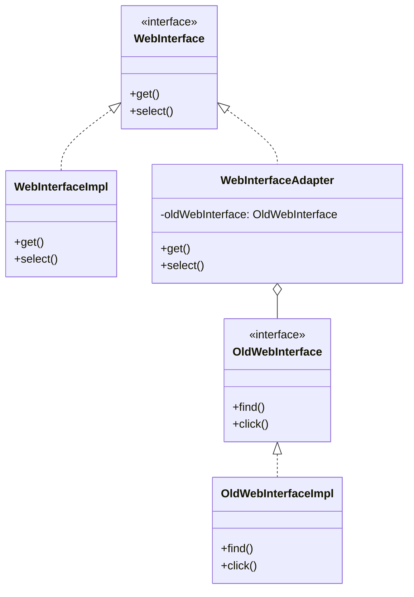

If you've ever had to wire a legacy service into a codebase where none of the method names line up with what the new caller expects, this is for you. I've run into this more than once: some old internal library nobody wants to touch, exposing methods like `find()` and `click()`, and a new consumer that only knows how to call `get()` and `select()`. Nobody's rewriting the legacy side. So something has to sit in between.

## The problem

You have two interfaces that do conceptually the same thing but don't share a method signature, and you can't (or won't) change either one. Rewriting the legacy class risks breaking whatever already depends on it. Rewriting the new consumer defeats the point of it being new. You need a translation layer, not a rewrite.

## How it's built

The setup here is `WebInterface`, the target interface the client expects, declaring `get()` and `select()`. The legacy side is `OldWebInterface`, declaring `find()` and `click()`, implemented by `OldWebInterfaceImpl`. `WebInterfaceAdapter` implements `WebInterface` and holds a reference to an `OldWebInterface` (a field literally named `oldWebInterface`, set through the constructor). Its `get()` method doesn't do any work itself, it just calls `oldWebInterface.find()`. Its `select()` calls `oldWebInterface.click()`. That's the whole pattern: one class translating calls, nothing else.

This is the object adapter variant, composition over inheritance. The adapter holds the adaptee rather than extending it, which means it can wrap any implementation of `OldWebInterface` you hand it, not just one hardcoded subclass. The class adapter variant (extend the adaptee directly) exists too, but you give up the ability to swap implementations at runtime, and Java's single inheritance makes it a worse fit anyway since your adapter would burn its one shot at extending something.

## When to reach for it

- You're integrating a third-party library or legacy service whose method names or call shape don't match what your code expects.
- You want the option to swap which legacy implementation gets wrapped, without touching the caller.
- You want the translation logic isolated in one place instead of scattered across every call site that talks to the old interface.

## The takeaway

The adapter doesn't fix the old interface, it just hides the mismatch from everyone downstream. If you find yourself writing more than a thin pass-through in the adapter, you've probably drifted into doing real work there, and that work belongs somewhere else.

[← Back to Structural Patterns](/interview/low-level-design/design-patterns/structural)
