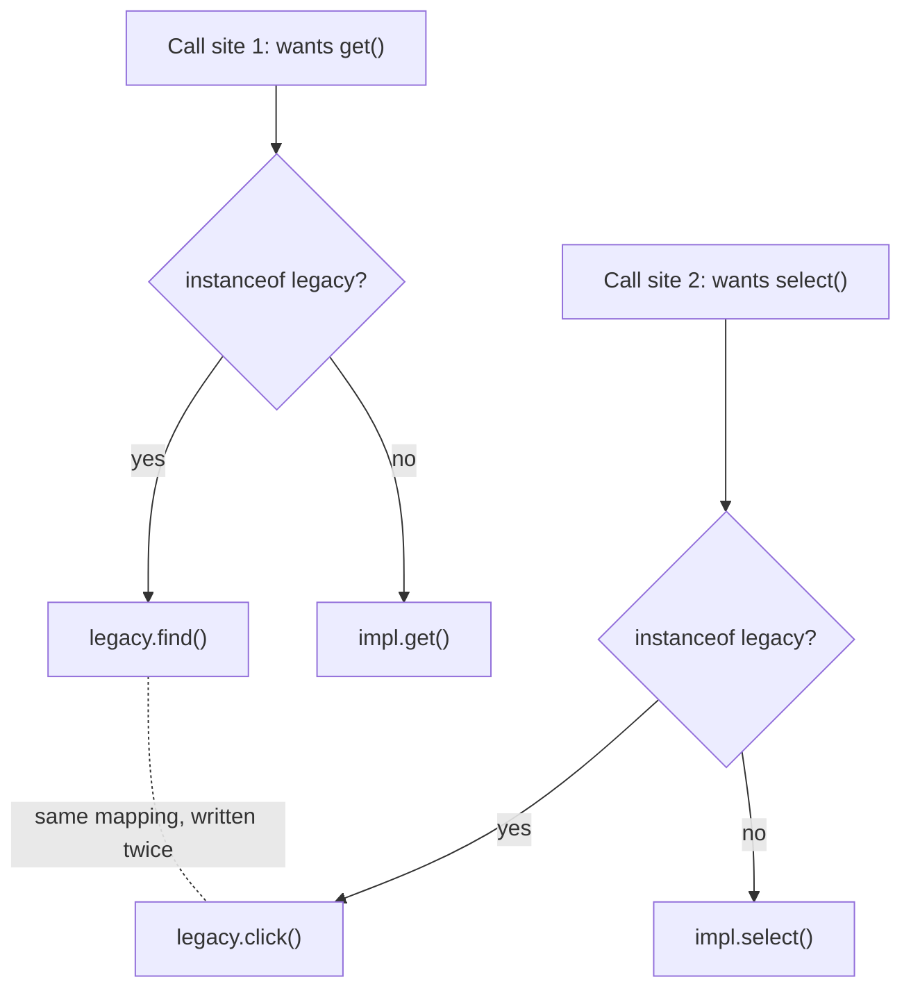
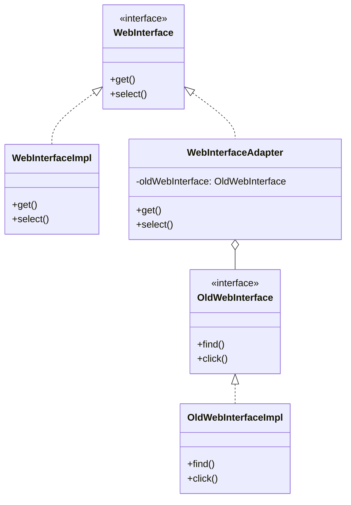

If you've ever had to wire a legacy service into a codebase where none of the method names line up with what the new caller expects, this is for you. I've run into this more than once: some old internal library nobody wants to touch, exposing methods like `find()` and `click()`, and a new consumer that only knows how to call `get()` and `select()`. Nobody's rewriting the legacy side. So something has to sit in between.

## The problem

You have two interfaces that do conceptually the same thing but don't share a method signature, and you can't (or won't) change either one. Rewriting the legacy class risks breaking whatever already depends on it. Rewriting the new consumer defeats the point of it being new. You need a translation layer, not a rewrite.

## Without the pattern

Without a translation layer the mismatch doesn't disappear, it just gets pushed onto every caller. Say client code is written against `get()` and `select()`, and now it needs to talk to something that only exposes `find()` and `click()`. The easy-looking fix is an `instanceof` check right at the call site: if this is the legacy object, call `find()` instead of `get()`. That's fine once. The second call site that also needs the legacy object writes the same branch again, because nothing forces it to share logic with the first one, and now the find()-means-get() mapping lives in two places that will quietly drift the moment someone updates one and forgets the other.

The other route is worse: reach into the legacy class itself and bolt `get()` and `select()` methods onto it that just forward to `find()` and `click()`. That works right up until you remember the legacy class is legacy for a reason, maybe it's vendored, maybe it's owned by another team, maybe you genuinely don't have write access to that repository. You've patched your one caller and left a landmine in a class you don't own.

Two call sites, same translation logic duplicated between them, and a third call site is just a third copy waiting to happen.

## With the pattern

The setup here is `WebInterface`, the target interface the client expects, declaring `get()` and `select()`. The legacy side is `OldWebInterface`, declaring `find()` and `click()`, implemented by `OldWebInterfaceImpl`. `WebInterfaceAdapter` implements `WebInterface` and holds a reference to an `OldWebInterface` (a field literally named `oldWebInterface`, set through the constructor). Its `get()` method doesn't do any work itself, it just calls `oldWebInterface.find()`. Its `select()` calls `oldWebInterface.click()`. That's the whole pattern: one class translating calls, nothing else.

This is the object adapter variant, composition over inheritance. The adapter holds the adaptee rather than extending it, which means it can wrap any implementation of `OldWebInterface` you hand it, not just one hardcoded subclass. The class adapter variant (extend the adaptee directly) exists too, but you give up the ability to swap implementations at runtime, and Java's single inheritance makes it a worse fit anyway since your adapter would burn its one shot at extending something.

## What it costs you

`WebInterfaceAdapter` is a fourth class in a pattern that started with two, and every additional adaptee you need to bridge costs you another one of these, that's nothing when you've got one legacy implementation, it adds up when you're wrapping five different vendors. Every call also picks up an extra hop: the client calls `adapter.get()`, the adapter calls `oldWebInterface.find()`, that's a stack frame and a virtual dispatch that wasn't there when the client called the old interface directly, usually not worth measuring but not free either. The sharper cost is semantic, not structural: `get()` and `find()` can line up perfectly on signature and still mean different things underneath. If `find()` throws on a missing element and the caller's `get()` contract promises null on a miss, the adapter either has to catch that exception and translate it (real logic, not a thin pass-through anymore) or it lets the exception leak through and the caller eats a contract violation it never agreed to. An adapter can make two interfaces look alike; it can't make two implementations behave alike, and the thinner you keep the adapter, the easier it is to forget that gap is still sitting there.

## When to reach for it

- You're integrating a third-party library or legacy service whose method names or call shape don't match what your code expects.
- You want the option to swap which legacy implementation gets wrapped, without touching the caller.
- You want the translation logic isolated in one place instead of scattered across every call site that talks to the old interface.

## The takeaway

The adapter doesn't fix the old interface, it just hides the mismatch from everyone downstream. If you find yourself writing more than a thin pass-through in the adapter, you've probably drifted into doing real work there, and that work belongs somewhere else.

Read the full source on [GitHub](https://github.com/akisonlyforu/design-patterns/tree/master/src/structural/adapter).

[← Back to Structural Patterns](/interview/low-level-design/design-patterns/structural)
