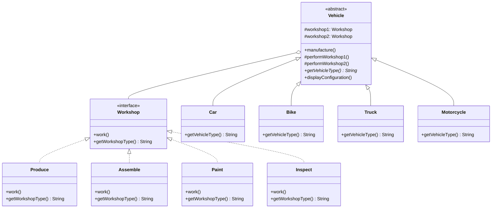

If you've ever started sketching out a class hierarchy and realized halfway through that you're about to multiply two unrelated things together, this is for you. The vehicle workshop example here makes it concrete: four vehicle types, four workshop operations, and if you inherit your way through it you end up writing `CarProduce`, `CarAssemble`, `BikeProduce`, `BikeAssemble`, and so on until you've written sixteen classes for what's really two independent lists of four things each.

## The problem

You've got two dimensions of variation that both need to grow independently. Every time inheritance is the tool you reach for in this situation, you get a class per combination, and every new vehicle type or every new workshop operation multiplies the class count instead of adding to it.

## How it's built

`Workshop` is the implementor interface: `work()` and `getWorkshopType()`. `Produce`, `Assemble`, `Paint`, and `Inspect` are the concrete implementors, each just printing what it does and naming itself.

`Vehicle` is the abstraction, an abstract class holding two `Workshop` references as protected fields, `workshop1` and `workshop2`, set through the constructor. Its `manufacture()` method is a small template method: print a start message, call `performWorkshop1()`, call `performWorkshop2()`, print a completion message. Those two `performWorkshopN()` methods just delegate to `workshop1.work()` and `workshop2.work()`. `Vehicle` also declares `getVehicleType()` as abstract, so `Car`, `Bike`, `Truck`, and `Motorcycle` only need to implement that one method, they inherit everything else.

The key decision is that `Vehicle` holds `Workshop` by composition, not by extending some `CarWorkshop` base. Any vehicle can be constructed with any pair of workshops, `new Car(produce, assemble)` and `new Car(paint, inspect)` are both valid without adding a single class. The vehicle hierarchy and the workshop hierarchy know nothing about each other beyond the interface, so you can extend either one without touching the other. Add a `Bus` vehicle, it works with all four existing workshops immediately. Add a `Repair` workshop, all four existing vehicles can use it immediately.

## When to reach for it

- You have two hierarchies that both want to grow, and inheriting through both at once multiplies your class count.
- You want to pick or swap the implementation side at runtime, not bake it in at compile time.
- You're designing this upfront, this isn't a retrofit pattern, that's Adapter's job.
- The implementation side is a set of interchangeable single things, not a matched *family* of objects. If it's a family (all-Motif widgets, all-Mac widgets that must stay consistent), that's Abstract Factory's job instead, the two get compared in [Designing a Document Editor](/interview/low-level-design/problems/document-editor).

## The takeaway

Bridge is what you reach for before the class explosion happens, not after. If you're already staring at a naming scheme like `CarProduce` and `BikeAssemble`, that's the signal you needed this two designs ago.

Read the full source on [GitHub](https://github.com/akisonlyforu/design-patterns/tree/master/src/structural/bridge).

[← Back to Structural Patterns](/interview/low-level-design/design-patterns/structural)
