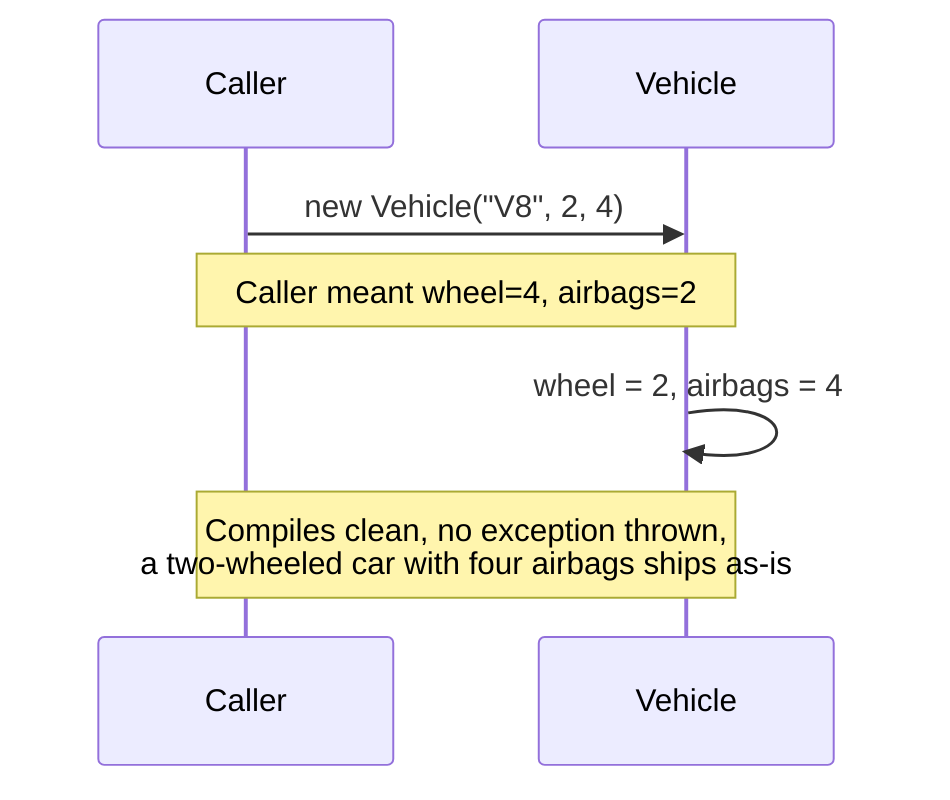
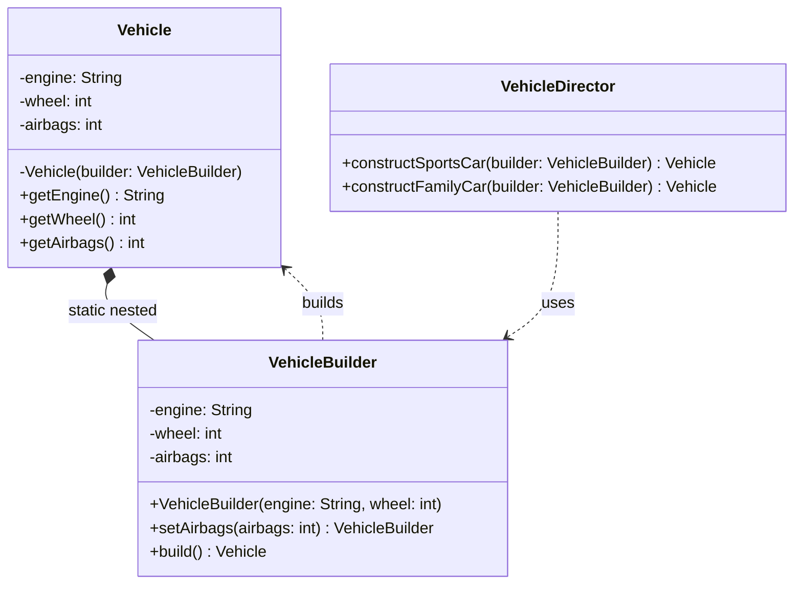

I've written the constructor with six optional parameters, most of them ints defaulting to zero, and watched a caller pass them in the wrong order because two of them were both ints and the IDE's parameter hints weren't enough to save them. Builder is the fix for that specific kind of bug.

## The problem

Some objects have a mix of required and optional fields, and neither telescoping constructors (one overload per combination of optional params) nor a plain no-args constructor plus setters (which gives up immutability and lets the object exist half-configured) is a good answer. You want required fields enforced at compile time, optional fields easy to skip, and an object that can't be mutated once it exists.

## Without the pattern

The naive version is a single constructor that takes every field, required and optional, as positional arguments: Vehicle(String engine, int wheel, int airbags). It compiles, it works, and it's fine right up until wheel and airbags are both plain ints and a caller transposes them. new Vehicle("V8", 2, 4) type-checks perfectly, the compiler has no idea you meant 4 wheels and 2 airbags, it just sees three arguments matching three parameters in order. You get a car with two wheels and four airbags, and nothing about the build tells you that's wrong.

Add a couple more optional fields, and the usual next move is telescoping constructor overloads, Vehicle(engine, wheel), Vehicle(engine, wheel, airbags), Vehicle(engine, wheel, airbags, color), each one covering a different combination of optionals. That doesn't fix the ordering problem, it just multiplies the number of places you can get the order wrong, and half the overloads exist only to let you skip parameters you don't care about.

## With the pattern

Vehicle has two required fields, engine and wheel, and one optional field, airbags. Its constructor is private and takes a VehicleBuilder, not raw values, so the only way to get a Vehicle is through the builder.

VehicleBuilder is a static nested class inside Vehicle. Its own constructor, VehicleBuilder(String engine, int wheel), takes exactly the required fields, there's no way to build a VehicleBuilder without them. setAirbags(int airbags) is the optional field's setter, and it returns this, that's what gives you the fluent chain, new VehicleBuilder("V8", 4).setAirbags(6).build(). build() hands the builder instance to Vehicle's private constructor and gets back an immutable Vehicle, no setters on Vehicle itself, once it's built it's built.

VehicleDirector is the optional layer on top, it exists for configurations you build often enough to name. constructSportsCar(builder) calls setAirbags(2) and build(), constructFamilyCar(builder) calls setAirbags(8) and build(). The director doesn't know anything about engine or wheel, those are already locked in by the time a builder gets passed to it, it only orchestrates the optional part. You don't need a director to use the builder, it's a convenience for repeatable recipes, not a required piece of the pattern.

## What it costs you

You've now got a whole second class, VehicleBuilder, that exists purely to hold the same three fields Vehicle already has, plus a setter and a build() method to maintain in lockstep with whatever Vehicle's constructor expects. Construction is two steps instead of one, build the builder with its required fields, chain the optional setters, then call build() to actually get a Vehicle, versus a single new Vehicle(engine, wheel, airbags) call. For a class with exactly one optional field, that's real ceremony bought against a fairly small ordering mistake. If Vehicle stays at three fields forever, a plain constructor with a comment reminding callers which int is which would probably have been enough; the builder starts paying for itself once the field count or the optional-combination count grows past what you'd want to track in your head.

## When to reach for it

Any object with more than a couple of optional fields, or where the required/optional split actually matters for correctness. Pizza orders, ride requests, search queries, anything where you'd otherwise be writing three or four constructor overloads to cover the common combinations. Skip it for small objects, a class with two required fields and nothing optional doesn't need this ceremony, a normal constructor is fine.

## The takeaway

The private constructor plus static nested builder is what actually enforces "required fields at compile time, optional fields whenever you want them." The director is a bonus for naming your common configurations, not the core of the pattern.

Read the full source on [GitHub](https://github.com/akisonlyforu/design-patterns/tree/master/src/creational/builder).

[← Back to Creational Patterns](/interview/low-level-design/design-patterns/creational)
