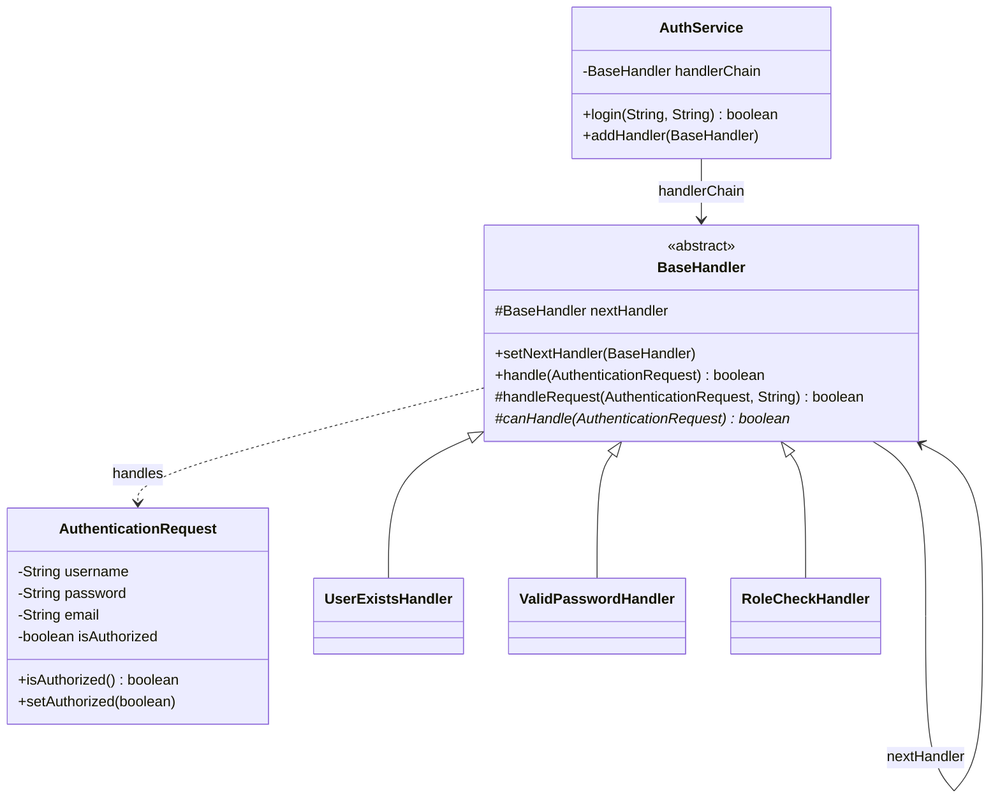

I once watched a login flow fail for a customer because one check in a five-step validation pipeline swallowed a bad case and just returned false, no explanation attached. Nobody upstream could tell which link in the chain had actually killed the request. That's the shape of almost every Chain of Responsibility bug: something in the middle ate it, and the chain itself doesn't say who.

## The problem

You've got a request that needs to pass through a sequence of checks, and you don't want the caller writing an if/else ladder for each one, and you don't want any single checker to know about the others. `AuthService.login()` shouldn't need to know that user-exists comes before password comes before role-check, it should just hand the request to the first link and get back a yes or no.

## How it's built

`AuthenticationRequest` carries username, password, email, and an `isAuthorized` flag that gets mutated as it travels. `BaseHandler` is the abstract base: a protected `nextHandler` field, `setNextHandler()`, an abstract `handle()`, and a shared protected `handleRequest(request, handlerName)` that does the actual work, call `canHandle()`, stop if it succeeds, forward to `nextHandler.handle()` if it doesn't. Every concrete handler's `handle()` is really a one-liner that calls `handleRequest()`, the only thing each subclass supplies is `canHandle()`. `UserExistsHandler` checks against a hardcoded list of valid usernames, `ValidPasswordHandler` checks length and looks up an expected password, `RoleCheckHandler` sets `request.setAuthorized(true)` on success, that's a handler mutating shared state as it passes through, which is exactly what this pattern lets you do since every handler receives the same request object. `AuthService.setupHandlerChain()` wires `userExistsHandler -> validPasswordHandler -> roleCheckHandler` with `setNextHandler()`, and `login()` just calls `handlerChain.handle(request)`. `addHandler()` walks to the tail and appends, so the whole chain composition happens at runtime, nothing hardcodes three handlers anywhere except the initial setup.

## When to reach for it

Multi-step validation, approval workflows, middleware pipelines, anything where a request needs to try handler after handler until one of them takes it. One rule of thumb worth keeping: only reach for an actual linked chain when each handler consumes or escalates the request, like ATM cash denominations or a multi-level approval. If your "chain" is really just a flat list of independent rules being evaluated, a rule list run by an engine is simpler and you don't need the linked structure at all.

## The takeaway

Chain of Responsibility decouples the sender from whichever handler ends up processing the request, but the cost is that the request no longer tells you, without logging, which handler actually stopped it. Log the handler name at every link, or you'll be grepping through several classes to find where a request quietly died.

[← Back to Behavioral Patterns](/interview/low-level-design/design-patterns/behavioral)
