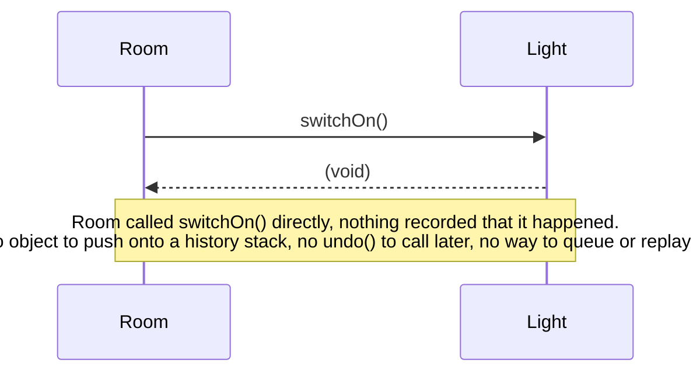
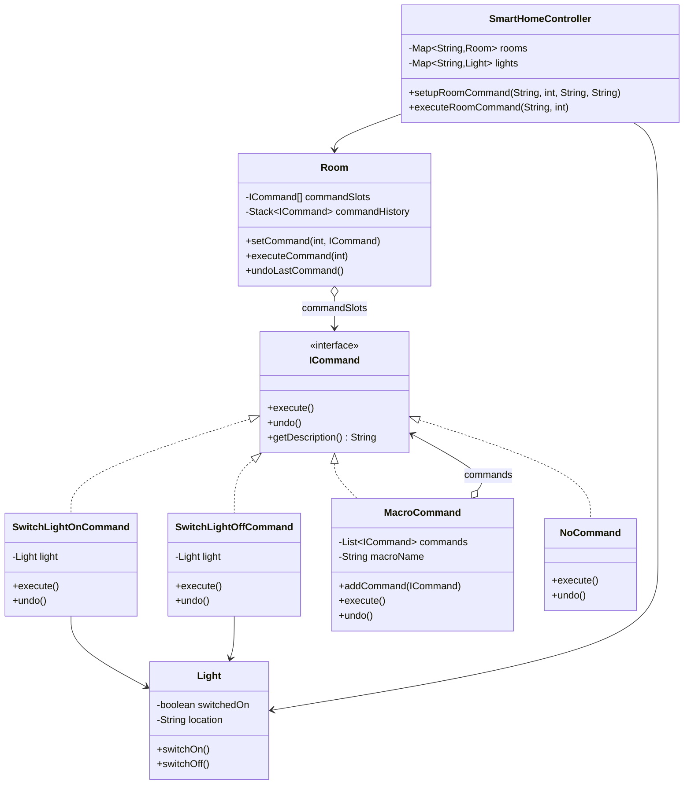

The first time I wrote a "remote control" style class without an undo stack, I ended up bolting a redo-state hack directly onto the invoker, because button presses were wired straight to receiver method calls with nothing in between. Command exists so you never have to retrofit that.

## The problem

`Room` (the invoker) needs to trigger operations on `Light` and `Fan` objects without hardcoding which device or which operation lives in which slot, and it needs undo support without every receiver reimplementing its own undo logic.

## Without the pattern

The obvious thing is `Room` just holding a `Light` reference and calling `light.switchOn()` or `light.switchOff()` directly when a button gets pressed, no `ICommand` sitting between them. That works fine right up until you want the button press to do anything other than execute immediately and be forgotten: log what happened, undo it, queue it for later, or fold it into a macro alongside three other button presses. There's no object anywhere holding "the switchOn that already ran", so the moment `light.switchOn()` returns, that fact is gone, `Room` never captured anything more durable than a method call sitting briefly on the stack.

Press the same button again and `Room` just calls `switchOn()` again, there's no history stack to check because there was never anything history-shaped to push onto one. Undo isn't hard here, it's simply absent: the only way to fake it is hardcoding `light.switchOff()` as "whatever the last button did, but backwards", which only works if `Room` also tracks, out of band, which button fired last and what its inverse happens to be. That bookkeeping is exactly what `ICommand` exists to take off your hands.

## With the pattern

`ICommand` is the contract: `execute()`, `undo()`, `getDescription()`. `Light` is the receiver, holding `switchedOn` and `location`, with the real `switchOn()`/`switchOff()` logic. `SwitchLightOnCommand` and `SwitchLightOffCommand` each wrap a single `Light` reference and one receiver call, `undo()` is just the inverse call. `MacroCommand` holds a `List<ICommand>` and a `macroName`, `execute()` walks the list forward, `undo()` walks it backward, that ordering detail matters, undoing a macro correctly means reversing the sequence, not repeating it. `NoCommand` is the Null Object counterpart, used to pre-fill `Room`'s `commandSlots` array so `executeCommand()` never has to null-check an empty slot. `Room` is the invoker: a fixed-size `ICommand[]` for slots, a `Stack<ICommand> commandHistory` pushed to on every `executeCommand()`, and `undoLastCommand()` pops and calls `undo()`. `SmartHomeController` sits a level up, mapping room and light names to `Room`/`Light` instances and wiring commands through `setupRoomCommand()` based on a string action. Nowhere in `Room` does the code mention `Light` directly, it only ever touches `ICommand`, which is the entire point of the exercise.

## What it costs you

Every action now needs its own class, `SwitchLightOnCommand` and `SwitchLightOffCommand` are two files where a direct call would've been two lines inside `Room`, and the day `SmartHomeController` needs to turn a `Fan` on, that's a third file, for a device that only ever gets toggled from one button in one room. Pressing a button no longer means "call the receiver", it means `Room.executeCommand()` looks up a slot, calls `execute()` on whatever `ICommand` happens to be sitting there, and that command then calls the receiver, one extra hop between the button press and the light actually switching, and one more place for a wrong slot index or a stale `NoCommand` to hide. All of that gets constructed and wired up front through `setupRoomCommand()` too, even the guest-room light that gets flipped on exactly once during setup and never touched again still needs its `SwitchLightOnCommand` built and slotted in before anything happens, an object with a lifecycle for an action that only ever fires once, in one place.

## When to reach for it

Undo/redo, macro recording, queued or scheduled execution, or decoupling an invoker from a receiver it has no business knowing about directly.

## The takeaway

Command's cost is one extra object per operation, and if you want undo, whatever state that operation needs to reverse itself. If you don't need queuing, logging, or undo, a direct method call is fine, don't wrap it in `ICommand` just to say you used the pattern.

Read the full source on [GitHub](https://github.com/akisonlyforu/design-patterns/tree/master/src/behavioral/command).

[← Back to Behavioral Patterns](/interview/low-level-design/design-patterns/behavioral)
