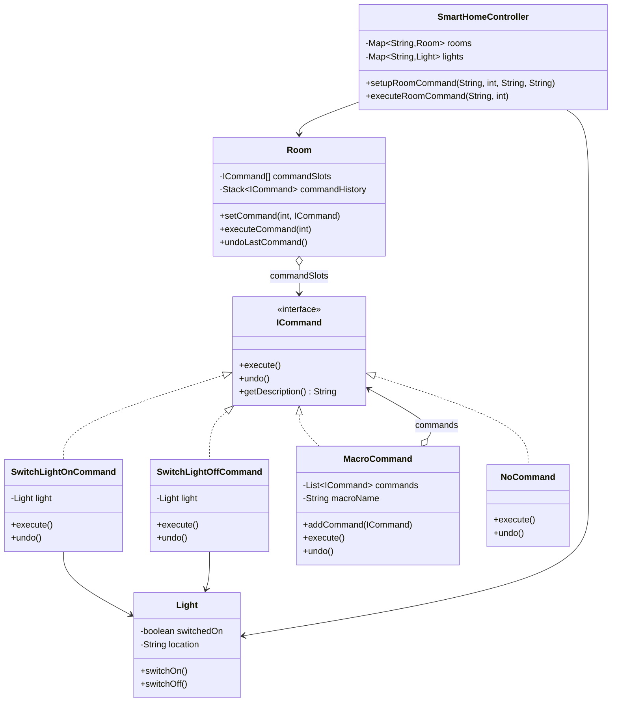

The first time I wrote a "remote control" style class without an undo stack, I ended up bolting a redo-state hack directly onto the invoker, because button presses were wired straight to receiver method calls with nothing in between. Command exists so you never have to retrofit that.

## The problem

`Room` (the invoker) needs to trigger operations on `Light` and `Fan` objects without hardcoding which device or which operation lives in which slot, and it needs undo support without every receiver reimplementing its own undo logic.

## How it's built

`ICommand` is the contract: `execute()`, `undo()`, `getDescription()`. `Light` is the receiver, holding `switchedOn` and `location`, with the real `switchOn()`/`switchOff()` logic. `SwitchLightOnCommand` and `SwitchLightOffCommand` each wrap a single `Light` reference and one receiver call, `undo()` is just the inverse call. `MacroCommand` holds a `List<ICommand>` and a `macroName`, `execute()` walks the list forward, `undo()` walks it backward, that ordering detail matters, undoing a macro correctly means reversing the sequence, not repeating it. `NoCommand` is the Null Object counterpart, used to pre-fill `Room`'s `commandSlots` array so `executeCommand()` never has to null-check an empty slot. `Room` is the invoker: a fixed-size `ICommand[]` for slots, a `Stack<ICommand> commandHistory` pushed to on every `executeCommand()`, and `undoLastCommand()` pops and calls `undo()`. `SmartHomeController` sits a level up, mapping room and light names to `Room`/`Light` instances and wiring commands through `setupRoomCommand()` based on a string action. Nowhere in `Room` does the code mention `Light` directly, it only ever touches `ICommand`, which is the entire point of the exercise.

## When to reach for it

Undo/redo, macro recording, queued or scheduled execution, or decoupling an invoker from a receiver it has no business knowing about directly.

## The takeaway

Command's cost is one extra object per operation, and if you want undo, whatever state that operation needs to reverse itself. If you don't need queuing, logging, or undo, a direct method call is fine, don't wrap it in `ICommand` just to say you used the pattern.

[← Back to Behavioral Patterns](/interview/low-level-design/design-patterns/behavioral)
