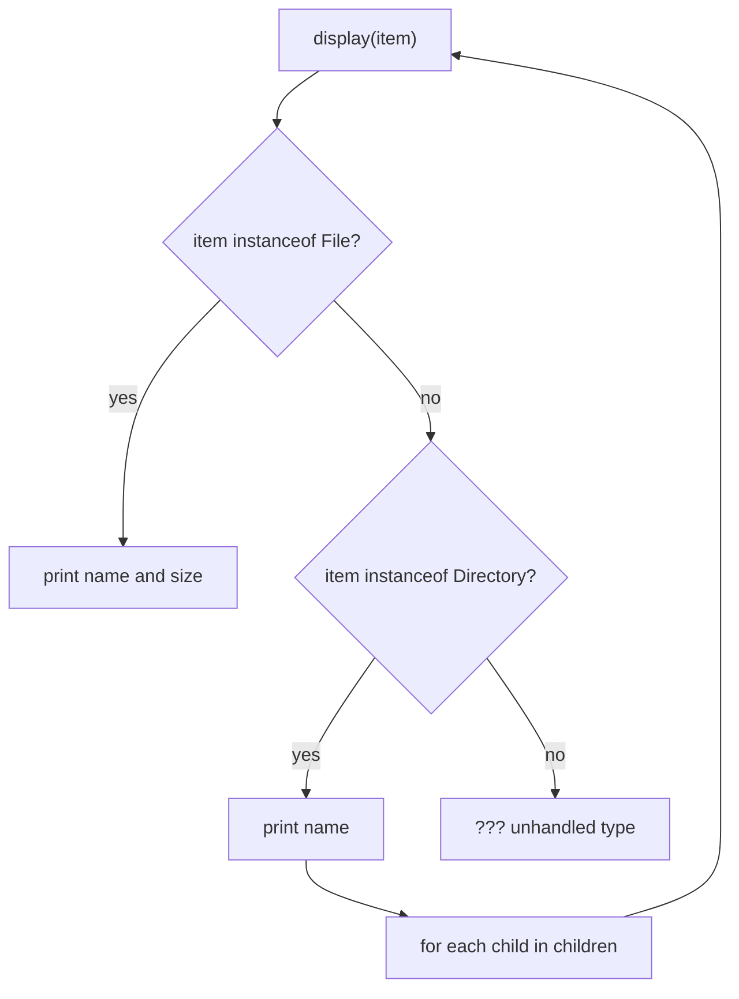
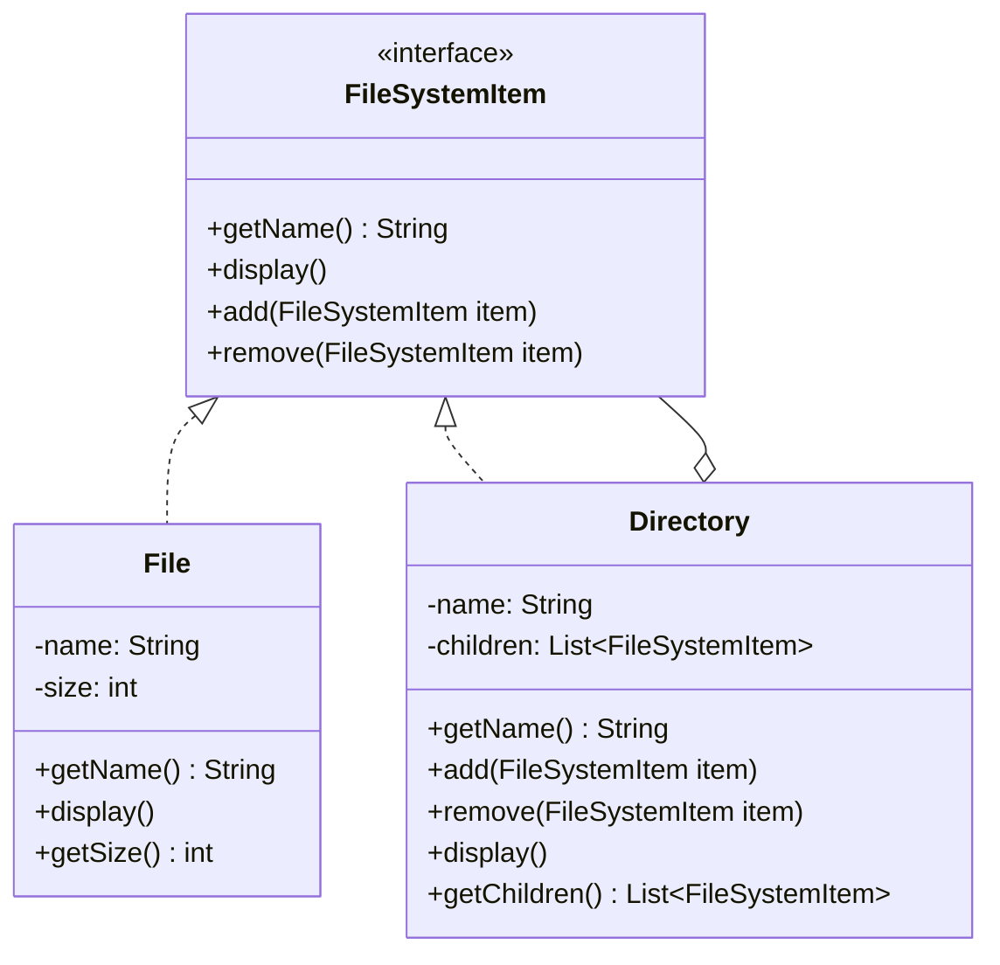

If you've ever written a `display()` or `delete()` method and then had to write a second, near-identical version for the folder case because a folder isn't a file, this is for you. The file system example nails the shape of it: a `Directory` can hold `File` objects and other `Directory` objects, and whoever's calling `display()` shouldn't have to care which one they're looking at.

## The problem

You've got a tree of things, some are leaves, some are containers of other things, and you want to run the same operation over the whole tree without writing an `if (isDirectory)` check at every call site.

## Without the pattern

The obvious way to walk a filesystem tree without a shared interface is to give `File` and `Directory` no common contract at all, and let every caller sort out which one it's holding. `display(Object item)` turns into a wall of `instanceof` checks: `if (item instanceof File)`, print the name and size and stop, `else if (item instanceof Directory)`, print the name, then loop over its children and call `display()` on each one again. That second branch is where it actually gets ugly, because the recursive call has to run the same `instanceof` check on every child it touches, and it's not just `display()`. Whoever writes `getTotalSize()` next has to write their own copy of the same two-way branch, and so does whoever writes `search(name)` after that, each one re-deriving "is this a leaf or a container" from scratch.

Add a third kind of node later, a `SymLink` say, and every one of those branches needs a third arm bolted on, in every method that ever cared about the distinction. Miss one, and you fall through to whatever the `else` does, which in the diagram above is nothing at all.

## With the pattern

`FileSystemItem` is the component interface: `getName()` and `display()`, plus two default methods, `add(FileSystemItem item)` and `remove(FileSystemItem item)`, both of which just throw `UnsupportedOperationException("Cannot add to a file")` (or the remove equivalent). That default-method trick is doing real work here: `File`, the leaf, never has to implement `add()` or `remove()` at all, it inherits the "no, you can't do that" behavior for free, and it fails loudly if someone tries anyway instead of silently doing nothing.

`File` is the leaf, holding `name` and `size`, its `display()` just prints itself. `Directory` is the composite, holding `name` and a `List<FileSystemItem> children`. Its `add()` and `remove()` mutate that list directly. Its `display()` prints itself and then loops over `children`, calling `child.display()` on each one, whether that child is a `File` or another `Directory`. That's the recursion: a `Directory`'s `display()` doesn't know or care how deep the tree under it goes, it just trusts each child to display itself correctly.

## What it costs you

You've traded scattered `instanceof` checks for a fatter interface, and that trade isn't free. `FileSystemItem` declares `add()` and `remove()` because `Directory` needs them, but `File` has to answer to that contract too, even though a file can never meaningfully contain anything, there's no version of "add a child to a file" that means something. The default-method dodge, throwing `UnsupportedOperationException` from both, hides that mismatch rather than resolving it, it moves the question from compile time to runtime. `file.add(new File("nope", 0))` compiles without a warning, passes code review if nobody's tracing the call by hand, and only surfaces as a bug the first time that exact line actually executes. Anyone holding a bare `FileSystemItem` reference has no way to tell, short of a runtime check or reading the stack trace after it blows up, whether the object underneath actually supports the container operations the interface promises. It's the same "which kind of thing is this" problem the pattern was supposed to erase, just relocated from an `if` you'd catch reading the code to an exception you find out about in production.

## When to reach for it

- You have a genuine part-whole tree (files and directories, UI widgets and containers, org charts).
- The operations you're running (display, total size, search) are naturally recursive across the tree.
- You want callers to hold a single `FileSystemItem` reference and not branch on what's actually inside it.

## The takeaway

The trick worth remembering isn't the tree structure, it's the default-method dodge that lets leaves opt out of container behavior without a wall of `if` checks or empty overrides. Get that part right and the recursion mostly writes itself.

Read the full source on [GitHub](https://github.com/akisonlyforu/design-patterns/tree/master/src/structural/composite).

[← Back to Structural Patterns](/interview/low-level-design/design-patterns/structural)
