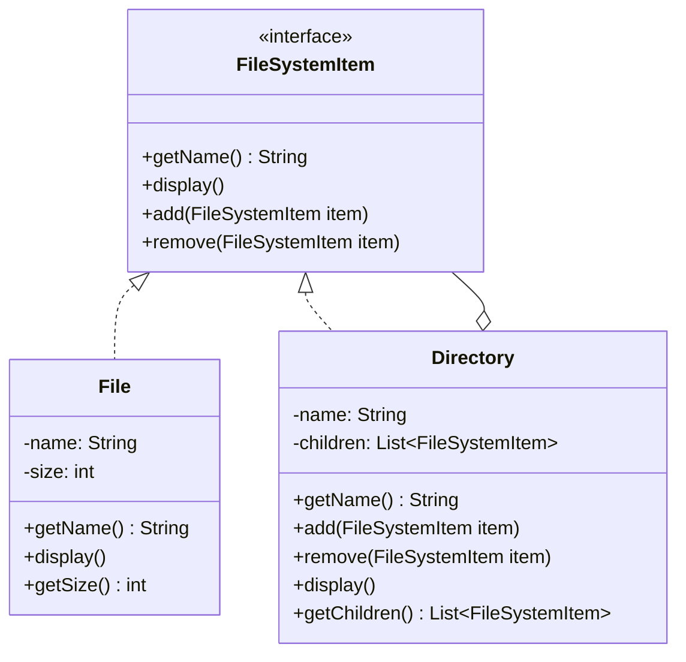

If you've ever written a `display()` or `delete()` method and then had to write a second, near-identical version for the folder case because a folder isn't a file, this is for you. The file system example nails the shape of it: a `Directory` can hold `File` objects and other `Directory` objects, and whoever's calling `display()` shouldn't have to care which one they're looking at.

## The problem

You've got a tree of things, some are leaves, some are containers of other things, and you want to run the same operation over the whole tree without writing an `if (isDirectory)` check at every call site.

## How it's built

`FileSystemItem` is the component interface: `getName()` and `display()`, plus two default methods, `add(FileSystemItem item)` and `remove(FileSystemItem item)`, both of which just throw `UnsupportedOperationException("Cannot add to a file")` (or the remove equivalent). That default-method trick is doing real work here: `File`, the leaf, never has to implement `add()` or `remove()` at all, it inherits the "no, you can't do that" behavior for free, and it fails loudly if someone tries anyway instead of silently doing nothing.

`File` is the leaf, holding `name` and `size`, its `display()` just prints itself. `Directory` is the composite, holding `name` and a `List<FileSystemItem> children`. Its `add()` and `remove()` mutate that list directly. Its `display()` prints itself and then loops over `children`, calling `child.display()` on each one, whether that child is a `File` or another `Directory`. That's the recursion: a `Directory`'s `display()` doesn't know or care how deep the tree under it goes, it just trusts each child to display itself correctly.

## When to reach for it

- You have a genuine part-whole tree (files and directories, UI widgets and containers, org charts).
- The operations you're running (display, total size, search) are naturally recursive across the tree.
- You want callers to hold a single `FileSystemItem` reference and not branch on what's actually inside it.

## The takeaway

The trick worth remembering isn't the tree structure, it's the default-method dodge that lets leaves opt out of container behavior without a wall of `if` checks or empty overrides. Get that part right and the recursion mostly writes itself.

Read the full source on [GitHub](https://github.com/akisonlyforu/design-patterns/tree/master/src/structural/composite).

[← Back to Structural Patterns](/interview/low-level-design/design-patterns/structural)
