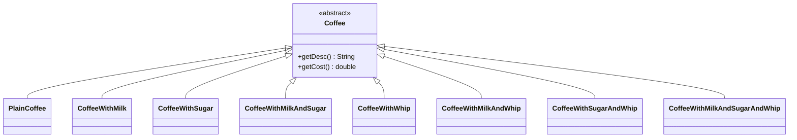
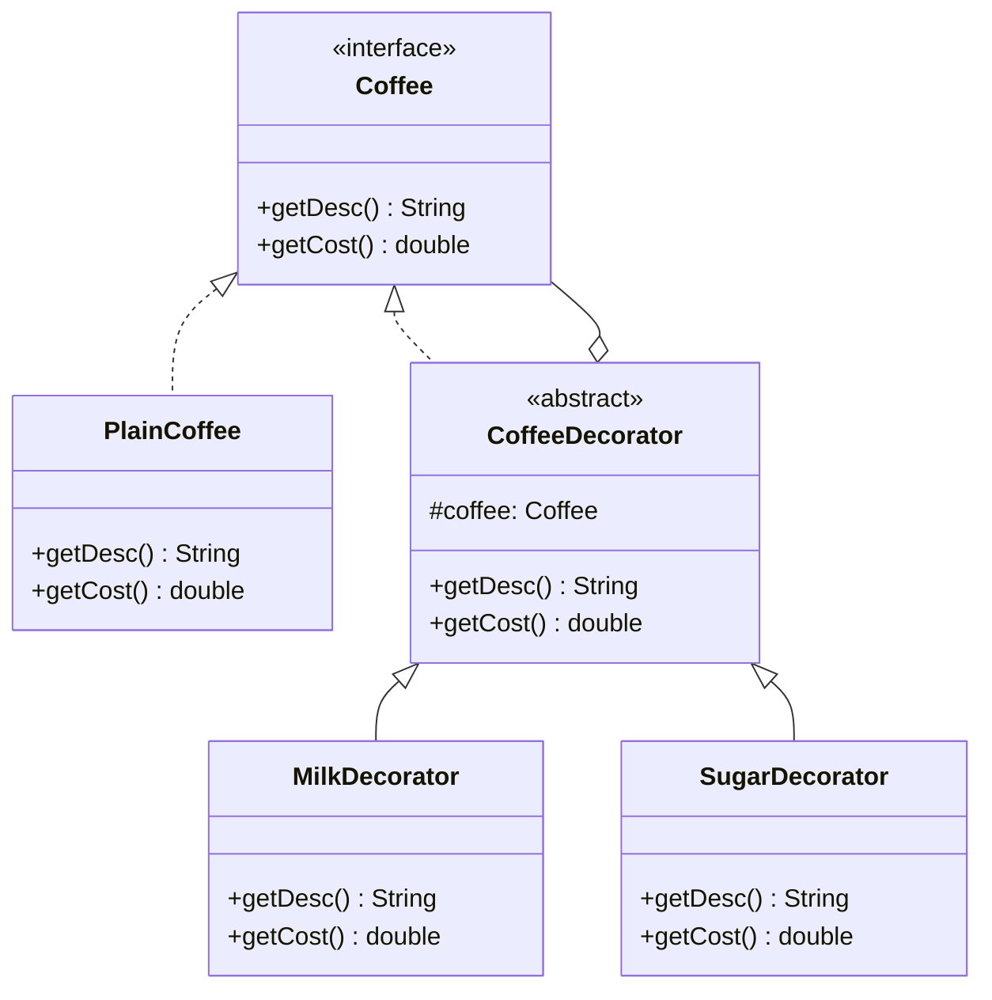

If you've ever added a fourth optional flag to a constructor and thought "I'm going to need a class for every combination of these," this is for you. The coffee example is the textbook case: milk, sugar, whipped cream, in any combination, and if you model that as subclasses you're writing `MilkSugarCoffee`, `MilkWhippedCoffee`, and it only gets worse as ingredients get added.

## The problem

You want to add optional, combinable behavior to an object without hardcoding a subclass for every combination, and you want to be able to add new behaviors later without touching the ones that already exist.

## Without the pattern

The naive move is to give every combination of ingredients its own subclass. `PlainCoffee` for the base case, `CoffeeWithMilk` and `CoffeeWithSugar` for the singles, `CoffeeWithMilkAndSugar` for the pair, and each one hardcodes its own `getDesc()` and `getCost()` by copy-pasting whatever the sibling class already wrote and gluing another string and another double onto it. That's fine at two optional ingredients, four classes, mildly annoying. Add whipped cream as a third option and you're not adding one class, you're adding four: `CoffeeWithWhip`, `CoffeeWithMilkAndWhip`, `CoffeeWithSugarAndWhip`, `CoffeeWithMilkAndSugarAndWhip`, because every existing combination now needs a whip-flavored twin. Four ingredients gets you sixteen classes for what is, underneath, the same handful of price deltas and string suffixes repeated in every permutation.

Every new ingredient means going back and multiplying out every class that already exists rather than just adding one thing, which is exactly backwards from what "open for extension" is supposed to feel like.

## With the pattern

`Coffee` is the component interface: `getDesc()` and `getCost()`. `PlainCoffee` is the concrete component, returning `"Plain Coffee"` and `2.0`. `CoffeeDecorator` is the abstract decorator, it implements `Coffee` and holds a protected `Coffee coffee` field, set through its constructor. By default it just delegates, `getDesc()` returns `coffee.getDesc()`, `getCost()` returns `coffee.getCost()`, unchanged.

`MilkDecorator` and `SugarDecorator` extend `CoffeeDecorator` and override both methods to layer on their own bit before returning. `MilkDecorator.getDesc()` returns `coffee.getDesc() + ", Milk"`, `getCost()` returns `coffee.getCost() + 0.5`. `SugarDecorator` does the same with `", Sugar"` and `0.3`. Each decorator only knows about its own addition, it calls into whatever it's wrapping for the rest.

The part that makes this pattern actually work is that decorators wrap other decorators just as easily as they wrap the base component, because everything in the chain, `PlainCoffee` included, satisfies the same `Coffee` interface. `new SugarDecorator(new MilkDecorator(new PlainCoffee()))` builds a three-deep chain where each `getCost()` call cascades down to the bottom and sums back up on the way out. Stack the same decorator twice, `new MilkDecorator(new MilkDecorator(new PlainCoffee()))`, and you get double milk, because the pattern has no idea what "milk" means, it just knows how to wrap.

## What it costs you

What you have at runtime once you build `new SugarDecorator(new MilkDecorator(new PlainCoffee()))` is three objects deep, each one holding a reference to the next, and there's no single object you can point at and say "that's the coffee," it's the whole chain or nothing. Drop a breakpoint on the outer `SugarDecorator` and all you see is a `coffee` field pointing at a `MilkDecorator`, which itself has a `coffee` field pointing at the `PlainCoffee`, you have to walk it by hand to find out what's actually in the cup, where a single `CoffeeWithMilkAndSugar` object would have just shown you its fields. The nesting order matters in ways that aren't visible from the call site either: stack `MilkDecorator` twice and you get double milk, not deduplicated milk, because nothing in the pattern knows two `MilkDecorator`s mean the same thing, and if you had a discount decorator that took a percentage off whatever `getCost()` returned from the layer underneath it, wrapping it outside the milk versus inside changes what the discount applies to, and that's not something you can tell by reading `new SugarDecorator(new MilkDecorator(new PlainCoffee()))`, you'd have to know the pricing intent going in. And because the object's feature set is assembled by whoever calls the constructors rather than declared on a named class, there's no `CoffeeWithMilkAndSugar.java` to open and read off what you're holding, you have to reconstruct it from wherever the wrapping happened, which might be three call sites and a config flag away from where you're actually looking at the object.

## When to reach for it

- The behaviors you're adding are optional and combinable, not mutually exclusive states.
- You want to add a new behavior later (whipped cream) without touching `MilkDecorator` or `SugarDecorator`.
- Subclassing every combination would multiply out of control.

## The takeaway

Each decorator should do exactly one small thing and delegate the rest. The moment a decorator starts checking what else is in the chain or reaching past its immediate `coffee` reference, you've broken the thing that made this useful in the first place.

And if the shape reminds you of [Composite](/interview/low-level-design/design-patterns/composite), good eye: a decorator *is* a single-child composite. Same trick of the wrapper sharing the wrapped thing's interface, except Composite holds many children to model a part-whole tree while a decorator holds exactly one and exists to add a layer before or after forwarding. Same structure, opposite intent, and naming that link is a cheap way to score in an interview. You can watch both fall out of the same design in [Designing a Document Editor](/interview/low-level-design/problems/document-editor).

Read the full source on [GitHub](https://github.com/akisonlyforu/design-patterns/tree/master/src/structural/decorator).

[← Back to Structural Patterns](/interview/low-level-design/design-patterns/structural)
