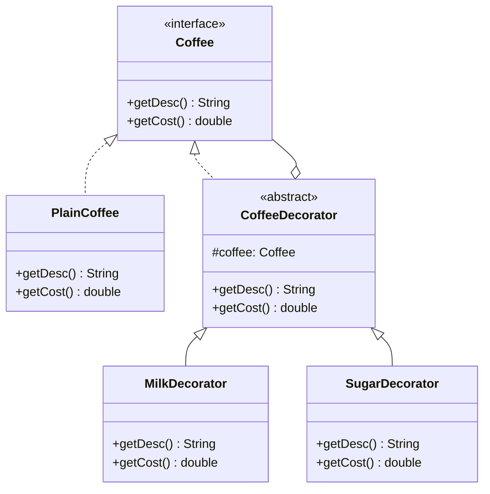

If you've ever added a fourth optional flag to a constructor and thought "I'm going to need a class for every combination of these," this is for you. The coffee example is the textbook case: milk, sugar, whipped cream, in any combination, and if you model that as subclasses you're writing `MilkSugarCoffee`, `MilkWhippedCoffee`, and it only gets worse as ingredients get added.

## The problem

You want to add optional, combinable behavior to an object without hardcoding a subclass for every combination, and you want to be able to add new behaviors later without touching the ones that already exist.

## How it's built

`Coffee` is the component interface: `getDesc()` and `getCost()`. `PlainCoffee` is the concrete component, returning `"Plain Coffee"` and `2.0`. `CoffeeDecorator` is the abstract decorator, it implements `Coffee` and holds a protected `Coffee coffee` field, set through its constructor. By default it just delegates, `getDesc()` returns `coffee.getDesc()`, `getCost()` returns `coffee.getCost()`, unchanged.

`MilkDecorator` and `SugarDecorator` extend `CoffeeDecorator` and override both methods to layer on their own bit before returning. `MilkDecorator.getDesc()` returns `coffee.getDesc() + ", Milk"`, `getCost()` returns `coffee.getCost() + 0.5`. `SugarDecorator` does the same with `", Sugar"` and `0.3`. Each decorator only knows about its own addition, it calls into whatever it's wrapping for the rest.

The part that makes this pattern actually work is that decorators wrap other decorators just as easily as they wrap the base component, because everything in the chain, `PlainCoffee` included, satisfies the same `Coffee` interface. `new SugarDecorator(new MilkDecorator(new PlainCoffee()))` builds a three-deep chain where each `getCost()` call cascades down to the bottom and sums back up on the way out. Stack the same decorator twice, `new MilkDecorator(new MilkDecorator(new PlainCoffee()))`, and you get double milk, because the pattern has no idea what "milk" means, it just knows how to wrap.

## When to reach for it

- The behaviors you're adding are optional and combinable, not mutually exclusive states.
- You want to add a new behavior later (whipped cream) without touching `MilkDecorator` or `SugarDecorator`.
- Subclassing every combination would multiply out of control.

## The takeaway

Each decorator should do exactly one small thing and delegate the rest. The moment a decorator starts checking what else is in the chain or reaching past its immediate `coffee` reference, you've broken the thing that made this useful in the first place.

And if the shape reminds you of [Composite](/interview/low-level-design/design-patterns/composite), good eye: a decorator *is* a single-child composite. Same trick of the wrapper sharing the wrapped thing's interface, except Composite holds many children to model a part-whole tree while a decorator holds exactly one and exists to add a layer before or after forwarding. Same structure, opposite intent, and naming that link is a cheap way to score in an interview. You can watch both fall out of the same design in [Designing a Document Editor](/interview/low-level-design/problems/document-editor).

Read the full source on [GitHub](https://github.com/akisonlyforu/design-patterns/tree/master/src/structural/decorator).

[← Back to Structural Patterns](/interview/low-level-design/design-patterns/structural)
