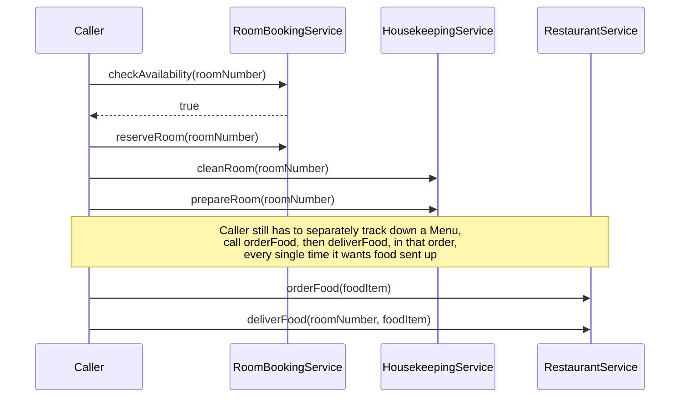
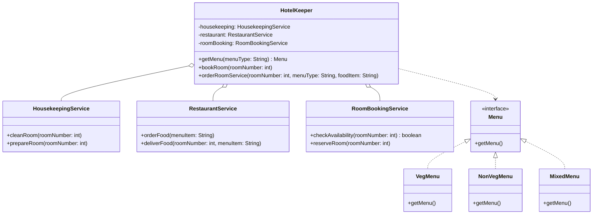

If you've ever had to call three services in a specific order just to book a hotel room, and gotten it wrong once because you forgot to check availability before reserving, this is for you. That's the exact shape of the hotel example: `RoomBookingService`, `HousekeepingService`, `RestaurantService`, each fine on its own, miserable to coordinate correctly from outside.

## The problem

A real operation touches multiple subsystems in a specific sequence, and every caller who wants to perform that operation has to know the sequence, the dependencies between the calls, and the error handling for each step. Duplicate that knowledge across enough call sites and a change to the sequence means hunting down every place that got it right (or wrong) independently.

## Without the pattern

Drop the facade and the caller is left holding all three subsystem objects directly: a `RoomBookingService`, a `HousekeepingService`, a `RestaurantService`, plus whichever `Menu` implementation it picked. Booking a room means the caller has to know, on its own, that `checkAvailability` comes before `reserveRoom`, that `reserveRoom` comes before `cleanRoom`, and that `prepareRoom` only makes sense once the room's actually been cleaned, none of which is enforced anywhere except in whatever order the caller happens to type the calls. Ordering food means picking a `Menu` implementation, calling `getMenu()`, then remembering `orderFood` has to run before `deliverFood`, and that neither one means anything until a room's been booked. Write that sequence once in a checkout controller and once in an admin rebooking tool and you've got two independent chances for someone to swap two lines and never notice, because nothing here throws if you clean a room before you've reserved it, it just quietly prepares a room nobody's checked into.

Nothing here is wrong on any individual call, `RoomBookingService` and `HousekeepingService` and `RestaurantService` all do exactly what they say. The problem is that the correct ordering and the dependency between the calls exists only in whichever caller wrote this sequence out by hand, and it has to be re-derived correctly at every call site that wants to book a room or send up food.

## With the pattern

`HotelKeeper` is the facade. Its constructor creates and holds a `HousekeepingService`, a `RestaurantService`, and a `RoomBookingService`, all owned internally, the caller never sees them.

`bookRoom(int roomNumber)` is one method that does the whole sequence: call `roomBooking.checkAvailability(roomNumber)`, and only if that returns true, call `roomBooking.reserveRoom(roomNumber)`, then `housekeeping.cleanRoom(roomNumber)`, then `housekeeping.prepareRoom(roomNumber)`. The caller gets one method call. The ordering logic and the branch on availability live in exactly one place.

`orderRoomService(int roomNumber, String menuType, String foodItem)` does the same for the food side: it calls `getMenu(menuType)`, which is itself a small facade over a `Menu` interface (`VegMenu`, `NonVegMenu`, `MixedMenu`, each just printing their own `getMenu()`), then calls `restaurant.orderFood(foodItem)` and `restaurant.deliverFood(roomNumber, foodItem)`. The caller never touches `RestaurantService` or the `Menu` implementations directly, `HotelKeeper` is the only thing that knows they exist.

## What it costs you

`HotelKeeper` now knows about every subsystem in the hotel, `RoomBookingService`, `HousekeepingService`, `RestaurantService`, all three `Menu` implementations, and that list only grows if a new subsystem shows up, payments, a concierge desk, whatever comes next. At some point it stops being a thin facade and turns into a hub that everything depends on and that itself depends on everything, which is exactly the coupling this pattern was supposed to get rid of in the first place. It also flattens control on purpose: `bookRoom` always checks availability, reserves, cleans, and prepares in that fixed order, so a caller that genuinely needs to prepare a room without re-cleaning it, say the room's already spotless, has no way to say that through `HotelKeeper`. It either bypasses the facade and talks to `HousekeepingService` directly, which puts you right back in the "Without the pattern" section, or someone bolts a new method or a flag onto `HotelKeeper` for that one case, and the facade slowly accretes a parameter for every exception anyone's ever needed. And when `bookRoom` throws or does the wrong thing, debugging means stepping through one more layer before you reach the subsystem call that actually failed, a small tax on every call in exchange for not paying it in the coordination logic.

## When to reach for it

- A real-world operation needs several subsystem calls in a fixed order, and you don't want that order re-implemented at every call site.
- You want a single, narrow surface (`bookRoom`, `orderRoomService`) that hides which subsystems exist behind it.
- The subsystems themselves are fine, the problem is purely that coordinating them from outside is error-prone.

## The takeaway

A facade doesn't replace the subsystem classes or simplify what they do, it just moves the coordination logic into one place instead of leaving it implicit in every caller's head. If two different call sites are calling your subsystem methods in a slightly different order, that's the smell that tells you a facade was missing.

Read the full source on [GitHub](https://github.com/akisonlyforu/design-patterns/tree/master/src/structural/facade).

[← Back to Structural Patterns](/interview/low-level-design/design-patterns/structural)
