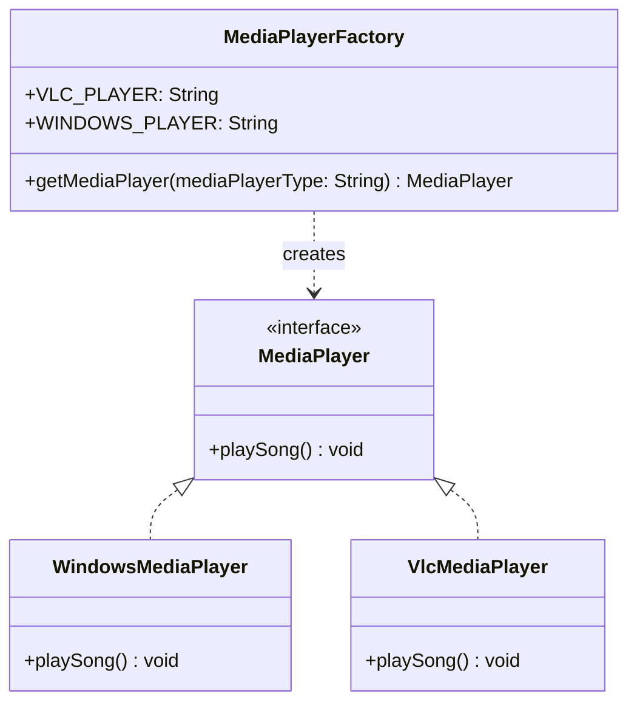

I've seen the same if/else ladder for "which media player class do I instantiate" copy-pasted into three different callers in the same codebase, one of them missing the VLC branch entirely because whoever wrote it didn't know it existed. Factory Method exists so that ladder lives in exactly one place.

## The problem

Client code shouldn't need to know the full list of concrete classes that implement an interface, and it definitely shouldn't have that decision logic duplicated everywhere a new instance is needed. When the type to construct is picked at runtime, based on a string, a config value, whatever, you want one method owning that decision.

## How it's built

MediaPlayer is the product interface, one method, playSong(). WindowsMediaPlayer and VlcMediaPlayer are the two concrete implementations, each just prints which player is doing the playing.

MediaPlayerFactory.getMediaPlayer(String mediaPlayerType) is the whole pattern. It defines VLC_PLAYER and WINDOWS_PLAYER as public static final constants so callers aren't passing around raw string literals, normalizes the input with mediaPlayerType.toUpperCase() so "vlc", "VLC", and "Vlc" all resolve the same concrete class, and switches on the normalized value to return a new instance. Null input throws IllegalArgumentException immediately rather than letting a NullPointerException happen somewhere deeper in the switch. An unrecognized type throws the same exception with a message naming what was actually passed in, instead of silently returning null, which is the failure mode I've seen bite people who copy this pattern and get lazy about the default branch.

## When to reach for it

Any time you've got multiple classes behind one interface and the choice of which one to instantiate is a runtime decision, a type token, a config flag, a piece type in a chess engine, a notification channel. If adding a new implementation means touching more than the factory's switch statement plus the new class itself, the abstraction is leaking somewhere.

## The takeaway

One method owns the "which concrete class" decision, everyone else programs against the interface. Adding a new player type means one new class and one new case label, nothing else in the codebase changes.

[← Back to Creational Patterns](/interview/low-level-design/design-patterns/creational)
