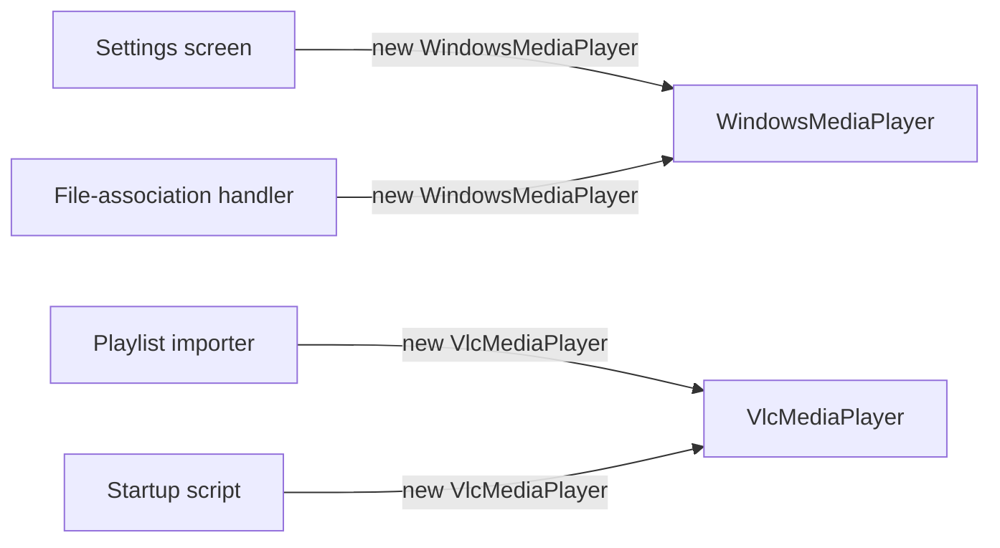
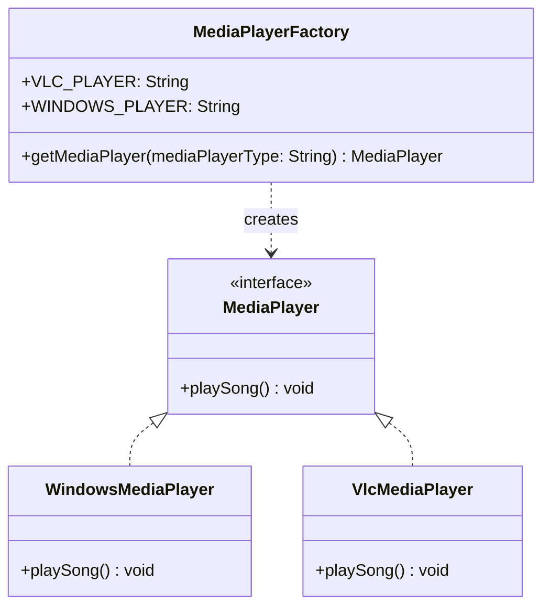

I've seen the same if/else ladder for "which media player class do I instantiate" copy-pasted into three different callers in the same codebase, one of them missing the VLC branch entirely because whoever wrote it didn't know it existed. Factory Method exists so that ladder lives in exactly one place.

## The problem

Client code shouldn't need to know the full list of concrete classes that implement an interface, and it definitely shouldn't have that decision logic duplicated everywhere a new instance is needed. When the type to construct is picked at runtime, based on a string, a config value, whatever, you want one method owning that decision.

## Without the pattern

The obvious version skips the factory entirely and just calls the constructor wherever a player is needed: `new WindowsMediaPlayer()` in the settings screen, `new VlcMediaPlayer()` in the playlist importer, another `new WindowsMediaPlayer()` in the file-association handler, each one deciding for itself which concrete class to build based on whatever local logic happens to be lying around, a config flag, a string comparison, a hardcoded default that seemed reasonable at the time.

That's fine right up until VLC support gets dropped for some new player, or the default flips from Windows to VLC. The type decision was never in one place to begin with, it's scattered across every call site that happened to write `new WindowsMediaPlayer()`, and finding all of them means grepping the codebase for the class name and hoping you didn't miss one hiding behind a helper method three files away. Each caller is coupled to a specific implementation when all it actually wanted was something that could playSong().

## With the pattern

MediaPlayer is the product interface, one method, playSong(). WindowsMediaPlayer and VlcMediaPlayer are the two concrete implementations, each just prints which player is doing the playing.

MediaPlayerFactory.getMediaPlayer(String mediaPlayerType) is the whole pattern. It defines VLC_PLAYER and WINDOWS_PLAYER as public static final constants so callers aren't passing around raw string literals, normalizes the input with mediaPlayerType.toUpperCase() so "vlc", "VLC", and "Vlc" all resolve the same concrete class, and switches on the normalized value to return a new instance. Null input throws IllegalArgumentException immediately rather than letting a NullPointerException happen somewhere deeper in the switch. An unrecognized type throws the same exception with a message naming what was actually passed in, instead of silently returning null, which is the failure mode I've seen bite people who copy this pattern and get lazy about the default branch.

Worth naming directly: what's implemented here is a Simple Factory, one static method, one switch, not the textbook GoF Factory Method. The actual GoF pattern pushes the decision into subclasses, an abstract Creator declares factoryMethod(), and each concrete Creator subclass overrides it to return its own Product, so the "which class" decision is made by picking a Creator subtype, not by a string passed into a switch. Nobody subclasses MediaPlayerFactory here, there's no Creator hierarchy at all. The two get conflated constantly, "Factory Method" gets used in interviews and blog posts (this one included, until you're reading this paragraph) to mean any method that hands back an interface instead of a concrete type. If an interviewer asks you to draw Factory Method and you draw this switch statement instead of a Creator subclass hierarchy, that's the gap they're checking for.

## What it costs you

"One new class and one new case label" undersells what adding a player type actually costs: you write the concrete class implementing MediaPlayer, and separately you edit MediaPlayerFactory.getMediaPlayer to add a case for it, and nothing enforces that those two edits stay in sync, the compiler has no idea VlcMediaPlayer exists until the switch mentions it by name. Forget the second half and the class just sits there unreachable, or worse, someone constructs it directly somewhere and now you've got a caller that bypassed the factory entirely. There's also an indirection hop baked into every call site: getMediaPlayer("VLC") hands back a MediaPlayer reference, and reading playSong() at the call site tells you nothing about which println is about to fire, that information lives in the string literal and the switch's memory of it, not in the type you're holding. A plain `new VlcMediaPlayer()` never had that problem, you could see exactly which class you had by reading the line it was constructed on.

## When to reach for it

Any time you've got multiple classes behind one interface and the choice of which one to instantiate is a runtime decision, a type token, a config flag, a piece type in a chess engine, a notification channel. If adding a new implementation means touching more than the factory's switch statement plus the new class itself, the abstraction is leaking somewhere.

## The takeaway

One method owns the "which concrete class" decision, everyone else programs against the interface. Adding a new player type means one new class and one new case label, nothing else in the codebase changes.

Read the full source on [GitHub](https://github.com/akisonlyforu/design-patterns/tree/master/src/creational/factory).

[← Back to Creational Patterns](/interview/low-level-design/design-patterns/creational)
