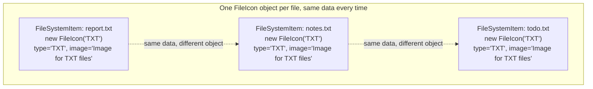
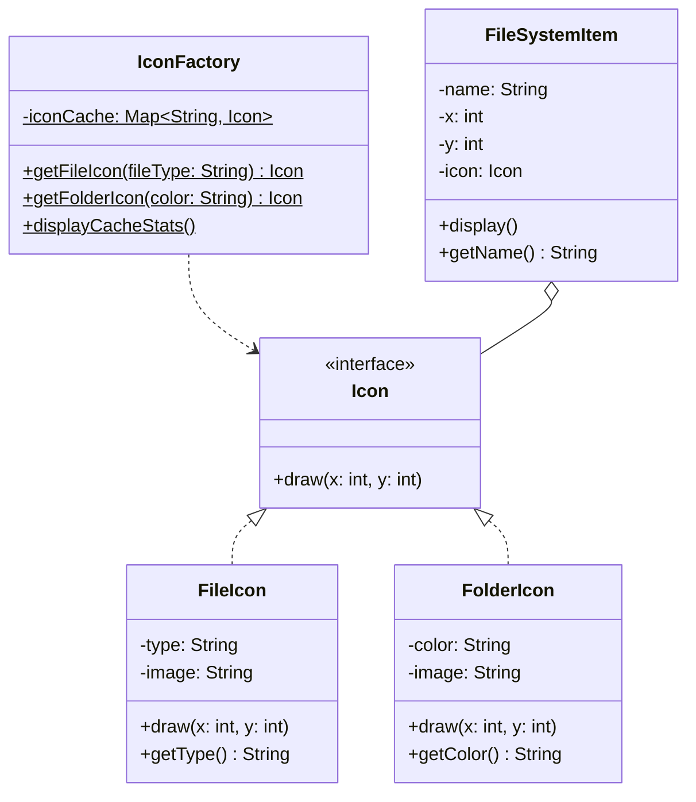

If you've ever built something that renders thousands of icons and noticed most of them are the same image just sitting at a different position, this is for you. The file explorer example is exactly that: a thousand files, but only four file types and three folder colors, so there's no reason to load the same icon image a thousand times.

## The problem

You need a large number of similar objects, and most of their state is actually identical across instances. Storing that identical state once per object is wasted memory that scales with object count instead of with the actual variety of data.

## Without the pattern

The obvious thing is to skip the factory and the cache entirely, and let each `FileSystemItem` build its own icon in its constructor: `new FileIcon(fileType)` or `new FolderIcon(color)`, right there, one per item. That compiles fine, and every icon draws correctly. The problem is what it does to the object graph once you're past a handful of files. A `FileIcon` stores `type` and builds `image` as `"Image for " + type + " files"` in its own constructor, so a thousand `.txt` files means a thousand separate `FileIcon` objects, each carrying its own independently-allocated copy of the exact same `type` string and the exact same `image` string. Same story for folders keyed on `color`. You're not storing four file-type icons and three folder-color icons anymore, you're storing one heavyweight icon per file on disk, and the "same type, same image, same everything" state gets duplicated on every single instance instead of built once.

Nothing about this is functionally wrong, it just means memory scales with file count instead of with the actual variety of icons in play, and those two numbers can be wildly different. Ten thousand files backed by four distinct images should cost you four images, not ten thousand.

## With the pattern

`Icon` is the flyweight interface: `draw(int x, int y)`. Notice `x` and `y` are parameters, not fields, that's the extrinsic state, unique per usage, passed in at call time rather than stored on the flyweight.

`FileIcon` and `FolderIcon` are the concrete flyweights. `FileIcon` stores `type` and `image` as its intrinsic state, the constructor builds `image` once as `"Image for " + type + " files"`. `FolderIcon` stores `color` and `image` the same way. Both are the same for every instance representing the same `type` or `color`, which is exactly why they're safe to share.

`IconFactory` is the flyweight factory, holding a static `Map<String, Icon> iconCache`. `getFileIcon(String fileType)` builds a key like `"FILE_" + fileType.toUpperCase()`, checks the cache, and only calls `new FileIcon(fileType)` if that key isn't already there. `getFolderIcon(String color)` does the same with a `"FOLDER_"` prefix. Every subsequent call for the same type or color returns the identical cached instance rather than building a new one, you can see that directly in the test file, `IconFactory.getFileIcon("TXT")` called three times in a row returns the same object, same hash code, every time.

`FileSystemItem` is the context: it holds `name`, `x`, `y` (the extrinsic state, unique per item) and a reference to a shared `Icon`. Its `display()` method prints the name and calls `icon.draw(x, y)`, handing the extrinsic state to the flyweight at the moment it's needed. A thousand `FileSystemItem` instances can all point at the same handful of `Icon` objects.

## What it costs you

Splitting `Icon` into intrinsic state that lives on the shared object (`type`, `image`) and extrinsic state that gets passed into `draw()` on every call (`x`, `y`) isn't free, it's a design decision you have to get right up front, and the split doesn't always fall out cleanly from how the domain wants to be modeled. `FileIcon` and `FolderIcon` only work as shared, cached objects because nothing about them ever changes after the constructor runs, if `draw()` ever needed to mutate `image` based on something item-specific, every `FileSystemItem` pointing at that same cached `FileIcon` would start stepping on every other one, one caller's change leaking into another caller's icon with no exception thrown to tell you it happened. That's the trade: the shared flyweight has to be treated as immutable for as long as it lives in `iconCache`, and anything that's even slightly per-instance has to be pulled out of the object and threaded through as a parameter instead, which is why `draw(x, y)` carries arguments a non-shared `Icon` would never need, and why every caller of `IconFactory` has to remember that what `getFileIcon("TXT")` hands back isn't theirs alone.

## When to reach for it

- You've got a large object count where most of the per-object state is actually identical across many instances.
- The identical portion is safely immutable, sharing it can't cause one caller's mutation to leak into another's.
- The unique-per-instance part (position, name, whatever) is small enough to hand in as a parameter instead of storing on the shared object.

## The takeaway

The whole pattern hinges on correctly splitting state into intrinsic and extrinsic. Get that split wrong, put something that should be per-instance into the shared flyweight, and you've built a bug where one caller's data bleeds into another's, not a memory optimization.

Read the full source on [GitHub](https://github.com/akisonlyforu/design-patterns/tree/master/src/structural/flyweight).

[← Back to Structural Patterns](/interview/low-level-design/design-patterns/structural)
