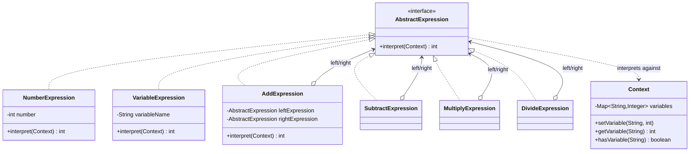

I once wrote a tiny arithmetic evaluator for a pricing config field, something like "base + surge * 1.5", and the naive version was a growing switch statement over token types. Adding a new operator meant touching that same method again, every time. Interpreter's whole pitch is: stop doing that, give every grammar rule its own class.

## The problem

You need to evaluate expressions built from a small grammar, numbers, variables, plus, minus, times, divide, and you want adding a new operator to mean adding a class, not editing an existing one.

## How it's built

`Context` wraps a `Map<String, Integer>` for variables, `setVariable()`, `getVariable()`, `hasVariable()`. `AbstractExpression` is the one-method contract, `interpret(Context)` returns an int. `NumberExpression` and `VariableExpression` are the terminal nodes, a `NumberExpression` just returns its stored int, a `VariableExpression` looks itself up in the `Context` via `getVariable()`. `AddExpression`, `SubtractExpression`, `MultiplyExpression`, `DivideExpression` are the non-terminal nodes, each holding a `leftExpression` and `rightExpression`, and `interpret()` recursively calls `interpret()` on both sides before combining them. `DivideExpression` is the only one that has to think about failure, it throws `ArithmeticException` on a zero divisor before doing the division. Composing an expression is just nesting constructors: `(x + y) * (10 - 5)` becomes `new MultiplyExpression(new AddExpression(varX, varY), new SubtractExpression(num10, num5))`. There's no parser here, the tree is built by hand, a real implementation would need a tokenizer in front of this to go from a raw string to that tree.

## When to reach for it

Small, stable grammars: config languages, rule engines, places where you evaluate expressions far more often than you change the grammar. It's a different tool from Strategy (interchangeable algorithms, no tree) and from Composite (structural part-whole, no evaluation semantics attached), Interpreter is specifically about building and walking a tree that represents a language.

## The takeaway

Don't reach for this past a handful of operators, each new grammar rule is a new class, and a deep expression tree means a deep call stack, that's a real limit, not a theoretical one. Past a certain grammar size you want a parser generator, not more expression classes.

[← Back to Behavioral Patterns](/interview/low-level-design/design-patterns/behavioral)
