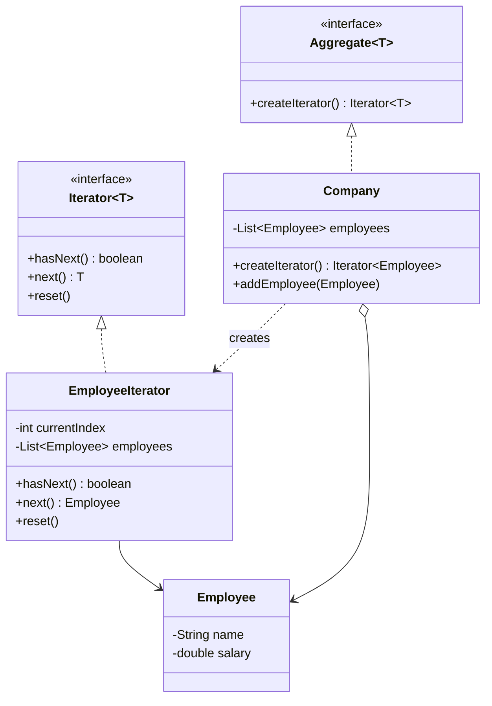

The first time I wrote a custom `Iterator` interface inside my own package, I got a compiler error that made no sense until I remembered `java.util.Iterator` exists too, and the unqualified name in my file resolved to mine instead of the JDK's. That's usually how people meet this pattern for the first time in Java, by accident, before they even realize they're using it constantly through the for-each loop.

## The problem

`Company` owns a `List<Employee>` internally, and you don't want every caller reaching in and looping over that list directly, because then `Company` can never change its internal storage without breaking callers, and you can't have two independent traversal positions over the same collection without hand-rolled index tracking.

## How it's built

`Iterator<T>` (yes, shadowing `java.util.Iterator` inside package `behavioral.iterator`) declares `hasNext()`, `next()`, `reset()`. `EmployeeIterator` implements it with a private `currentIndex` and a reference to the employee list, `hasNext()` is a bounds check, `next()` throws `NoSuchElementException` past the end, `reset()` zeroes `currentIndex` back to 0. `Aggregate<T>` is the other half, a one-method contract, `createIterator()`, that any collection-owning class implements. `Company implements Aggregate<Employee>`, and `createIterator()` just returns `new EmployeeIterator(employees)`. Because `Company` hands out a fresh `EmployeeIterator` each call, two callers doing `company.createIterator()` get independent position tracking over the same underlying list, that's the property the test file leans on directly when it advances two separate iterators side by side.

## When to reach for it

Whenever a caller needs to walk a collection without knowing, or being allowed to know, its internal representation, or when you need multiple independent traversals over the same structure at once.

## The takeaway

The pattern is mostly invisible once your language has built-in iteration protocols, Java's for-each, Python's generators, you're using Iterator constantly without ever writing the interface yourself. Write your own version, like `EmployeeIterator` here, only when the built-in one can't express what you need, resettable position, a non-standard order, something specific like that.

[← Back to Behavioral Patterns](/interview/low-level-design/design-patterns/behavioral)
