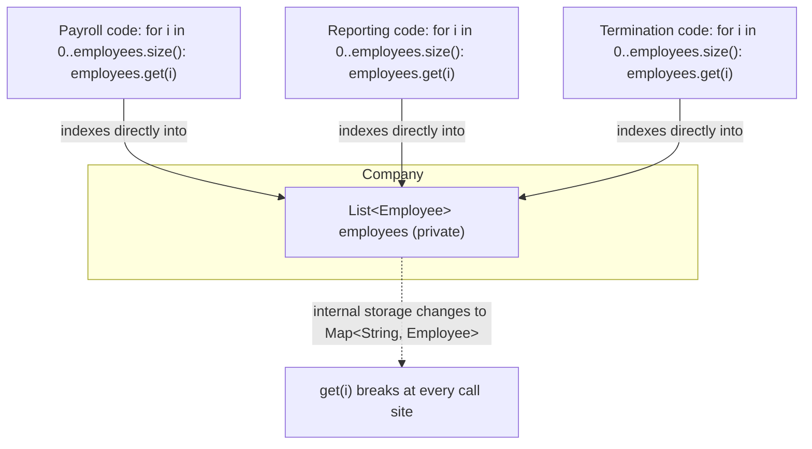
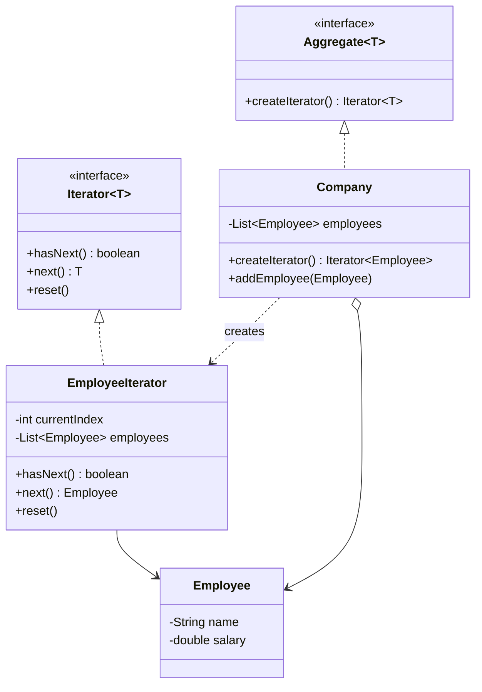

The first time I wrote a custom `Iterator` interface inside my own package, I got a compiler error that made no sense until I remembered `java.util.Iterator` exists too, and the unqualified name in my file resolved to mine instead of the JDK's. That's usually how people meet this pattern for the first time in Java, by accident, before they even realize they're using it constantly through the for-each loop.

## The problem

`Company` owns a `List<Employee>` internally, and you don't want every caller reaching in and looping over that list directly, because then `Company` can never change its internal storage without breaking callers, and you can't have two independent traversal positions over the same collection without hand-rolled index tracking.

## Without the pattern

Before something like `EmployeeIterator` exists, the obvious fix is to just expose the list. `Company` hands back its internal `List<Employee>` directly, or a package-friend method returns `employees.get(i)`, and every caller that needs to loop writes its own `for (int i = 0; i < employees.size(); i++)` against that field. That works for the first caller. The second one, computing payroll, writes basically the same bounds-checked loop again. The third, running terminations, writes it a third time. Three unrelated pieces of code, none of which have any business knowing this, now all depend on the fact that `Company` stores employees as a `List` at contiguous integer indices.

Then storage changes, say `Company` moves from `List<Employee>` to a `Map<String, Employee>` keyed by ID because lookups by ID got common, and every one of those three call sites breaks, `get(i)` means nothing on a `Map`. If it had been a linked structure instead, walking `head.next.next` by hand at each call site would have the same problem: the traversal logic isn't behind an interface, it's smeared across every consumer, so a storage change that should be a one-file diff turns into a search across the codebase for anywhere someone looped over `employees` themselves.

Nothing here is wrong on day one. It's wrong the day `Company`'s internals need to change and three call sites have quietly welded themselves to the old shape.

## With the pattern

`Iterator<T>` (yes, shadowing `java.util.Iterator` inside package `behavioral.iterator`) declares `hasNext()`, `next()`, `reset()`. `EmployeeIterator` implements it with a private `currentIndex` and a reference to the employee list, `hasNext()` is a bounds check, `next()` throws `NoSuchElementException` past the end, `reset()` zeroes `currentIndex` back to 0. `Aggregate<T>` is the other half, a one-method contract, `createIterator()`, that any collection-owning class implements. `Company implements Aggregate<Employee>`, and `createIterator()` just returns `new EmployeeIterator(employees)`. Because `Company` hands out a fresh `EmployeeIterator` each call, two callers doing `company.createIterator()` get independent position tracking over the same underlying list, that's the property the test file leans on directly when it advances two separate iterators side by side.

## What it costs you

None of this is free. Every `createIterator()` call allocates a new `EmployeeIterator`, so two callers looping over the same `Company` at once means two extra objects on the heap that a raw indexed for-loop over `employees` wouldn't need, on a hot path that iterates a large company repeatedly, that's an allocation per traversal, not a one-time cost. And because iteration here is external, the caller drives the loop by calling `hasNext()` then `next()` itself, `EmployeeIterator` has to carry `currentIndex` as mutable state living on the object between calls, cursor bookkeeping that a plain `for (int i ...)` would keep on the stack for free and forget the moment the loop ends. That state also has no protection against `employees` changing underneath it mid-iteration, nothing here does the `java.util` trick of a `modCount` check to fail fast on concurrent modification, so a stale `EmployeeIterator` held past an `addEmployee()` call is just quietly wrong instead of throwing. You're trading a five-line loop for a class, an allocation, and cursor state that now has to be reasoned about independently of the collection it's walking.

## When to reach for it

Whenever a caller needs to walk a collection without knowing, or being allowed to know, its internal representation, or when you need multiple independent traversals over the same structure at once.

## The takeaway

The pattern is mostly invisible once your language has built-in iteration protocols, Java's for-each, Python's generators, you're using Iterator constantly without ever writing the interface yourself. Write your own version, like `EmployeeIterator` here, only when the built-in one can't express what you need, resettable position, a non-standard order, something specific like that.

Read the full source on [GitHub](https://github.com/akisonlyforu/design-patterns/tree/master/src/behavioral/iterator).

[← Back to Behavioral Patterns](/interview/low-level-design/design-patterns/behavioral)
