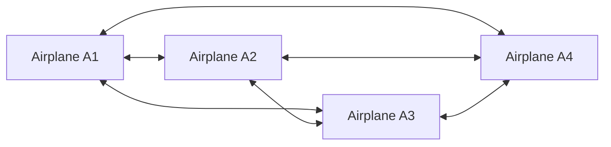
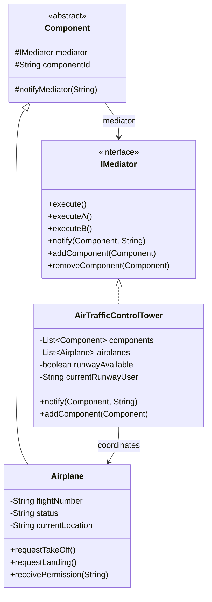

Picture five components that all need to coordinate around one shared resource, a runway, say, and imagine wiring each one with a direct reference to every other one it might conflict with. That's the mess Mediator prevents, and air traffic control is the textbook example precisely because the alternative, planes coordinating with each other directly, is obviously insane once you say it out loud.

## The problem

Multiple `Airplane` instances need to coordinate around a shared resource, the runway, but you don't want each `Airplane` holding references to every other `Airplane` it might conflict with, that's all-to-all coupling that gets worse with every aircraft you add.

## Without the pattern

The naive version of this system gives every `Airplane` a list of the other `Airplane` instances it might conflict with, and `requestTakeOff()` walks that list directly, asking each peer whether it's currently on the runway before proceeding. Four airplanes in the air means each one is holding references to the other three, which is twelve direct references total, up to N² as you add more aircraft. Nothing about that is exotic, it's just object references, but it means an `Airplane`'s takeoff logic now has to know the internal state of every other `Airplane` it's wired to, `currentLocation`, `status`, whatever field happens to answer "is the runway yours right now." Rename that field, or change what `receivePermission()` expects as an argument, and you're not editing one class, you're editing every peer that ever reached into it directly. Add a fifth plane and you're not adding one relationship, you're adding four, one to each existing aircraft.

Six direct connections for four planes, and every one of them is a place a bug can hide, two airplanes independently deciding the runway's free because neither one's local view of "who's using it" agrees with the other's.

## With the pattern

`IMediator` declares `execute()`, `executeA()`, `executeB()`, `notify(Component, String)`, `addComponent()`, `removeComponent()`. `Component` is the abstract base every participant extends, holding a protected `mediator` reference and `componentId`, its only real behavior is `notifyMediator(String)`, which forwards to `mediator.notify(this, message)`, so a `Component` never talks to another `Component`, only to the mediator. `Airplane extends Component` and adds `flightNumber`, `status`, `currentLocation`, its `executeA()`/`executeB()` are really `requestTakeOff()`/`requestLanding()` under the generic names the base class requires, each one calls `notifyMediator()` with a request string like `"TAKEOFF_REQUEST"`. `AirTrafficControlTower implements IMediator` and is where all the actual coordination logic lives: a `List<Component>`, a `List<Airplane>`, a `runwayAvailable` boolean, and `currentRunwayUser` tracking who's holding the shared resource. `notify()` is the single entry point, it switches on the request string inside `handleAirplaneRequest()` (`"TAKEOFF_REQUEST"`, `"LANDING_REQUEST"`, `"TAKEOFF_COMPLETE"`, `"LANDING_COMPLETE"`) and grants or denies based on `runwayAvailable`, calling back into `airplane.receivePermission()` to tell the aircraft what happened. Every cross-aircraft interaction, "runway occupied, wait," "runway free, proceed," passes through this one class instead of through direct references between planes.

## What it costs you

You've traded N² tangled references for one class that knows everything, and "knows everything" is doing a lot of work in that sentence. `AirTrafficControlTower` already holds a `List<Component>`, a `List<Airplane>`, `runwayAvailable`, and `currentRunwayUser`, and `handleAirplaneRequest()` is a switch statement that grows a new branch every time you add a request type. Add a taxiway or a gate to coordinate next to the runway and that same class picks up more state and more branches, there's nowhere else for it to go, that's the whole design. And because `notify()` is the single entry point every `Airplane` funnels through, it's also the single place things back up, a slow or buggy `handleAirplaneRequest()` doesn't just break one plane's coordination, it stalls every plane waiting on a takeoff or landing decision. You've centralized the coupling, which is the point, but you've also centralized the failure mode.

## When to reach for it

Many-to-many communication where the coordination logic itself is the hard part, not any single component's own behavior. If you just need one-to-many notifications with no arbitration involved, that's Observer, don't reach for the heavier pattern by default.

## The takeaway

The mediator ends up as the one class that knows everything, which is the whole point, but it also means all your coordination bugs live in one place instead of scattered across every component. That's usually a good trade, just watch that the mediator doesn't quietly grow business logic that has nothing to do with coordination.

Read the full source on [GitHub](https://github.com/akisonlyforu/design-patterns/tree/master/src/behavioral/mediator).

[← Back to Behavioral Patterns](/interview/low-level-design/design-patterns/behavioral)
