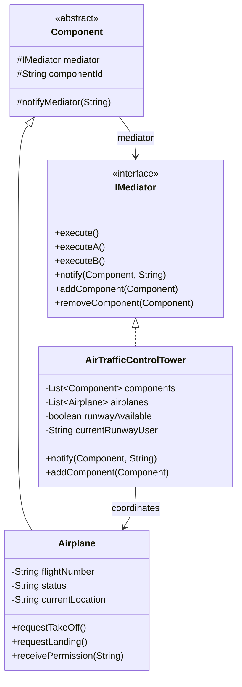

[← Back to Behavioral Patterns](/interview/low-level-design/design-patterns/behavioral)

Picture five components that all need to coordinate around one shared resource, a runway, say, and imagine wiring each one with a direct reference to every other one it might conflict with. That's the mess Mediator prevents, and air traffic control is the textbook example precisely because the alternative, planes coordinating with each other directly, is obviously insane once you say it out loud.

## The problem

Multiple `Airplane` instances need to coordinate around a shared resource, the runway, but you don't want each `Airplane` holding references to every other `Airplane` it might conflict with, that's all-to-all coupling that gets worse with every aircraft you add.

## How it's built

`IMediator` declares `execute()`, `executeA()`, `executeB()`, `notify(Component, String)`, `addComponent()`, `removeComponent()`. `Component` is the abstract base every participant extends, holding a protected `mediator` reference and `componentId`, its only real behavior is `notifyMediator(String)`, which forwards to `mediator.notify(this, message)`, so a `Component` never talks to another `Component`, only to the mediator. `Airplane extends Component` and adds `flightNumber`, `status`, `currentLocation`, its `executeA()`/`executeB()` are really `requestTakeOff()`/`requestLanding()` under the generic names the base class requires, each one calls `notifyMediator()` with a request string like `"TAKEOFF_REQUEST"`. `AirTrafficControlTower implements IMediator` and is where all the actual coordination logic lives: a `List<Component>`, a `List<Airplane>`, a `runwayAvailable` boolean, and `currentRunwayUser` tracking who's holding the shared resource. `notify()` is the single entry point, it switches on the request string inside `handleAirplaneRequest()` (`"TAKEOFF_REQUEST"`, `"LANDING_REQUEST"`, `"TAKEOFF_COMPLETE"`, `"LANDING_COMPLETE"`) and grants or denies based on `runwayAvailable`, calling back into `airplane.receivePermission()` to tell the aircraft what happened. Every cross-aircraft interaction, "runway occupied, wait," "runway free, proceed," passes through this one class instead of through direct references between planes.

## When to reach for it

Many-to-many communication where the coordination logic itself is the hard part, not any single component's own behavior. If you just need one-to-many notifications with no arbitration involved, that's Observer, don't reach for the heavier pattern by default.

## The takeaway

The mediator ends up as the one class that knows everything, which is the whole point, but it also means all your coordination bugs live in one place instead of scattered across every component. That's usually a good trade, just watch that the mediator doesn't quietly grow business logic that has nothing to do with coordination.

Read the full source on [GitHub](https://github.com/akisonlyforu/design-patterns/tree/master/src/behavioral/mediator).

[← Back to Behavioral Patterns](/interview/low-level-design/design-patterns/behavioral)
