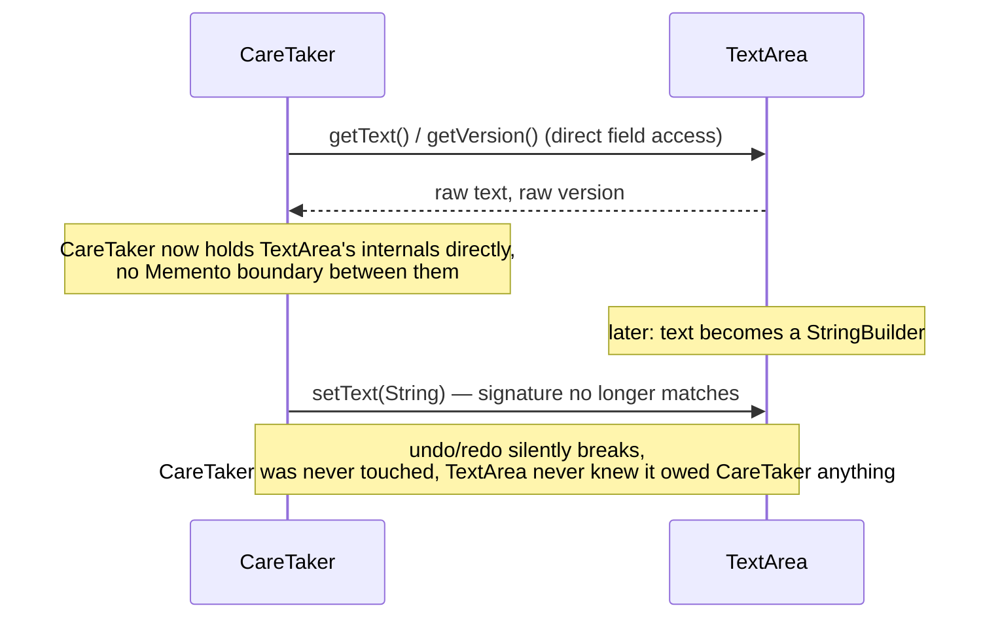
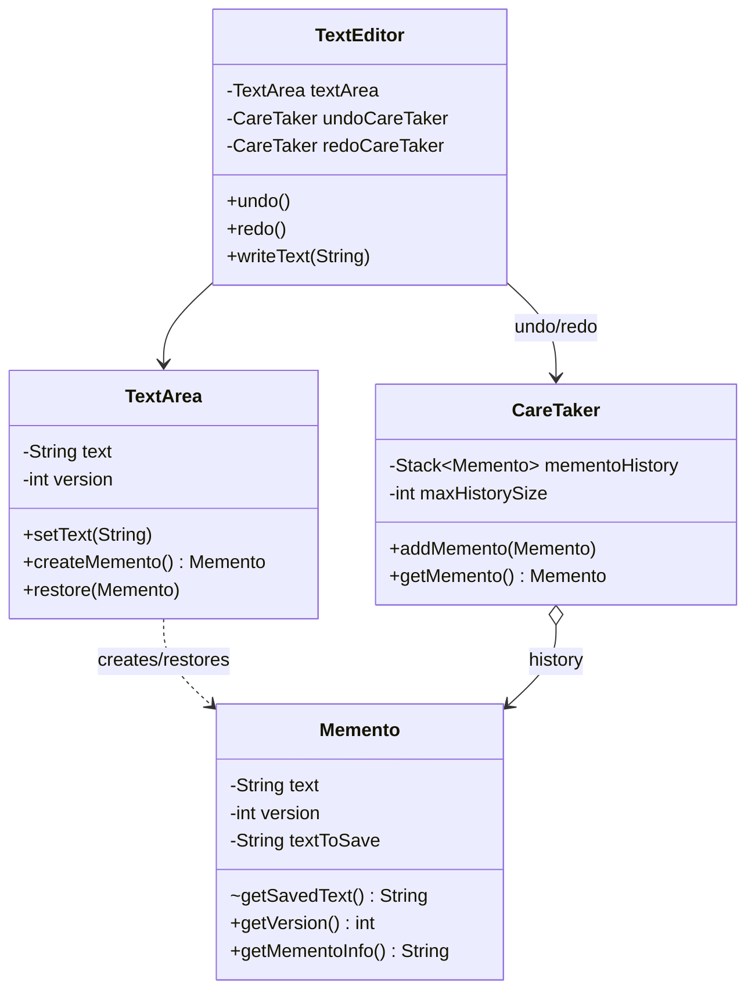

Every undo button you've ever clicked in a text editor is this pattern, and the detail people miss when they build their own is that whatever's holding your history isn't allowed to see your document's internals while it stores them, it just holds an opaque snapshot and hands it back later.

## The problem

`TextEditor` needs undo/redo, which means saving snapshots of `TextArea`'s state before every edit, but `TextArea` shouldn't have to expose its internal fields publicly just so something else can stash and later restore them, that would trade encapsulation for a history feature.

## Without the pattern

The naive fix for undo is to skip the snapshot object entirely and let `CareTaker` (or `TextEditor` directly) reach into `TextArea`'s private `text` and `version` fields to save and restore them, either by making those fields package-private or by bolting on public `getText()`/`setText()`/`getVersion()`/`setVersion()` just so the undo code has something to call. Now every push onto the undo stack is `CareTaker` pulling `textArea.text` straight out of the originator, and every pop is `CareTaker` pushing it straight back in, no `Memento` in between, no boundary saying "this is what's safe to expose for history purposes."

That holds up right until `TextArea`'s internal representation changes for a reason that has nothing to do with undo, say `text` becomes a `StringBuilder` so appends stop reallocating, or gets split into a `List<String>` of lines for cheaper line-level edits. `CareTaker` has no idea any of that happened, it's still calling `getText()` expecting a `String` and `setText(String)` expecting the same shape back, and the undo/redo logic silently breaks or starts corrupting state, in a class that has nothing to do with `TextArea` and that nobody thought to touch when the internal representation changed.

## With the pattern

`Memento` is the snapshot: a final `text` field and `version`, with a package-private constructor and a package-private `getSavedText()`, so only classes inside `behavioral.memento` (in practice, only `TextArea`) can construct one or read its raw contents, everything else only ever sees `getMementoInfo()` (a version plus character count) or `toString()`. `TextArea` is the originator, `createMemento()` packages current text and version into a new `Memento`, `restore(Memento)` unpacks one back into its own fields. `CareTaker` holds a `Stack<Memento> mementoHistory` and a `maxHistorySize`, `addMemento()` evicts the oldest entry once the stack is full, `getMemento()` pops the most recent one. `TextEditor` wires two separate `CareTaker` instances, `undoCareTaker` and `redoCareTaker`, every mutating call (`writeText`, `appendText`, `insertText`, `clearText`) first calls `saveCurrentState()`, which pushes onto `undoCareTaker` and clears the redo history, because taking a new action after an undo should invalidate whatever you could have redone. `undo()` pushes the current state onto `redoCareTaker` before restoring the previous one from `undoCareTaker`, `redo()` does the mirror image, and that's the entire two-stack undo/redo mechanism.

## What it costs you

None of this is free. Every `Memento` `TextArea` creates is a full copy of `text`, not a diff against the previous version, so if you're editing something that regularly holds a lot of state, a large document, a big in-memory buffer, each snapshot is another full-size copy sitting on `undoCareTaker`'s stack, not a few changed bytes. `maxHistorySize` caps that here, but only because `CareTaker.addMemento()` was explicitly written to evict the oldest entry once the stack fills up, the pattern itself makes no such promise. Skip that cap, or wire up a `CareTaker` without one because "we'll add it later," and you've built a slow memory leak: every mutating call pushes another snapshot, nothing pops except on an explicit undo, and the history just grows for as long as the session runs, until someone notices the process is holding onto megabytes of text nobody's going to restore.

## When to reach for it

Any feature that needs to roll back to a prior state, undo/redo in an editor, rollback in a transaction, save-game snapshots. If state is cheap to snapshot, this is a clean fit, if state is large, think about how expensive each `Memento` actually is before you're pushing hundreds of them onto a stack.

## The takeaway

Memento buys you encapsulation-preserving history at the cost of memory, every saved state is a full snapshot, not a diff. Cap your `CareTaker`'s history size the way this implementation does with `maxHistorySize`, an unbounded undo stack is a memory leak with extra steps.

Read the full source on [GitHub](https://github.com/akisonlyforu/design-patterns/tree/master/src/behavioral/memento).

[← Back to Behavioral Patterns](/interview/low-level-design/design-patterns/behavioral)
