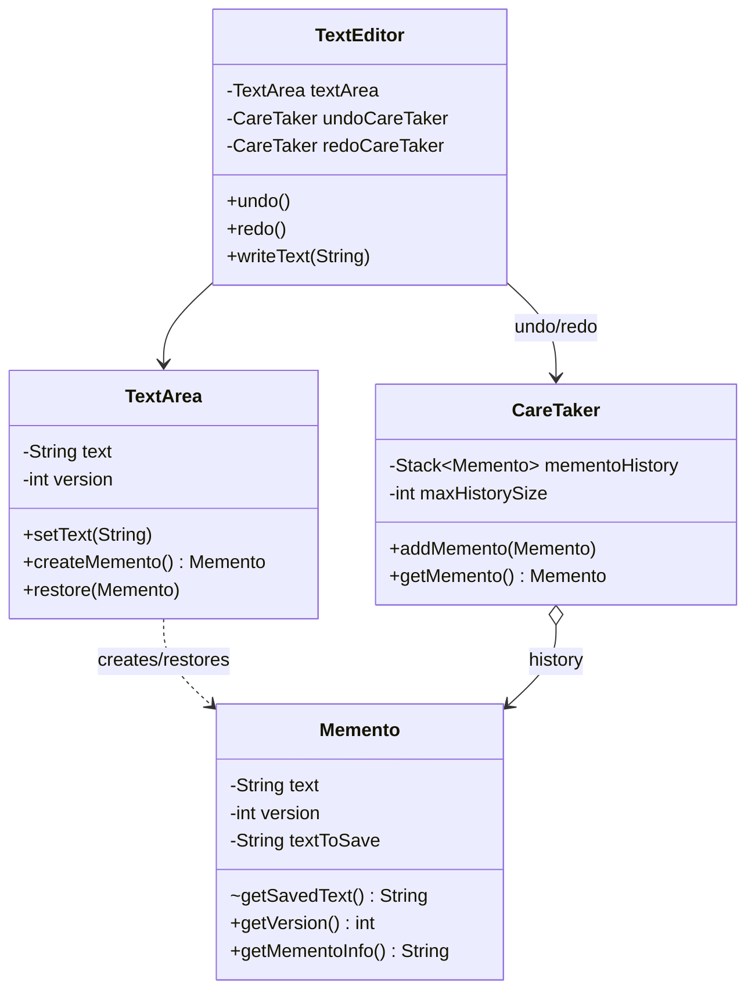

Every undo button you've ever clicked in a text editor is this pattern, and the detail people miss when they build their own is that whatever's holding your history isn't allowed to see your document's internals while it stores them, it just holds an opaque snapshot and hands it back later.

## The problem

`TextEditor` needs undo/redo, which means saving snapshots of `TextArea`'s state before every edit, but `TextArea` shouldn't have to expose its internal fields publicly just so something else can stash and later restore them, that would trade encapsulation for a history feature.

## How it's built

`Memento` is the snapshot: a final `text` field and `version`, with a package-private constructor and a package-private `getSavedText()`, so only classes inside `behavioral.memento` (in practice, only `TextArea`) can construct one or read its raw contents, everything else only ever sees `getMementoInfo()` (a version plus character count) or `toString()`. `TextArea` is the originator, `createMemento()` packages current text and version into a new `Memento`, `restore(Memento)` unpacks one back into its own fields. `CareTaker` holds a `Stack<Memento> mementoHistory` and a `maxHistorySize`, `addMemento()` evicts the oldest entry once the stack is full, `getMemento()` pops the most recent one. `TextEditor` wires two separate `CareTaker` instances, `undoCareTaker` and `redoCareTaker`, every mutating call (`writeText`, `appendText`, `insertText`, `clearText`) first calls `saveCurrentState()`, which pushes onto `undoCareTaker` and clears the redo history, because taking a new action after an undo should invalidate whatever you could have redone. `undo()` pushes the current state onto `redoCareTaker` before restoring the previous one from `undoCareTaker`, `redo()` does the mirror image, and that's the entire two-stack undo/redo mechanism.

## When to reach for it

Any feature that needs to roll back to a prior state, undo/redo in an editor, rollback in a transaction, save-game snapshots. If state is cheap to snapshot, this is a clean fit, if state is large, think about how expensive each `Memento` actually is before you're pushing hundreds of them onto a stack.

## The takeaway

Memento buys you encapsulation-preserving history at the cost of memory, every saved state is a full snapshot, not a diff. Cap your `CareTaker`'s history size the way this implementation does with `maxHistorySize`, an unbounded undo stack is a memory leak with extra steps.

[← Back to Behavioral Patterns](/interview/low-level-design/design-patterns/behavioral)
