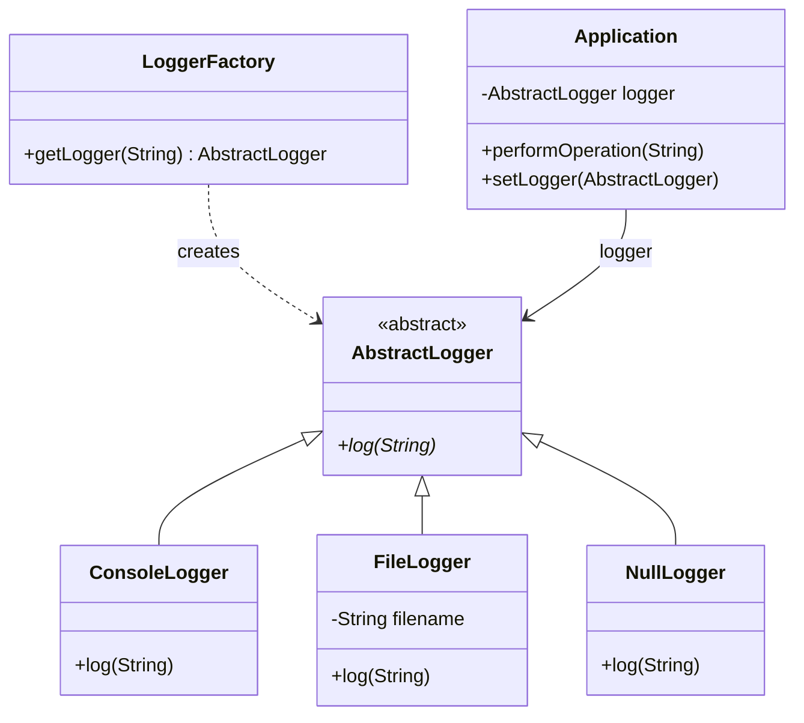

[← Back to Behavioral Patterns](/interview/low-level-design/design-patterns/behavioral)

I've lost count of how many `NullPointerException`s I've traced back to an optional dependency, a logger, a notifier, something that's fine to skip, that someone forgot to null-check three call sites deep. Null Object's fix is almost insultingly simple: make "nothing" a real object instead of the absence of one.

## The problem

`Application` takes an `AbstractLogger`, but logging is genuinely optional in some configurations, and you don't want `performOperation()`, or any other method, doing a null check before every single log call, that check would end up repeated everywhere the logger gets used.

## How it's built

`AbstractLogger` is a one-method abstract class, `log(String)`. `ConsoleLogger` and `FileLogger` are the real implementations doing actual work. `NullLogger extends AbstractLogger` too, its `log()` body is empty, a legitimate implementation of the contract that just does nothing. `LoggerFactory.getLogger(String type)` is the single place that decides what you get back, if `type` is null or doesn't match `"CONSOLE"`/`"FILE"`/`"NULL"` it falls through to `new NullLogger()`, so the factory never hands back an actual null reference. `Application`'s constructor still guards with a ternary, `logger != null ? logger : new NullLogger()`, covering the case where someone bypasses the factory and passes null directly, so the null-safety is enforced at two levels, factory and consumer, belt and suspenders. Everywhere else in `Application`, `logger.log(...)` runs with zero null checks, because there's no null logger reachable through this code path anymore.

## When to reach for it

Optional collaborators, objects your code calls but which are allowed to legitimately do nothing, logging, notifications, analytics hooks, anywhere a no-op is a valid business outcome rather than an error condition.

## The takeaway

Don't use Null Object to swallow error states, it's for "this collaborator is legitimately absent," not "something went wrong and I don't want to deal with it." If the null case should actually surface an error somewhere, a no-op object just hides the bug quietly instead of failing loudly.

Read the full source on [GitHub](https://github.com/akisonlyforu/design-patterns/tree/master/src/behavioral/null_object).

[← Back to Behavioral Patterns](/interview/low-level-design/design-patterns/behavioral)
