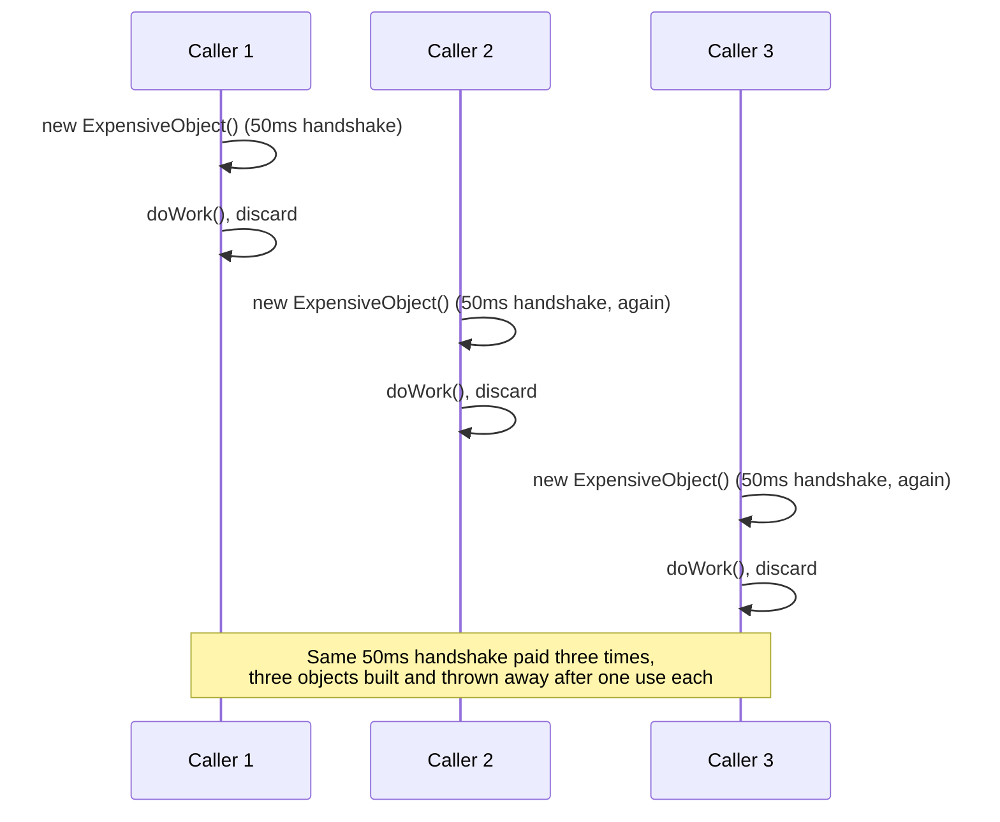
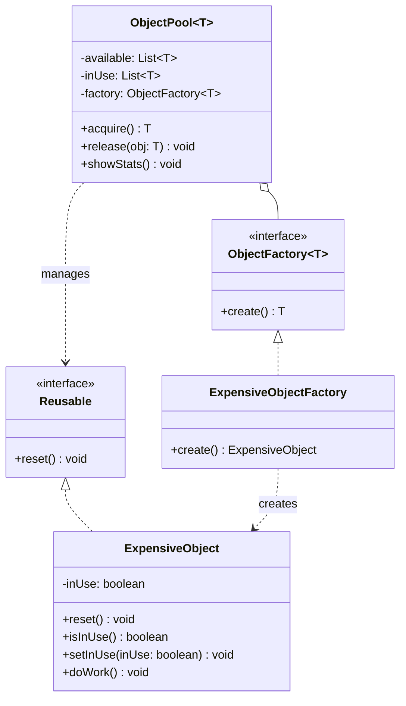

The test file for this one fakes "expensive" with a 50 millisecond Thread.sleep() in the constructor, which is a stand-in for the real thing, a database handshake, a socket setup, whatever actually costs wall-clock time to build. The pool exists so you pay that cost once per object and then hand the same object out over and over instead of re-paying it on every request.

## The problem

Some objects are genuinely expensive to construct and short-lived in how they're used, database connections being the standard example. Creating a fresh one per request and throwing it away afterward means paying the expensive part constantly and generating garbage the collector has to clean up. If the number of objects actually in use at any moment is small, a pool of pre-built, reusable ones is cheaper than constant creation and disposal.

## Without the pattern

The obvious thing is to skip the pool entirely and let every caller do `new ExpensiveObject()` whenever it needs one. The constructor runs its 50 millisecond simulated handshake (a real socket setup or DB connection costs about the same, just with a network round trip instead of a sleep), the object handles one doWork() call, and then it gets discarded. No acquire/release ceremony, no available/inUse bookkeeping, nothing to forget.

The problem shows up on the second call, and every call after it. Ten requests means paying that 50 millisecond construction cost ten separate times, back to back, instead of once. Nothing's broken, each object works fine on its own, you're just re-paying the expensive part on every single request instead of reusing what you already built and are done with.

That's fine when construction is cheap or calls are rare. It stops being fine once the cost is real and request volume isn't trivial, at which point you're spending more wall-clock time building objects than doing the work you built them for.

## With the pattern

Reusable is the one-method contract, reset(). ExpensiveObject implements it, carries an inUse boolean, and its constructor does the simulated expensive work (the sleep) before printing that it's done. reset() just flips inUse back to false. doWork() checks inUse first and throws IllegalStateException if the object hasn't actually been acquired, which catches the specific bug of someone holding a reference to a pooled object they never checked out.

ObjectPool<T extends Reusable> holds two lists, available and inUse, plus an ObjectFactory<T>. acquire() checks available first, if it's empty it delegates to factory.create() for a new instance, otherwise it pops the last entry off available and reuses it, either way the object goes into inUse before it's handed back to the caller. release(T obj) does the reverse, removes it from inUse, calls reset() on it, and adds it to available. The reset() call inside release() is the part that's easy to forget when reimplementing this from memory, skip it and the next caller who acquires that object gets one with leftover state from whoever used it last.

ObjectFactory<T> exists for a specific reason that has nothing to do with elegance, Java generics can't do new T(), there's no way for ObjectPool<T> to construct a T directly. So the factory is how the pool learns what to build without knowing the concrete type itself, ExpensiveObjectFactory.create() just returns new ExpensiveObject(), and the pool calls that instead of a constructor it doesn't have access to.

One thing worth flagging since it's not addressed here: available and inUse are plain ArrayLists, and acquire()/release() aren't synchronized. That's fine for a single-threaded demo but not for concurrent callers, two threads racing to acquire from a pool with exactly one available object could both pull it or corrupt the list's internal state. A real pool needs that acquire-check-and-claim sequence protected, either a lock around it or a concurrent collection built for exactly this.

## What it costs you

You traded per-call construction cost for a pool that now needs its own lifecycle discipline, every acquire() has to be matched by a release(), and nothing in the type system stops a caller from acquiring an ExpensiveObject and just never calling release() on it. That object doesn't get garbage collected in any useful sense, it's stuck in inUse forever, never coming back to available no matter how many times someone else calls acquire(). The pool doesn't refill itself, it just quietly shrinks by one usable object every time a caller forgets. The other failure mode is subtler: release() calls reset() to clear inUse, but reset() only clears what it's told to clear, if ExpensiveObject picked up any other state during doWork() that reset() doesn't touch, the next caller to acquire that same instance inherits it, and now one caller's leftover state is showing up in a completely unrelated request. A pool is only as safe as its reset() method is thorough, and that method is exactly the kind of thing that's easy to leave incomplete when you add a new field later.

## When to reach for it

Database connection pools, thread pools, buffer pools, anything where construction cost is real and the object is safe to reset and reuse rather than being tied to one specific piece of state. Skip it if construction is cheap, you'll add lifecycle complexity (tracking available vs in-use, remembering to release) for no real benefit.

## The takeaway

The two things that make this pattern actually work are reset() being mandatory on release and the factory existing to solve Java's "can't new a generic type" problem. Miss either one and you either leak state between users or you can't write the pool at all.

Read the full source on [GitHub](https://github.com/akisonlyforu/design-patterns/tree/master/src/creational/object_pool).

[← Back to Creational Patterns](/interview/low-level-design/design-patterns/creational)
