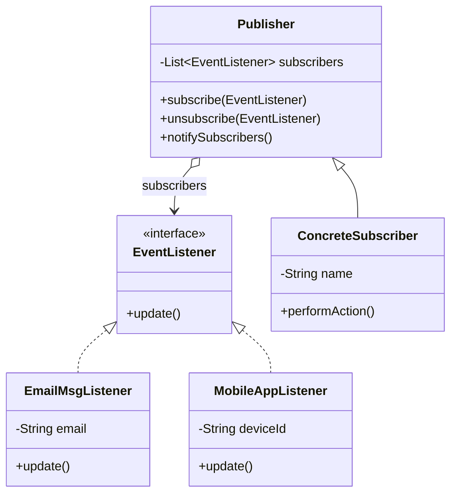

The bug I remember here isn't a crash, it's a silence, a subscriber that stopped getting notified because nobody unsubscribed it properly and it just sat there, or the opposite, an event that fired and nobody downstream noticed because the listener never got registered in the first place. Observer bugs are almost always about the subscription list, not the notification logic.

## The problem

`Publisher` needs to tell an arbitrary, changing set of interested parties when something happens, without hardcoding which parties those are, and without those parties needing to poll for changes.

## How it's built

`EventListener` is a one-method interface, `update()`, no parameters, which is worth noticing: the design bakes each listener's context into its constructor rather than into the event payload, `EmailMsgListener` takes an `email` string at construction, `MobileAppListener` takes a `deviceId`, so `update()` already has everything it needs, it doesn't need the event to hand it anything. `Publisher` holds a `List<EventListener> subscribers`, `subscribe()`/`unsubscribe()` add or remove from that list, `notifySubscribers()` loops over it calling `update()` on every entry. `ConcreteSubscriber extends Publisher` directly rather than composing one, `performAction()` is the trigger, it does whatever the "event" actually is and then calls `notifySubscribers()` to fan out. Because subscribe/unsubscribe just mutate a list, registration is fully dynamic at runtime, the test file shows this directly: unsubscribe `emailListener1`, fire the event again, only the remaining listeners get called.

## When to reach for it

One-to-many notification where the "one" doesn't need to know who's listening or how many there are, config change broadcasts, UI event systems, anything shaped like publish/subscribe.

## The takeaway

The most common way this pattern breaks in production isn't the notify loop, it's forgetting to unsubscribe. A listener that outlives its usefulness but stays in the list is a memory leak and a source of notifications firing into dead code. If your listeners have a shorter lifetime than the publisher, make sure something calls unsubscribe when they're done.

Read the full source on [GitHub](https://github.com/akisonlyforu/design-patterns/tree/master/src/behavioral/observer).

[← Back to Behavioral Patterns](/interview/low-level-design/design-patterns/behavioral)
