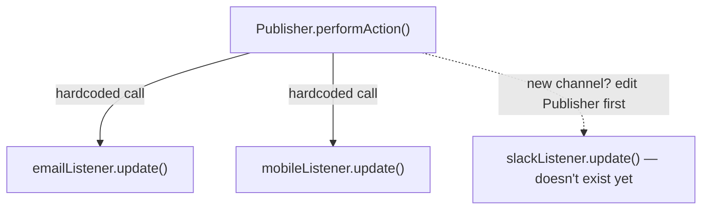
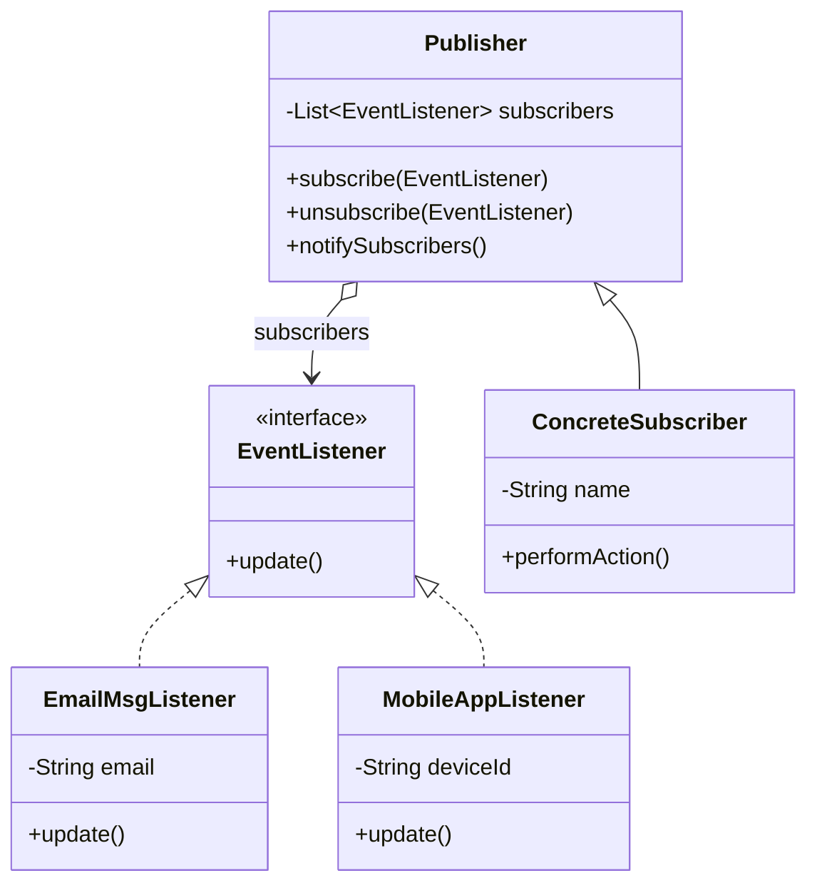

The bug I remember here isn't a crash, it's a silence, a subscriber that stopped getting notified because nobody unsubscribed it properly and it just sat there, or the opposite, an event that fired and nobody downstream noticed because the listener never got registered in the first place. Observer bugs are almost always about the subscription list, not the notification logic.

## The problem

`Publisher` needs to tell an arbitrary, changing set of interested parties when something happens, without hardcoding which parties those are, and without those parties needing to poll for changes.

## Without the pattern

The obvious version has the thing that fires the event hold a direct reference to each interested party by name, an `EmailMsgListener` field, a `MobileAppListener` field, and the method that would've become `notifySubscribers()` just calls each one's `update()` directly, `emailListener.update()`, then `mobileListener.update()`, one line per listener, hardcoded in source. It works, in the sense that it compiles and runs, right up until someone wants a third channel added, a Slack listener say, and the fix isn't "register a new subscriber", it's opening the publisher's class, adding `slackListener.update()` as a new line next to the other two, and recompiling. The publisher ends up with compile-time knowledge of every consumer that will ever care about its events, including the ones that don't exist yet, and every new listener type is a diff to a file that has nothing to do with that listener.

## With the pattern

`EventListener` is a one-method interface, `update()`, no parameters, which is worth noticing: the design bakes each listener's context into its constructor rather than into the event payload, `EmailMsgListener` takes an `email` string at construction, `MobileAppListener` takes a `deviceId`, so `update()` already has everything it needs, it doesn't need the event to hand it anything. `Publisher` holds a `List<EventListener> subscribers`, `subscribe()`/`unsubscribe()` add or remove from that list, `notifySubscribers()` loops over it calling `update()` on every entry. `ConcreteSubscriber extends Publisher` directly rather than composing one, `performAction()` is the trigger, it does whatever the "event" actually is and then calls `notifySubscribers()` to fan out. Because subscribe/unsubscribe just mutate a list, registration is fully dynamic at runtime, the test file shows this directly: unsubscribe `emailListener1`, fire the event again, only the remaining listeners get called.

## What it costs you

`Publisher` fires `update()` on subscribers in whatever order they happen to sit in `subscribers`, which is insertion order and nothing more, there's no priority, no way to say "the audit listener has to run before the cache-invalidation listener does". If `EmailMsgListener.update()` has a side effect that causes `MobileAppListener` to also change state and call back into the publisher, you get a notification cascade that's genuinely hard to trace at 2am, because the stack trace just shows `update()` calling into more `update()` calls and nothing in it explains why the chain started. And `subscribe()` without a matching `unsubscribe()` is a memory leak by construction, not by accident, `Publisher.subscribers` holds a strong reference to every `EventListener` it's ever been handed, so a listener whose owning object should've been garbage collected stays reachable for as long as the publisher lives, which in a long-running process can mean forever.

## When to reach for it

One-to-many notification where the "one" doesn't need to know who's listening or how many there are, config change broadcasts, UI event systems, anything shaped like publish/subscribe.

## The takeaway

The most common way this pattern breaks in production isn't the notify loop, it's forgetting to unsubscribe. A listener that outlives its usefulness but stays in the list is a memory leak and a source of notifications firing into dead code. If your listeners have a shorter lifetime than the publisher, make sure something calls unsubscribe when they're done.

Read the full source on [GitHub](https://github.com/akisonlyforu/design-patterns/tree/master/src/behavioral/observer).

[← Back to Behavioral Patterns](/interview/low-level-design/design-patterns/behavioral)
