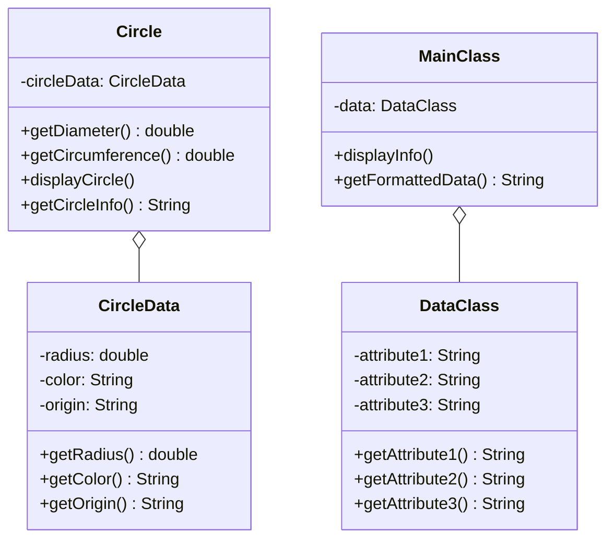

If you've ever handed out a setter on a class and then spent an afternoon tracking down which caller mutated a field it had no business touching, this is for you. The `Circle` example makes the fix boringly simple: once a `Circle` is constructed, nothing about it should be able to change out from under you.

## The problem

Exposing internal state directly, whether through public fields or through setters, means any caller with a reference can mutate it. Once mutation is possible, "how did this object get into this state" stops being answerable by reading the constructor alone, you have to trace every place that ever touched it.

## How it's built

`CircleData` holds `radius`, `color`, and `origin` as private fields, set once through the constructor, with only getters, `getRadius()`, `getColor()`, `getOrigin()`. No setters exist. Once a `CircleData` is built, it cannot change.

`Circle` holds a private `CircleData circleData` field and never exposes it. Its own methods work by reading from `circleData`, `getDiameter()` returns `circleData.getRadius() * 2`, `getCircumference()` returns `2 * Math.PI * circleData.getRadius()`. `displayCircle()` and `getCircleInfo()` both format their output by pulling values out through `circleData`'s getters, they never hand the `CircleData` object itself back to the caller. The same shape shows up again in the file with `DataClass` and `MainClass`, `DataClass` holds three attributes with getters only, `MainClass` holds a `DataClass data` field and exposes `displayInfo()` and `getFormattedData()` built entirely from reading `data`, never returning it.

The separation matters more than it looks: `Circle` is where the geometry logic lives, `CircleData` is where the storage lives, and the only way anything outside `Circle` learns a radius is by asking `Circle` a real question (give me the diameter) rather than reading the raw field.

## When to reach for it

- The object's state should be fixed at construction time and never touched again.
- You want to stop a class's own internal fields from being reachable by anything outside it, including its own subclasses reaching in directly.
- You're separating "how this data is stored" from "what this object does with it," so the two can change independently.

## The takeaway

This isn't really a structural trick, it's a discipline: no setters on the data holder, no method that hands the data object itself back to a caller. If either of those slips in, you've quietly undone the whole point.

Read the full source on [GitHub](https://github.com/akisonlyforu/design-patterns/tree/master/src/structural/private_class_data).

[← Back to Structural Patterns](/interview/low-level-design/design-patterns/structural)
