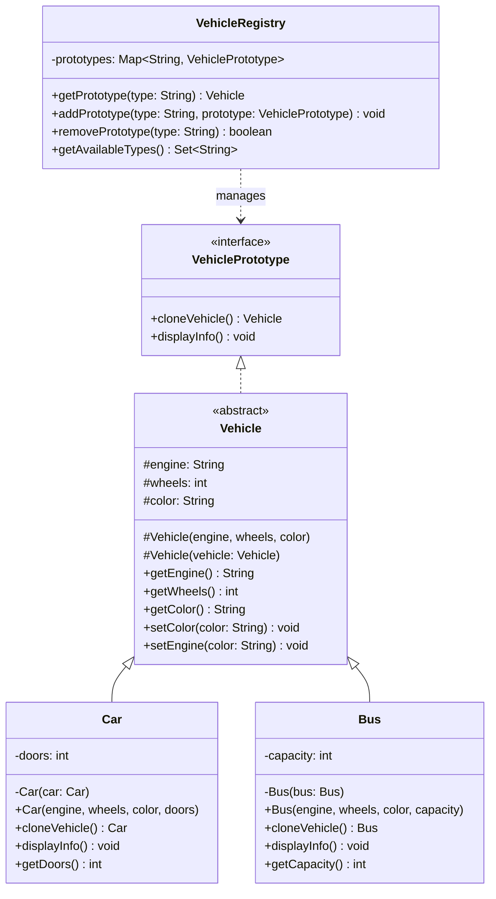

The source code for this one is a little more interesting than the README lets on. It talks about Java's Cloneable interface and Object.clone() at length, but the actual VehiclePrototype implementation doesn't use either. It rolls its own copy constructors instead. That's worth noticing, because it sidesteps the exact problems the Cloneable notes complain about, the checked CloneNotSupportedException and the fact that Cloneable is a marker interface with no real contract behind it.

## The problem

Building a new Car or Bus from scratch every time means running the full constructor path again, even when what you actually want is "the same as this one, but slightly different." And if you're handing callers a shared canonical instance instead, you risk one caller's mutation leaking into everyone else's copy.

## How it's built

VehiclePrototype is the interface, two methods, cloneVehicle() and displayInfo(). Vehicle is an abstract class implementing it, holding the three shared fields, engine, wheels, color, with a regular constructor for building fresh and a second, protected copy constructor, Vehicle(Vehicle vehicle), that copies those three fields from an existing instance.

Car extends Vehicle and adds doors. Its copy constructor, private Car(Car car), calls super(car) to copy the shared fields, then copies doors itself. cloneVehicle() returns new Car(this), and its return type is Car, not Vehicle, that's a covariant return type, callers who already have a Car in hand get a Car back from clone, no downcast needed. Bus mirrors this exactly with capacity instead of doors.

Because engine, wheels, and color are a String and two ints, plain field copying in the copy constructor already gives you full independence between original and clone, there's no shared mutable state to worry about. That only holds because none of the fields here are mutable references. If Vehicle held something like a List<String> features, the copy constructor would need to explicitly build a new list, copying the reference alone would leave the clone and the original pointing at the same underlying list, and a mutation on one would show up on the other.

VehicleRegistry is the prototype catalog, a Map<String, VehiclePrototype> pre-loaded with STANDARD_CAR, SPORTS_CAR, CITY_BUS, SCHOOL_BUS. getPrototype(type) never hands back the stored prototype itself, it calls cloneVehicle() on it and returns that. That's the detail that makes the registry safe to share, callers can mutate the Vehicle they get back all they want (the test file does exactly this, setColor("Purple") on a fetched STANDARD_CAR), and the next caller who asks the registry for STANDARD_CAR still gets the original untouched configuration.

## When to reach for it

Reach for it when you've got a small set of canonical configurations and need many independent copies of them, game piece prototypes, canned vehicle configs, template documents. It's also a reasonable answer when you want to hand out objects without exposing which concrete class backs them, callers work against VehiclePrototype and never need to know Car or Bus exists.

## The takeaway

Copy constructors get you most of what Cloneable promises without the checked exception or the marker-interface awkwardness. Just remember that field-by-field copying is only safe for primitives and immutable references, mutable fields need to be copied explicitly or the clone and original end up sharing state.

[← Back to Creational Patterns](/interview/low-level-design/design-patterns/creational)
