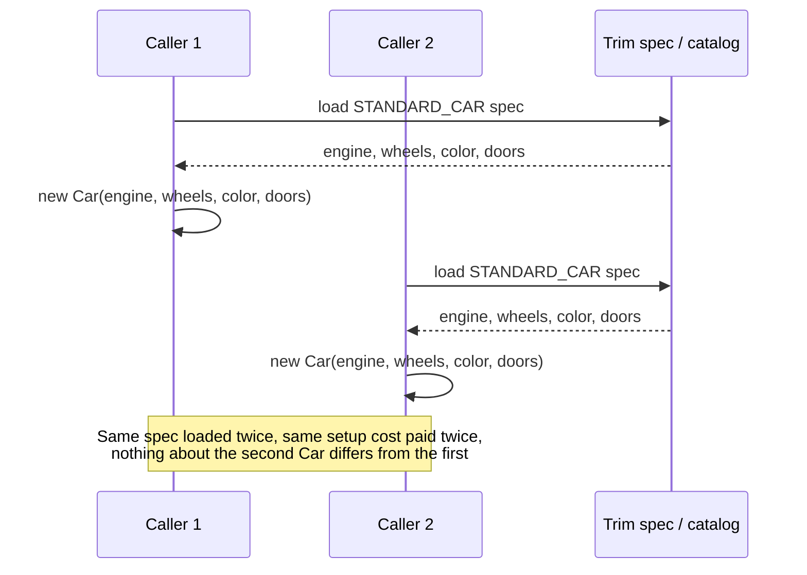
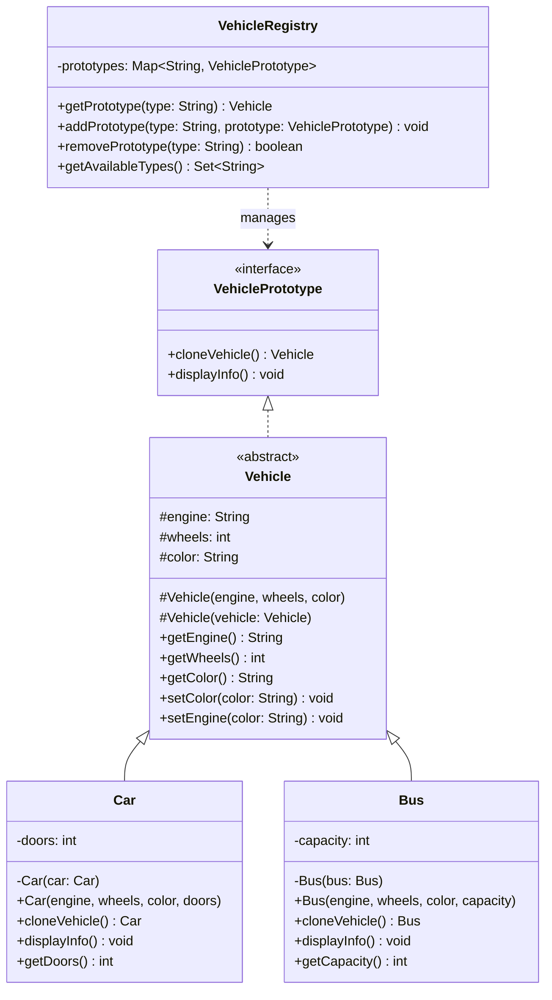

The source code for this one is a little more interesting than the README lets on. It talks about Java's Cloneable interface and Object.clone() at length, but the actual VehiclePrototype implementation doesn't use either. It rolls its own copy constructors instead. That's worth noticing, because it sidesteps the exact problems the Cloneable notes complain about, the checked CloneNotSupportedException and the fact that Cloneable is a marker interface with no real contract behind it.

## The problem

Building a new Car or Bus from scratch every time means running the full constructor path again, even when what you actually want is "the same as this one, but slightly different." And if you're handing callers a shared canonical instance instead, you risk one caller's mutation leaking into everyone else's copy.

## Without the pattern

Without VehicleRegistry, the obvious way to hand someone a standard car is to just call `new Car(engine, wheels, color, doors)` wherever you need one, feeding it "V6", 4, "White", 4, whether those four values are hardcoded or pulled fresh from wherever the STANDARD_CAR spec actually lives. That's fine as long as a Car really is four cheap fields and nothing else. It stops being fine the moment building one means more than assigning into four slots, reading a trim spec off disk, validating a color code against a catalog, running whatever setup the real constructor needs before you get back a usable Vehicle. Every caller who wants "a standard car" pays that setup cost again, in full, to arrive at an object that's byte-for-byte identical to the one the last caller built five milliseconds earlier.

## With the pattern

VehiclePrototype is the interface, two methods, cloneVehicle() and displayInfo(). Vehicle is an abstract class implementing it, holding the three shared fields, engine, wheels, color, with a regular constructor for building fresh and a second, protected copy constructor, Vehicle(Vehicle vehicle), that copies those three fields from an existing instance.

Car extends Vehicle and adds doors. Its copy constructor, private Car(Car car), calls super(car) to copy the shared fields, then copies doors itself. cloneVehicle() returns new Car(this), and its return type is Car, not Vehicle, that's a covariant return type, callers who already have a Car in hand get a Car back from clone, no downcast needed. Bus mirrors this exactly with capacity instead of doors.

Because engine, wheels, and color are a String and two ints, plain field copying in the copy constructor already gives you full independence between original and clone, there's no shared mutable state to worry about. That only holds because none of the fields here are mutable references. If Vehicle held something like a List<String> features, the copy constructor would need to explicitly build a new list, copying the reference alone would leave the clone and the original pointing at the same underlying list, and a mutation on one would show up on the other.

VehicleRegistry is the prototype catalog, a Map<String, VehiclePrototype> pre-loaded with STANDARD_CAR, SPORTS_CAR, CITY_BUS, SCHOOL_BUS. getPrototype(type) never hands back the stored prototype itself, it calls cloneVehicle() on it and returns that. That's the detail that makes the registry safe to share, callers can mutate the Vehicle they get back all they want (the test file does exactly this, setColor("Purple") on a fetched STANDARD_CAR), and the next caller who asks the registry for STANDARD_CAR still gets the original untouched configuration.

## What it costs you

The catch is that clone-by-copy-constructor only stays safe as long as every field is a primitive or an immutable reference, and that guarantee doesn't enforce itself, you have to re-verify it by hand every time a class grows a new field. Say Vehicle picked up a mutable field down the line, a `List<String> features`, say, and whoever added it wrote the copy constructor the way copy constructors get written when nobody's paying close attention: `this.features = vehicle.features;`. That compiles, the existing tests still pass, cloneVehicle() still returns something that looks like a Car. What it actually returns is a Car whose features field points at the exact same List object as the Car it was cloned from. Call getPrototype("STANDARD_CAR") twice, mutate features on one of the two Vehicles you get back, and the other one changes too, despite nobody touching it directly, because there was only ever one List, just two Vehicle objects both holding a reference to it. That's the whole deep-vs-shallow split in one sentence: copying the reference isn't copying the object, and a clone that quietly shares mutable state with its original isn't really a clone.

## When to reach for it

Reach for it when you've got a small set of canonical configurations and need many independent copies of them, game piece prototypes, canned vehicle configs, template documents. It's also a reasonable answer when you want to hand out objects without exposing which concrete class backs them, callers work against VehiclePrototype and never need to know Car or Bus exists.

## The takeaway

Copy constructors get you most of what Cloneable promises without the checked exception or the marker-interface awkwardness. Just remember that field-by-field copying is only safe for primitives and immutable references, mutable fields need to be copied explicitly or the clone and original end up sharing state.

Read the full source on [GitHub](https://github.com/akisonlyforu/design-patterns/tree/master/src/creational/prototype).

[← Back to Creational Patterns](/interview/low-level-design/design-patterns/creational)
