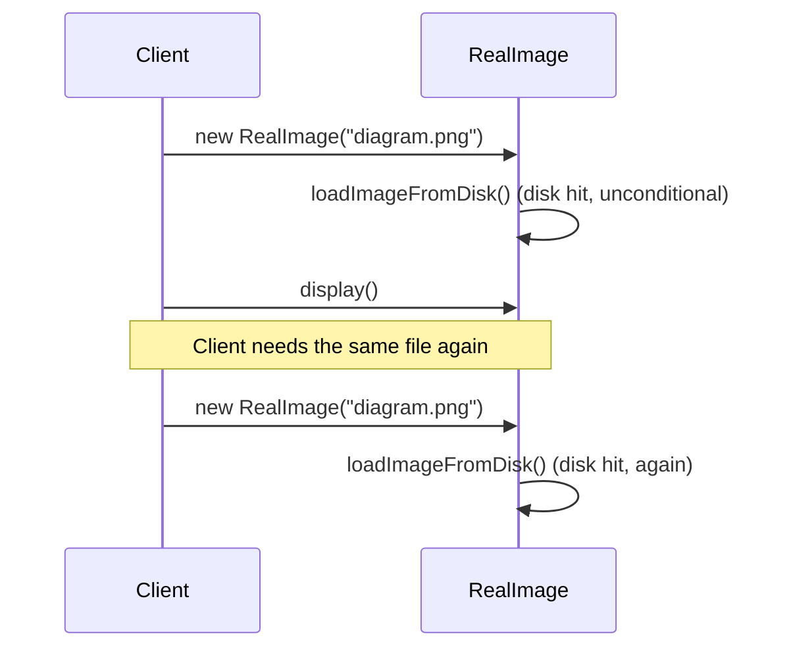
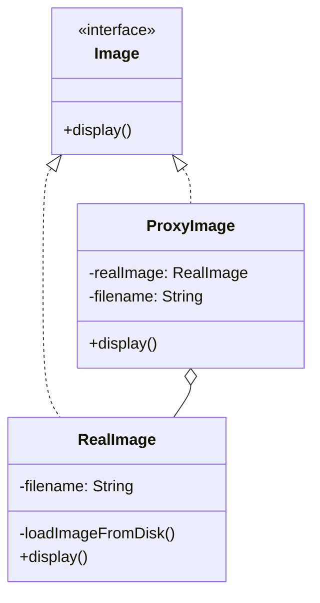

If you've ever stared at a Spring `@Configuration` class, seen a `@Bean` method called from two other `@Bean` methods, and wondered why it doesn't just create two separate instances, this is for you. It doesn't, because you're never actually calling that method directly, you're calling a CGLIB-generated subclass of your configuration class that intercepts the call first.

## The problem

Sometimes you want to control access to an object, whether that's delaying its creation until it's actually needed, checking whether it already exists before making another one, or adding a check before a call reaches it, and you want to do it without changing the real object's code or the caller's code.

## Without the pattern

The obvious thing is to skip the indirection and just hand the client a `RealImage` directly, `Image display = new RealImage(filename)` wherever an image is needed, no `ProxyImage` in the middle. Since `RealImage`'s constructor calls `loadImageFromDisk()` immediately, that line pays the disk hit the moment it runs, whether or not `display()` ever actually gets called, and whether or not you're about to construct the exact same file again three lines later.

Nothing about that call site can hold the load back until `display()` is actually needed, or notice the same filename was already loaded a second ago, or check whether the caller's even allowed to see it. The constructor doesn't know any of that's a concern, and by the time control returns to the client the expensive part has already happened. Every caller that wants deferred loading, caching, or an access check has to reimplement it inline, right next to its own `new RealImage(...)` call, because there's no seam between "get a reference to an `Image`" and "pay the cost of building one."

## With the pattern

The core example here is small and it's worth working through directly. `Image` is the service interface: `display()`. `RealImage` implements it, and its constructor calls a private `loadImageFromDisk()` immediately, so constructing a `RealImage` does the expensive work right away, whether you needed it yet or not.

`ProxyImage` also implements `Image`. It holds a `filename` and a `realImage` field that starts out `null`. Its `display()` method checks `if (realImage == null)`, and only then does `realImage = new RealImage(filename)`, followed by `realImage.display()`. The expensive constructor never runs until the first `display()` call, and every call after that reuses the same `realImage` instead of reloading. The caller holds an `Image` reference either way and can't tell which one it's got just from the type.

That's a virtual proxy, lazy initialization plus a cached delegate. Spring's usage, covered in `SpringProxyUsage.md`, is the same idea applied to `@Configuration` classes: Spring generates a CGLIB subclass of your configuration class and routes every `@Bean` method call through it. When `userService()` and `orderService()` both call `databaseService()`, the call doesn't go straight to your method, it goes through the proxy first, which checks the Spring container for an existing bean of that type before deciding whether to actually invoke your method body. That's the same `if (realImage == null)` branch as `ProxyImage`, just implemented by a proxy the framework generates for you instead of one you wrote by hand, and it's why a `@Bean` method that "gets called three times" in your source only ever constructs one instance. Spring also leans on the JDK dynamic proxy variant (interface-based, used for `@Service` and `@Repository` beans) for the same interception idea, and uses proxies again for `@Transactional` and `@Cacheable`, wrapping the real method call with behavior that runs before or after it without the method itself knowing a proxy is involved.

## What it costs you

`ProxyImage.display()` is one more hop than calling `RealImage.display()` directly, for every single call, cache hit or not, since it's the one checking `realImage == null` before it can even consider delegating. That hop only stays invisible as long as `ProxyImage`'s interface matches `RealImage`'s exactly, add a method to `RealImage` without adding it to `Image` (and `ProxyImage`), and a caller holding an `Image` reference just can't reach it, no compiler error pointing at the proxy, it's simply not there. The same risk runs the other way: if `ProxyImage.display()` ever drifted from what `RealImage.display()` actually does, that's a bug that only shows up when someone's holding the proxy instead of the real thing, and in a codebase full of `Image` references that's not obviously visible from the call site. And the whole reason this pattern is convenient, that the caller never sees the `loadImageFromDisk()` cost, cuts both ways, a caller who genuinely needed to know that first `display()` call was about to block on disk I/O now can't tell that from the type or the method signature. Same story for Spring's transactional proxies: hide the fact that a method call is opening a database transaction and you've also hidden the fact that it can fail in ways a plain method call can't.

## When to reach for it

- The real object is expensive to construct and you want to defer that cost until it's actually used.
- You want caching, access checks, or logging wrapped around a call without touching the real class or the caller.
- You're working inside a framework that already does this for you (Spring beans, transactions, caching), and it helps to know a proxy is what's actually intercepting the call.

## The takeaway

The proxy and the real object share the same interface on purpose, that's what lets the caller stay completely unaware of which one it's holding. If your proxy starts exposing methods the real object doesn't have, or the caller starts checking which one it got, the substitution has stopped being transparent and the pattern isn't doing its job anymore.

Read the full source on [GitHub](https://github.com/akisonlyforu/design-patterns/tree/master/src/structural/proxy).

[← Back to Structural Patterns](/interview/low-level-design/design-patterns/structural)
