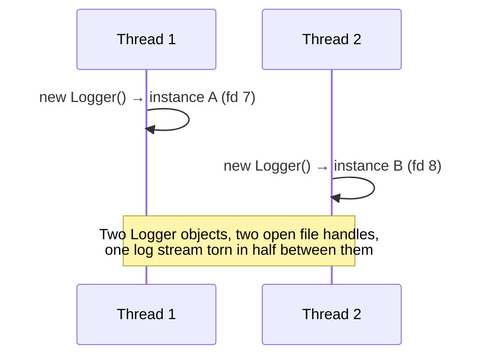
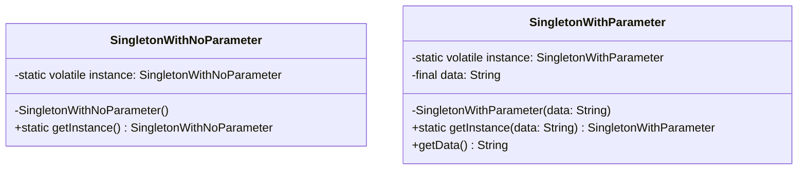

I once chased a bug where a config object had all the right values in local testing and came back with a null field under load. Same getInstance() call, same class, no code changed between runs. Took a day to realize the constructor was still running on another thread when a second thread read the reference. That's the entire Singleton pattern in one sentence: get object creation and visibility across threads right, or watch it come apart exactly when you can least afford it, under concurrent load.

## The problem

Some things in a system genuinely need to exist exactly once. A ParkingLot only makes sense if every Level and Slot resolves against the same instance, two threads racing to create it shouldn't end up tracking two separate sets of slots. Same story for a shared ID generator or a logger writing to one file. The problem isn't "how do I make a class instantiate only once" (that part's easy), it's making the lazy, first-call initialization safe when multiple threads hit getInstance() before the instance exists.

## Without the pattern

The obvious thing is a plain constructor, and letting every caller do `new Logger()` when it needs one. That works fine right up until two callers on two threads both need it around the same moment, and both find no instance yet, and both build one.

Nothing crashes. Nothing throws. You just quietly have two loggers writing to two file descriptors, or two ParkingLots each convinced they own the only copy of Level 3, and whichever one a given caller happened to grab depends on a race you didn't know you were running.

## With the pattern

The repo has two versions living side by side, SingletonWithNoParameter and SingletonWithParameter.

SingletonWithNoParameter keeps a private static volatile instance field and a private constructor, and getInstance() does the classic double-checked locking dance: check instance == null outside the lock first (so once it's built, every later caller skips synchronization entirely), synchronize only on the class object, then check == null again inside the lock before calling new SingletonWithNoParameter(). The volatile on that field isn't decorative. Without it the JVM is allowed to publish a reference to instance before the constructor has finished running on it, a second thread can see a non-null instance and start reading half-initialized fields off it. volatile forces the write to the reference to happen after the object is fully constructed, and forces every thread to read the current value instead of a stale cached one.

SingletonWithParameter is the same shape but carries state: a final String data field, set in the constructor and never touched again. Because data is final, there's deliberately no no-args constructor, a no-args constructor would leave data null and defeat the point of making it final. The catch with this version: getInstance(String data) only pays attention to data on the call that actually creates the instance. Call getInstance("production-db") first and getInstance("test-db") second, and the second call just hands back the same instance built with "production-db". Nothing about the parameter version pattern-matches, it's whichever thread wins the race to construct.

If you don't want to reason about any of this, an enum with a single INSTANCE constant gives you thread safety for free, the JVM guarantees enum constants are constructed exactly once. It's a legitimate escape hatch when your singleton doesn't need constructor parameters.

## What it costs you

You traded a five-second `new Logger()` for a private constructor, a volatile field, and a synchronized block that's easy to get subtly wrong, drop the volatile and the whole thing still compiles, still passes every single-threaded test, and only breaks under real concurrent load, which is the worst possible time to find out. It's also a global by another name: anything holding a reference to the singleton can be reached from anywhere, which makes unit tests harder (you can't just construct a fresh one per test without resetting static state) and hides a dependency that a constructor parameter would have made obvious. Use it because the correctness problem is real, not because "only one" sounds tidy.

## When to reach for it

Reach for it when a second instance would be a correctness bug, not just wasted memory, a second ParkingLot, a second IDGenerator handing out duplicate IDs, a second Logger writing to two different file handles. In an interview setting it's usually not worth spending the time on the double-checked locking ceremony unless the problem specifically calls for a shared instance, most of the time instantiating once in your Main/driver class and passing it around via constructor injection gets you the same guarantee for free.

## The takeaway

If you're doing lazy double-checked locking, the volatile keyword is not optional, it's the only thing stopping a second thread from reading a half-built object. If you don't want to think about memory visibility at all, use an enum and let the JVM handle it.

Read the full source on [GitHub](https://github.com/akisonlyforu/design-patterns/tree/master/src/creational/singleton).

[← Back to Creational Patterns](/interview/low-level-design/design-patterns/creational)
