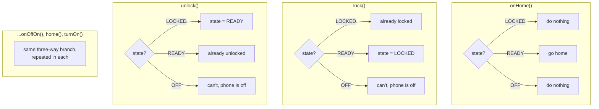
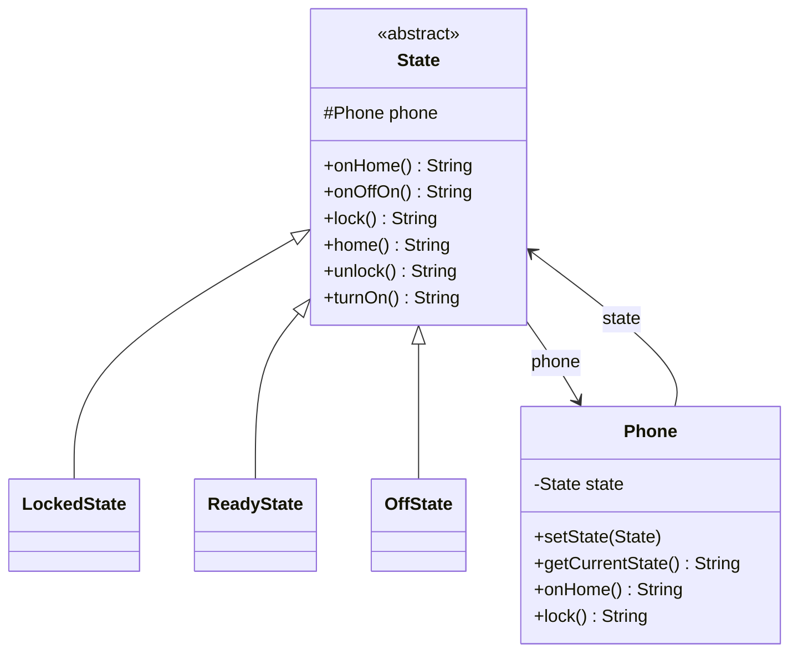

The tell that you need State instead of a pile of booleans is when you catch yourself writing "if locked and not off, do X, but if off do nothing, unless." Phone lock/unlock/power logic is the cleanest version of this I've seen: three states, six actions, and every action means something different depending on which state you're in.

## The problem

`Phone`'s behavior for the same six actions, `onHome`, `onOffOn`, `lock`, `home`, `unlock`, `turnOn`, is completely different depending on whether the phone is locked, ready, or off, and encoding that as conditionals inside `Phone` itself means every new state adds a branch to every single method.

## Without the pattern

The naive version keeps everything on `Phone` itself: one `state` field, probably an enum with three values, `LOCKED`, `READY`, `OFF`, and each of the six methods opens with a switch or an if/else chain on that field to figure out what it's actually supposed to do. `onHome()` checks: if locked, do nothing; if ready, go home; if off, do nothing. `lock()` does its own three-way check. `unlock()` does its own three-way check. `turnOn()` does its own. Six methods, three branches each, eighteen cases you have to keep straight in your head, and every one of them reads the same `state` field to decide both what to do and, sometimes, what to reassign that field to next.

The transitions aren't even localized to one place. `lock()`'s "if ready, set state to LOCKED" lives inside `lock()`, and `unlock()`'s "if locked, set state to READY" lives inside a completely different method, so there's no single spot that owns "how does this object move between states." It's smeared across six method bodies, each reassigning the same field from a different branch, and nothing stops two of those branches from disagreeing about what a legal transition even is.

Add a state, say `RINGING` for an incoming call, and you're not writing one new class, you're adding a fourth branch to all six existing switches. Miss one and the compiler won't warn you, you just find out at runtime that `turnOn()` silently no-ops on the state you forgot to handle.

## With the pattern

`State` is an abstract class holding a protected `Phone` reference and six abstract methods, one per action, so every concrete state has to answer all six, there's no partial implementation. `LockedState.unlock()` calls `phone.setState(new ReadyState(phone))` and returns a message, that's the actual transition: a state doesn't just describe behavior, it also decides the next state by constructing it and handing it to `phone.setState()`. `ReadyState.lock()` does the mirror transition into `LockedState`. `OffState.turnOn()` (and `onOffOn()`) both move into `ReadyState`, and note that `onHome()`/`lock()`/`home()`/`unlock()` on `OffState` all just return "can't do that, phone is off" strings without any state change, plenty of these six actions are simply invalid in a given state, and that's expressed as "do nothing but say why," not as an exception. `Phone` is the context, holding a single `State` field, and every one of its own public methods is a one-line delegation, `state.onHome()`, `state.lock()`, and so on, `Phone` never contains an if/else about what state it's in, it just asks the current state object. The file also sketches an alternative `IState`/`ConcreteState` shape with a settable context, worth noting only because "state holds a back-reference to its context" is the recurring shape, not the specific method names.

## What it costs you

The trade is that "what happens when I call X while in state Y" is no longer answerable by reading one method top to bottom. Locked's response to `unlock()` lives in `LockedState.java`, Ready's response to `lock()` lives in `ReadyState.java`, Off's response to everything lives in `OffState.java`, so tracing a bug means opening the specific state class, not scrolling to the third branch of a switch statement inside `Phone`. That's fine when you already know which state you're chasing, it's slower when a bug report just says "user pressed home and nothing happened" and you don't yet know which of three files owns that behavior. You've swapped eighteen branches jammed into six methods for six classes each answering the same six questions, each one small and easy to reason about in isolation, but the full picture of "everything Phone can do" no longer exists in one place, you have to mentally assemble it from N files instead of reading it off one method.

## When to reach for it

Any entity whose valid operations, and their outcomes, depend on which stage of a lifecycle it's currently in: vending machines, elevators, order status, connection states. If the behavior differs per state rather than per client-chosen algorithm, that's State, not Strategy.

## The takeaway

Watch for state explosion. Three states and six methods, like this example, is fine, but a state machine with a dozen states each implementing a dozen methods gets unwieldy fast. If most transitions and behaviors are actually shared and only one or two methods differ, you might be overpaying for a full `State` object per state.

Read the full source on [GitHub](https://github.com/akisonlyforu/design-patterns/tree/master/src/behavioral/state).

[← Back to Behavioral Patterns](/interview/low-level-design/design-patterns/behavioral)
