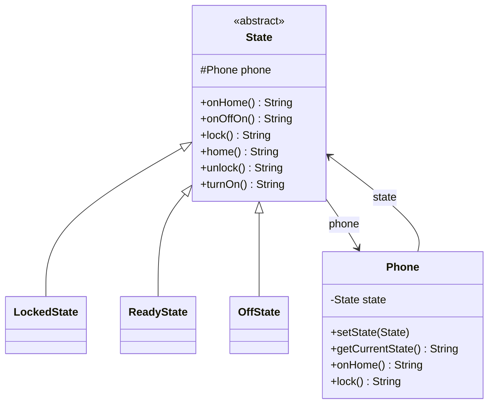

The tell that you need State instead of a pile of booleans is when you catch yourself writing "if locked and not off, do X, but if off do nothing, unless." Phone lock/unlock/power logic is the cleanest version of this I've seen: three states, six actions, and every action means something different depending on which state you're in.

## The problem

`Phone`'s behavior for the same six actions, `onHome`, `onOffOn`, `lock`, `home`, `unlock`, `turnOn`, is completely different depending on whether the phone is locked, ready, or off, and encoding that as conditionals inside `Phone` itself means every new state adds a branch to every single method.

## How it's built

`State` is an abstract class holding a protected `Phone` reference and six abstract methods, one per action, so every concrete state has to answer all six, there's no partial implementation. `LockedState.unlock()` calls `phone.setState(new ReadyState(phone))` and returns a message, that's the actual transition: a state doesn't just describe behavior, it also decides the next state by constructing it and handing it to `phone.setState()`. `ReadyState.lock()` does the mirror transition into `LockedState`. `OffState.turnOn()` (and `onOffOn()`) both move into `ReadyState`, and note that `onHome()`/`lock()`/`home()`/`unlock()` on `OffState` all just return "can't do that, phone is off" strings without any state change, plenty of these six actions are simply invalid in a given state, and that's expressed as "do nothing but say why," not as an exception. `Phone` is the context, holding a single `State` field, and every one of its own public methods is a one-line delegation, `state.onHome()`, `state.lock()`, and so on, `Phone` never contains an if/else about what state it's in, it just asks the current state object. The file also sketches an alternative `IState`/`ConcreteState` shape with a settable context, worth noting only because "state holds a back-reference to its context" is the recurring shape, not the specific method names.

## When to reach for it

Any entity whose valid operations, and their outcomes, depend on which stage of a lifecycle it's currently in: vending machines, elevators, order status, connection states. If the behavior differs per state rather than per client-chosen algorithm, that's State, not Strategy.

## The takeaway

Watch for state explosion. Three states and six methods, like this example, is fine, but a state machine with a dozen states each implementing a dozen methods gets unwieldy fast. If most transitions and behaviors are actually shared and only one or two methods differ, you might be overpaying for a full `State` object per state.

[← Back to Behavioral Patterns](/interview/low-level-design/design-patterns/behavioral)
