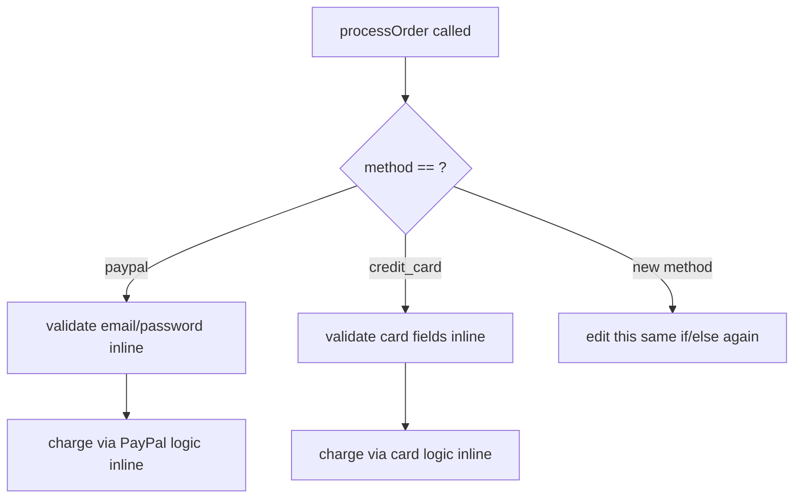
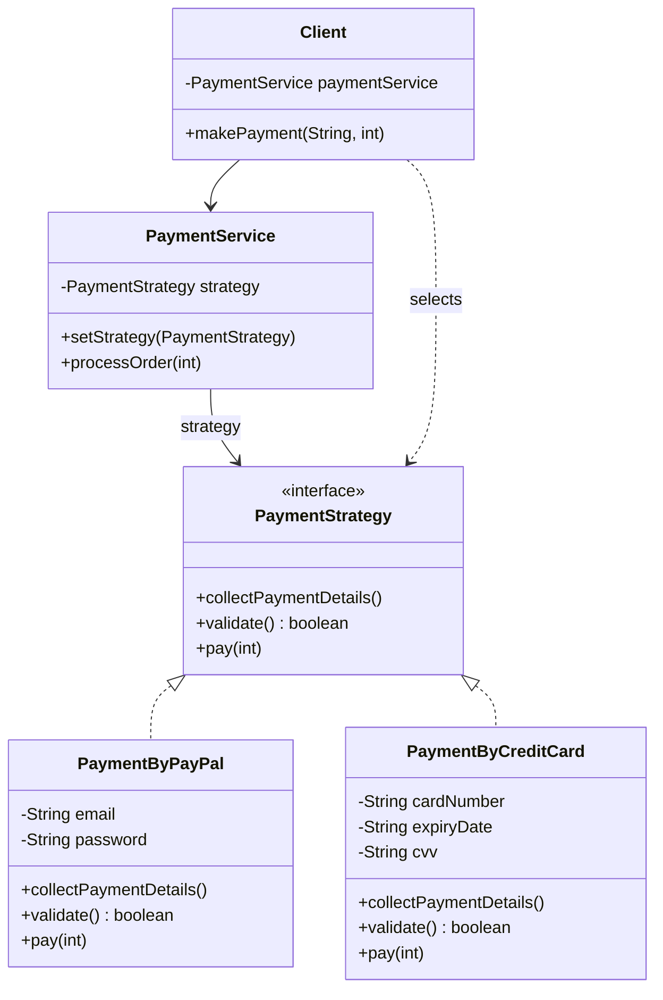

Every payments codebase I've touched eventually needs a second payment method, and the ones that started with a big if/else on a string end up rewriting that same if/else in three more places by the time a fourth method shows up. Strategy's whole job is making sure that growth costs you a new class, not a new branch in five existing ones.

## The problem

`PaymentService` needs to process an order using whichever payment method the client picked, PayPal, credit card, whatever comes next, without `processOrder()` itself knowing anything about how a given method actually validates or charges.

## Without the pattern

The naive version skips the `PaymentStrategy` interface entirely. `PaymentService.processOrder()` just carries a payment-method string and an if/else (or a switch) sitting right there in the method body: if it's "paypal", validate `email`/`password` inline and charge through PayPal's flow, else if it's "credit_card", validate `cardNumber`/`expiryDate`/`cvv` inline and charge through the card flow. All those fields, PayPal's and the card's and whatever the next method needs, end up living directly on `PaymentService`, whether or not the current call is even using them.

Fine for two methods. But every new payment method means going back into `PaymentService.processOrder()` and adding another arm, and `processOrder()` has quietly picked up a dependency on the validation rules of every payment type it supports, PayPal's password check, the card's CVV format, all of it living inside the one method that's supposed to just be orchestrating "validate then pay." That coupling, one class that has to change every time the set of algorithms changes, is exactly what the interface below exists to cut.

## With the pattern

`PaymentStrategy` is the contract: `collectPaymentDetails()`, `validate()`, `pay(int)`. `PaymentByPayPal` and `PaymentByCreditCard` both implement it with their own fields (`email`/`password` for PayPal, `cardNumber`/`expiryDate`/`cvv`/`cardHolderName` for the card), and both route `pay()` through their own `validate()` first, so validation logic lives with the strategy that owns the fields it's validating, not in some shared `PaymentService` method. `PaymentService` is the context, holding a single `PaymentStrategy` field, `setStrategy()` swaps it, `processOrder()` calls `collectPaymentDetails()` then `pay()` on whatever strategy is currently set, with zero knowledge of PayPal or credit cards. `Client.makePayment(String, int)` is where selection actually happens, a switch on the payment method string constructs the right `PaymentStrategy` and hands it to `paymentService.setStrategy()` before calling `processOrder()`, that switch is the one place in the whole system that has to know all the concrete strategy types, everything downstream only sees the interface. The file also keeps a bare-bones `IStrategy`/`ConcreteStrategy` pair around as a simpler illustration of the same shape without the payment-specific methods.

## What it costs you

Every new payment method is now a new class, `PaymentByPayPal`, `PaymentByCreditCard`, and whatever comes third, each carrying its own fields and its own `validate()`/`pay()`, which for two variants is more files and more boilerplate than the if/else it replaced. The branching didn't disappear either, it moved: `Client.makePayment()` still has to know every concrete strategy type that exists so it can construct the right one and pass it to `setStrategy()` before `processOrder()` runs. You've traded "the if/else lives in the class that uses it" for "the if/else lives in whatever code is responsible for wiring things up," and the caller now has to know about and instantiate a class it never had to think about before. For a system that will only ever have PayPal and credit cards, that's real indirection paid for a problem you don't have yet, a two-line if/else would've been faster to write and just as easy to read.

## When to reach for it

Whenever you need to swap an algorithm at runtime and the algorithms genuinely differ in behavior, not just in values. Strategy generally comes in three shapes: a comparator cascade (rank candidates), a first-success cascade (try each until one works), or a contributor list (combine results from all of them). This example is closer to "client picks exactly one," which is a valid, simpler use of the same interface.

One shape this example doesn't show, but worth keeping in your pocket: using Strategy to pry a *complex* algorithm loose from the data structure it runs over, so the two move on independent axes. A document editor keeping its line-breaking out of the document tree is the classic case, swap the formatter without touching the tree, add an element type without touching the formatter. Same interface, a richer reason to reach for it: [Designing a Document Editor](/interview/low-level-design/problems/document-editor).

## The takeaway

If your "strategies" only differ by which numbers they plug into the same formula, you don't need Strategy, you need a config table. Reach for the interface only when the actual logic changes between implementations, not just the inputs.

Read the full source on [GitHub](https://github.com/akisonlyforu/design-patterns/tree/master/src/behavioral/strategy).

[← Back to Behavioral Patterns](/interview/low-level-design/design-patterns/behavioral)
