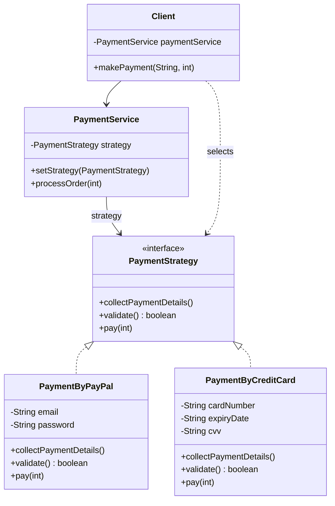

Every payments codebase I've touched eventually needs a second payment method, and the ones that started with a big if/else on a string end up rewriting that same if/else in three more places by the time a fourth method shows up. Strategy's whole job is making sure that growth costs you a new class, not a new branch in five existing ones.

## The problem

`PaymentService` needs to process an order using whichever payment method the client picked, PayPal, credit card, whatever comes next, without `processOrder()` itself knowing anything about how a given method actually validates or charges.

## How it's built

`PaymentStrategy` is the contract: `collectPaymentDetails()`, `validate()`, `pay(int)`. `PaymentByPayPal` and `PaymentByCreditCard` both implement it with their own fields (`email`/`password` for PayPal, `cardNumber`/`expiryDate`/`cvv`/`cardHolderName` for the card), and both route `pay()` through their own `validate()` first, so validation logic lives with the strategy that owns the fields it's validating, not in some shared `PaymentService` method. `PaymentService` is the context, holding a single `PaymentStrategy` field, `setStrategy()` swaps it, `processOrder()` calls `collectPaymentDetails()` then `pay()` on whatever strategy is currently set, with zero knowledge of PayPal or credit cards. `Client.makePayment(String, int)` is where selection actually happens, a switch on the payment method string constructs the right `PaymentStrategy` and hands it to `paymentService.setStrategy()` before calling `processOrder()`, that switch is the one place in the whole system that has to know all the concrete strategy types, everything downstream only sees the interface. The file also keeps a bare-bones `IStrategy`/`ConcreteStrategy` pair around as a simpler illustration of the same shape without the payment-specific methods.

## When to reach for it

Whenever you need to swap an algorithm at runtime and the algorithms genuinely differ in behavior, not just in values. Strategy generally comes in three shapes: a comparator cascade (rank candidates), a first-success cascade (try each until one works), or a contributor list (combine results from all of them). This example is closer to "client picks exactly one," which is a valid, simpler use of the same interface.

## The takeaway

If your "strategies" only differ by which numbers they plug into the same formula, you don't need Strategy, you need a config table. Reach for the interface only when the actual logic changes between implementations, not just the inputs.

Read the full source on [GitHub](https://github.com/akisonlyforu/design-patterns/tree/master/src/behavioral/strategy).

[← Back to Behavioral Patterns](/interview/low-level-design/design-patterns/behavioral)
