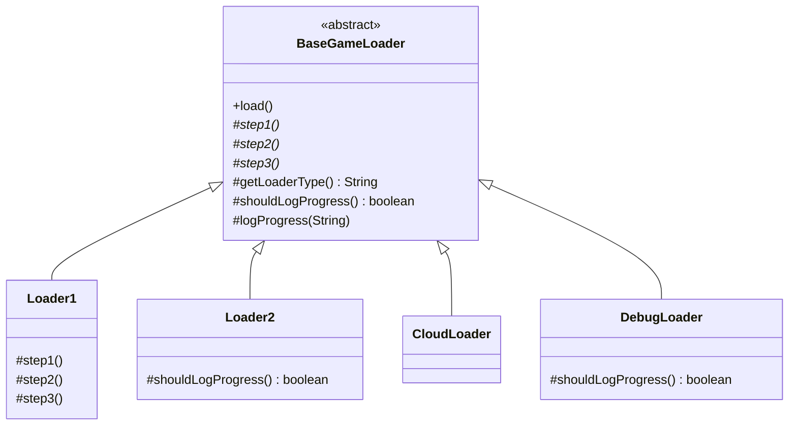

I've rewritten the same "load config, load assets, connect network" skeleton across several loader classes before, log line for log line, before noticing only the middle of each step was actually different. Template Method exists so you write that skeleton exactly once.

## The problem

`Loader1`, `Loader2`, `CloudLoader`, and `DebugLoader` all share the same overall loading sequence, three steps in a fixed order with a header and footer log around them, but each one's actual step logic differs, and you don't want that shared skeleton copy-pasted four times with only the middle changed.

## How it's built

`BaseGameLoader.load()` is declared `final`, deliberately, it's the one method nobody gets to override. It prints a header using `getLoaderType()`, calls `step1()`, `step2()`, `step3()` in that fixed order, then prints a footer. `step1`/`step2`/`step3` are abstract, every subclass must supply them, that's the part of the algorithm that has to vary. `getLoaderType()` and `shouldLogProgress()` are hook methods, they have default implementations on `BaseGameLoader` but subclasses can override them, `Loader2` overrides `shouldLogProgress()` to return false because it doesn't want verbose logging, `DebugLoader` overrides it to explicitly return true, `Loader1` and `CloudLoader` just inherit the default. `logProgress(String)` is a concrete helper on the base class that checks `shouldLogProgress()` before printing, so hook methods aren't just decoration, they actually gate behavior inside a method the subclass never touches directly. Each concrete loader, `Loader1` (database-flavored), `Loader2` (filesystem-flavored, quiet), `CloudLoader` (cloud auth and sync), `DebugLoader` (verbose, always logs), implements the three abstract steps with completely different content but goes through the exact same `load()` sequence, which is the guarantee this pattern sells: the order can never drift between loaders because it isn't any individual loader's to control.

## When to reach for it

A family of classes that share the same overall algorithm shape but differ in a handful of steps: ETL pipelines, framework lifecycle hooks, test setup and teardown. If the variation is closer to "swap the whole algorithm" than "override a couple of steps in a fixed skeleton," you probably want Strategy (composition) instead of Template Method (inheritance).

## The takeaway

Template Method locks the algorithm's shape down using inheritance, which means every loader is permanently tied to `BaseGameLoader`, you can't swap the skeleton itself at runtime the way you could swap a Strategy. That's fine when the skeleton really is fixed, it's a liability the moment you discover you need two different skeletons.

[← Back to Behavioral Patterns](/interview/low-level-design/design-patterns/behavioral)
