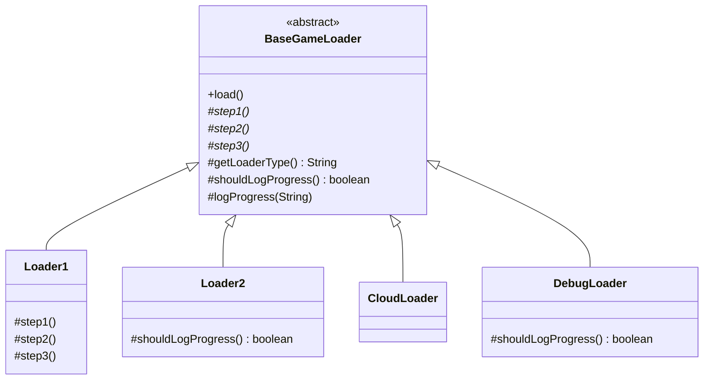

I've rewritten the same "load config, load assets, connect network" skeleton across several loader classes before, log line for log line, before noticing only the middle of each step was actually different. Template Method exists so you write that skeleton exactly once.

## The problem

`Loader1`, `Loader2`, `CloudLoader`, and `DebugLoader` all share the same overall loading sequence, three steps in a fixed order with a header and footer log around them, but each one's actual step logic differs, and you don't want that shared skeleton copy-pasted four times with only the middle changed.

## Without the pattern

Before there's a `BaseGameLoader`, the obvious move is to give `Loader1`, `Loader2`, `CloudLoader`, and `DebugLoader` each their own `load()` method, header log line, three loading steps specific to that loader, footer log line, typed out top to bottom in every class. It compiles, it works, and for about a day it's fine. Then someone notices the header log is missing a timestamp and fixes it in `Loader1`'s copy, ships it, moves on to the next ticket. `Loader2`, `CloudLoader`, and `DebugLoader` still print the old header, because nobody grepped for every place that line got typed out by hand, and there's no shared method to have fixed instead. The bug isn't wrong logic anymore, it's correct logic sitting in three places and stale logic sitting in a fourth, and the four loaders will keep drifting apart every time this happens again.

Four copies of the same skeleton, one of them patched, three of them quietly stale, and nothing in the code tells you which is which until someone diffs them by hand.

## With the pattern

`BaseGameLoader.load()` is declared `final`, deliberately, it's the one method nobody gets to override. It prints a header using `getLoaderType()`, calls `step1()`, `step2()`, `step3()` in that fixed order, then prints a footer. `step1`/`step2`/`step3` are abstract, every subclass must supply them, that's the part of the algorithm that has to vary. `getLoaderType()` and `shouldLogProgress()` are hook methods, they have default implementations on `BaseGameLoader` but subclasses can override them, `Loader2` overrides `shouldLogProgress()` to return false because it doesn't want verbose logging, `DebugLoader` overrides it to explicitly return true, `Loader1` and `CloudLoader` just inherit the default. `logProgress(String)` is a concrete helper on the base class that checks `shouldLogProgress()` before printing, so hook methods aren't just decoration, they actually gate behavior inside a method the subclass never touches directly. Each concrete loader, `Loader1` (database-flavored), `Loader2` (filesystem-flavored, quiet), `CloudLoader` (cloud auth and sync), `DebugLoader` (verbose, always logs), implements the three abstract steps with completely different content but goes through the exact same `load()` sequence, which is the guarantee this pattern sells: the order can never drift between loaders because it isn't any individual loader's to control.

## What it costs you

This is inheritance doing the work, and inheritance gets fixed at compile time: `BaseGameLoader` decides which pieces are hooks, `step1`, `step2`, `step3`, `getLoaderType()`, `shouldLogProgress()`, and a subclass only gets to customize exactly those, nothing more. If `Loader1` ever needs to skip `step2` for certain inputs, or run `step1` twice, or slot a fourth step between `step2` and `step3`, there's no clean way to do it without touching `BaseGameLoader` itself, because the shape of `load()` isn't visible to any subclass, let alone changeable from one. That's the one place GoF quietly breaks its own favor-composition-over-inheritance advice, Template Method is inheritance by design, and the tradeoff is real: you get a skeleton that literally cannot drift between loaders, in exchange for a skeleton that also cannot bend per loader. Discover halfway through a project that `CloudLoader` actually needs a different algorithm shape, not just different steps, and you're not extending `BaseGameLoader` anymore, you're editing it out from under every other loader that depends on it.

## When to reach for it

A family of classes that share the same overall algorithm shape but differ in a handful of steps: ETL pipelines, framework lifecycle hooks, test setup and teardown. If the variation is closer to "swap the whole algorithm" than "override a couple of steps in a fixed skeleton," you probably want Strategy (composition) instead of Template Method (inheritance).

## The takeaway

Template Method locks the algorithm's shape down using inheritance, which means every loader is permanently tied to `BaseGameLoader`, you can't swap the skeleton itself at runtime the way you could swap a Strategy. That's fine when the skeleton really is fixed, it's a liability the moment you discover you need two different skeletons.

Read the full source on [GitHub](https://github.com/akisonlyforu/design-patterns/tree/master/src/behavioral/template).

[← Back to Behavioral Patterns](/interview/low-level-design/design-patterns/behavioral)
