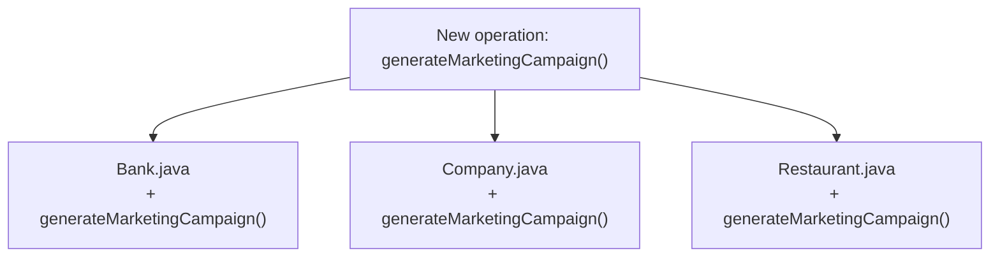
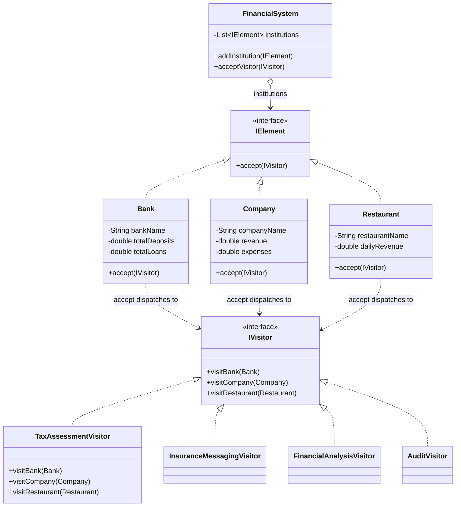

The first time I needed to add a new report across `Bank`, `Company`, and `Restaurant` classes that already existed, say a marketing-campaign generator, I didn't want to touch any of those three classes to bolt on another method each. Visitor is what lets you add that operation from the outside, at the cost of a mechanic that trips up almost everyone the first time they read it: double dispatch.

## The problem

`Bank`, `Company`, and `Restaurant` need several unrelated operations run against them, tax assessment, insurance messaging, financial analysis, audits, and you don't want each of those bolted directly onto the element classes as more and more methods pile up on `Bank`/`Company`/`Restaurant` every time someone invents a new report.

## Without the pattern

The naive way to add tax assessment, insurance messaging, financial analysis, and audits to `Bank`, `Company`, and `Restaurant` is to just put a method for each directly on each class, `Bank.calculateTax()`, `Bank.generateInsuranceMessage()`, `Bank.analyzeFinancials()`, `Bank.audit()`, then the same four methods again on `Company`, then again on `Restaurant`. That works fine right up until the first time someone needs a fifth operation, say the marketing-campaign generator from the intro. Now you're opening `Bank.java` to add `generateMarketingCampaign()`, opening `Company.java` to add it there too, opening `Restaurant.java` to add it a third time. Three element types here, so three edits, but the pattern doesn't scale with how many operations you started with, it scales with how many classes exist in the hierarchy, and that number only grows as the domain grows. A `CreditUnion` class shows up eight months later and every operation anyone has ever written needs a matching method bolted onto it before it compiles into anything useful.

Nothing here is technically wrong, it's just that the edit fans out to every single class every single time, and there's no way to add the operation without touching code you didn't write and might not fully understand.

## With the pattern

`IElement` declares one method, `accept(IVisitor)`, and `Bank`/`Company`/`Restaurant` all implement it identically in shape, `visitor.visitBank(this)` (or `visitCompany`/`visitRestaurant` respectively). `IVisitor` declares one method per element type, `visitBank(Bank)`, `visitCompany(Company)`, `visitRestaurant(Restaurant)`. That `accept()`/`visitX()` pair is the double dispatch: calling `element.accept(visitor)` first dispatches on `element`'s runtime type (which `accept()` implementation runs), and inside that method, `visitor.visitBank(this)` dispatches a second time on `visitor`'s runtime type, so the method that actually executes depends on both types at once, not just one, which is exactly why there's no `instanceof` anywhere in this code. `TaxAssessmentVisitor`, `InsuranceMessagingVisitor`, `FinancialAnalysisVisitor`, and `AuditVisitor` are four completely different operations implementing the same `IVisitor` contract, `TaxAssessmentVisitor.visitBank()` taxes deposits-minus-loans at 25%, `visitCompany()` taxes profit at 30%, `visitRestaurant()` taxes annualized daily profit at 20%, three different formulas, one visitor, no changes to `Bank`/`Company`/`Restaurant` needed to add it. `FinancialSystem` is the object structure, a `List<IElement>`, `acceptVisitor(IVisitor)` just loops calling `institution.accept(visitor)` on everything it holds, that's the single fan-out point for any visitor you write. The test file's `CreditUnion` class shows the pattern's real cost directly: it's a new `IElement`, but `IVisitor`'s interface has no `visitCreditUnion()` method, so `CreditUnion.accept()` can't dispatch anywhere, it just prints that it can't. Adding a new element type means touching every existing visitor, not just adding one class.

## What it costs you

Visitor doesn't remove the maintenance burden, it inverts which axis carries it. Add a new element type, `CreditUnion` say, and you're not editing one class, you're editing every existing visitor, `TaxAssessmentVisitor`, `InsuranceMessagingVisitor`, `FinancialAnalysisVisitor`, `AuditVisitor`, plus the `IVisitor` interface itself, to add a `visitCreditUnion()` method nobody had to write before. It also requires `Bank`/`Company`/`Restaurant` to expose enough of their internals, deposits, loans, revenue, expenses, for a visitor sitting outside the class to actually compute anything against them, which is a hole in encapsulation you wouldn't need if the logic just lived inside the class. And the double-dispatch mechanics, `element.accept(visitor)` calling back into `visitor.visitBank(this)`, read like an infinite loop the first time you trace them by hand, it takes real effort to see that the two calls dispatch on two different runtime types and the recursion never actually recurs, it just looks like it should.

## When to reach for it

A stable set of element types that rarely changes, but a growing set of unrelated operations you want to run against them: compilers walking an AST, document exporters, reporting across a fixed set of domain objects. If new element types show up more often than new operations, invert your thinking, Visitor is the wrong shape, you'll be touching every visitor on every new element.

## The takeaway

Visitor trades "adding an operation is free" for "adding an element type is expensive," it's a deliberate bet on which axis of change is more likely in your domain. Know which axis actually moves before you commit to it, guessing wrong means rewriting every visitor class you've already written.

Read the full source on [GitHub](https://github.com/akisonlyforu/design-patterns/tree/master/src/behavioral/visitor).

[← Back to Behavioral Patterns](/interview/low-level-design/design-patterns/behavioral)
