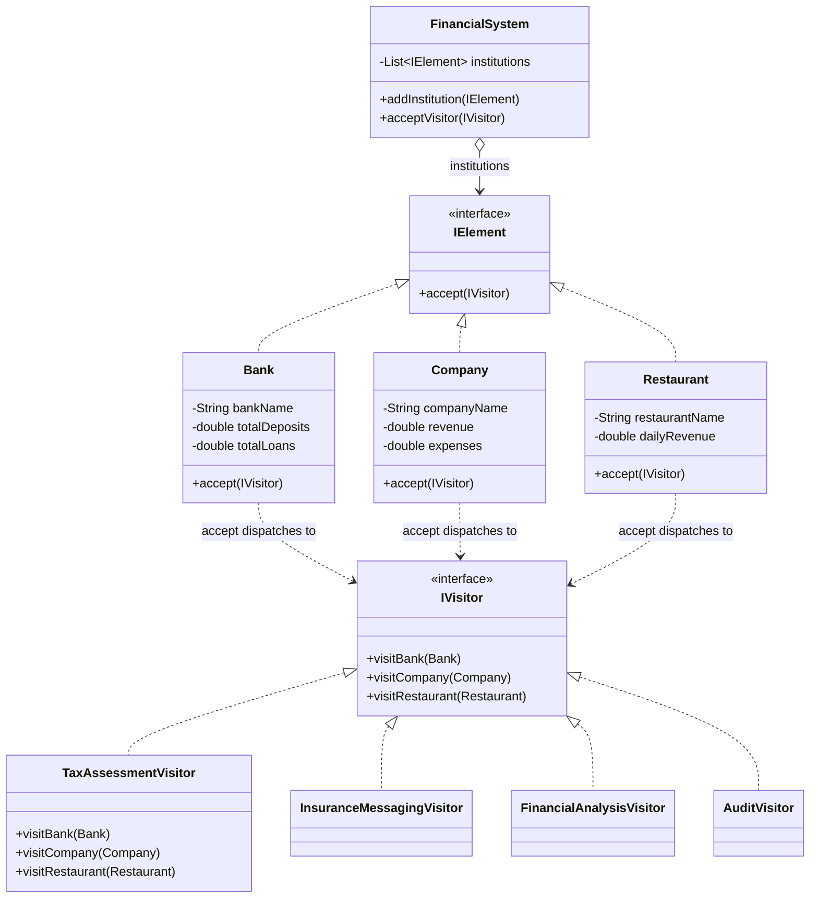

The first time I needed to add a new report across `Bank`, `Company`, and `Restaurant` classes that already existed, say a marketing-campaign generator, I didn't want to touch any of those three classes to bolt on another method each. Visitor is what lets you add that operation from the outside, at the cost of a mechanic that trips up almost everyone the first time they read it: double dispatch.

## The problem

`Bank`, `Company`, and `Restaurant` need several unrelated operations run against them, tax assessment, insurance messaging, financial analysis, audits, and you don't want each of those bolted directly onto the element classes as more and more methods pile up on `Bank`/`Company`/`Restaurant` every time someone invents a new report.

## How it's built

`IElement` declares one method, `accept(IVisitor)`, and `Bank`/`Company`/`Restaurant` all implement it identically in shape, `visitor.visitBank(this)` (or `visitCompany`/`visitRestaurant` respectively). `IVisitor` declares one method per element type, `visitBank(Bank)`, `visitCompany(Company)`, `visitRestaurant(Restaurant)`. That `accept()`/`visitX()` pair is the double dispatch: calling `element.accept(visitor)` first dispatches on `element`'s runtime type (which `accept()` implementation runs), and inside that method, `visitor.visitBank(this)` dispatches a second time on `visitor`'s runtime type, so the method that actually executes depends on both types at once, not just one, which is exactly why there's no `instanceof` anywhere in this code. `TaxAssessmentVisitor`, `InsuranceMessagingVisitor`, `FinancialAnalysisVisitor`, and `AuditVisitor` are four completely different operations implementing the same `IVisitor` contract, `TaxAssessmentVisitor.visitBank()` taxes deposits-minus-loans at 25%, `visitCompany()` taxes profit at 30%, `visitRestaurant()` taxes annualized daily profit at 20%, three different formulas, one visitor, no changes to `Bank`/`Company`/`Restaurant` needed to add it. `FinancialSystem` is the object structure, a `List<IElement>`, `acceptVisitor(IVisitor)` just loops calling `institution.accept(visitor)` on everything it holds, that's the single fan-out point for any visitor you write. The test file's `CreditUnion` class shows the pattern's real cost directly: it's a new `IElement`, but `IVisitor`'s interface has no `visitCreditUnion()` method, so `CreditUnion.accept()` can't dispatch anywhere, it just prints that it can't. Adding a new element type means touching every existing visitor, not just adding one class.

## When to reach for it

A stable set of element types that rarely changes, but a growing set of unrelated operations you want to run against them: compilers walking an AST, document exporters, reporting across a fixed set of domain objects. If new element types show up more often than new operations, invert your thinking, Visitor is the wrong shape, you'll be touching every visitor on every new element.

## The takeaway

Visitor trades "adding an operation is free" for "adding an element type is expensive," it's a deliberate bet on which axis of change is more likely in your domain. Know which axis actually moves before you commit to it, guessing wrong means rewriting every visitor class you've already written.

[← Back to Behavioral Patterns](/interview/low-level-design/design-patterns/behavioral)
