# Low Level Design

Object-oriented design and clean architecture principles.

## Framework

- [What do you actually do in a LLD Interview?](/interview/low-level-design/lld-framework)
  - **Patterns** (deep dives per variation type)
    - [Strategy Variation Playbook](/interview/low-level-design/patterns/strategy-variation)
      - **Problems**
        - [Parking Lot](/interview/low-level-design/problems/parking-lot)
        - [Movie Ticket Booking](/interview/low-level-design/problems/movie-ticket-booking)
        - [Delivery Agent Assignment](/interview/low-level-design/problems/delivery-agent-assignment)
        - [Ride Sharing](/interview/low-level-design/problems/ride-sharing)
        - [Pluggable Eviction Cache](/interview/low-level-design/problems/pluggable-eviction-cache)
        - [Rate Limiter](/interview/low-level-design/problems/rate-limiter)
        - [Splitwise](/interview/low-level-design/problems/splitwise)
        - [Twitter Feed](/interview/low-level-design/problems/twitter-feed)
    - [State Variation Playbook](/interview/low-level-design/patterns/state-variation)
      - **Problems**
        - [Food Delivery](/interview/low-level-design/problems/food-delivery)
        - [Vending Machine](/interview/low-level-design/problems/vending-machine)
    - [Command Variation Playbook](/interview/low-level-design/patterns/command-variation)
      - **Problems**
        - [Pub-Sub Message Queue](/interview/low-level-design/problems/pub-sub-message-queue)
        - [Text Editor](/interview/low-level-design/problems/text-editor)
    - [Rule-Chain Variation Playbook](/interview/low-level-design/patterns/rule-chain-variation)
      - **Problems**
        - [Chess](/interview/low-level-design/problems/chess)
        - [Online Shopping](/interview/low-level-design/problems/online-shopping)
    - [Data-Driven Variation Playbook](/interview/low-level-design/patterns/data-driven-variation)
      - **Problems**
        - [Snake & Ladder](/interview/low-level-design/problems/snake-and-ladder)
        - [Coffee Machine](/interview/low-level-design/problems/coffee-machine)
        - [Stack Overflow](/interview/low-level-design/problems/stack-overflow)
        - [Task Planner](/interview/low-level-design/problems/task-planner)
    - [Structure-Driven Problems Playbook](/interview/low-level-design/patterns/structure-driven)
      - **Problems**
        - [LRU Cache](/interview/low-level-design/problems/lru-cache)
        - [Stock Exchange Matching](/interview/low-level-design/problems/stock-exchange-matching)

## Concepts

- **[Design Patterns](#design-patterns)**, all 26, Creational/Structural/Behavioral, full writeups below.

Coming soon...

- **SOLID**
  - Single Responsibility
  - Open/Closed
  - Liskov Substitution
  - Interface Segregation
  - Dependency Inversion
- UML Diagrams
- Class Design
- Interface Design
- Dependency Injection
- Clean Code Practices
- Code Refactoring

## Design Patterns

These aren't from a textbook chapter I read once. Every pattern below is a small Java package I've actually written, tested, and broken at least once, `singleton.java` threw a null under load before I put the `volatile` back in, the object pool test file still fakes an expensive constructor with a 50ms sleep because that's the honest way to demo one without a real database sitting behind it. 26 patterns, three buckets: how you build objects (Creational), how you wire them into bigger structures (Structural), how they talk to each other (Behavioral). Each one below has the real class diagram, pulled from the actual source in [design-patterns/src](https://github.com/akisonlyforu/design-patterns), not a redrawn textbook version. If you haven't read the [LLD framework](#framework) above yet, do that first, these patterns are the vocabulary, that framework is when to actually reach for one.

**Creational**
- [Singleton](#singleton)
- [Factory Method](#factory-method)
- [Abstract Factory](#abstract-factory)
- [Builder](#builder)
- [Prototype](#prototype)
- [Object Pool](#object-pool)

**Structural**
- [Adapter](#adapter)
- [Bridge](#bridge)
- [Composite](#composite)
- [Decorator](#decorator)
- [Facade](#facade)
- [Flyweight](#flyweight)
- [Private Class Data](#private-class-data)
- [Proxy](#proxy)

**Behavioral**
- [Chain of Responsibility](#chain-of-responsibility)
- [Command](#command)
- [Interpreter](#interpreter)
- [Iterator](#iterator)
- [Mediator](#mediator)
- [Memento](#memento)
- [Null Object](#null-object)
- [Observer](#observer)
- [State](#state)
- [Strategy](#strategy)
- [Template Method](#template-method)
- [Visitor](#visitor)

### Creational Patterns

Object creation control. When making an object is expensive, or the exact type isn't known until runtime, or you need exactly one instance, exactly one family of related instances, or a fast supply of near-identical copies, one of these six covers it.

#### Singleton

I once chased a bug where a config object had all the right values in local testing and came back with a null field under load. Same getInstance() call, same class, no code changed between runs. Took a day to realize the constructor was still running on another thread when a second thread read the reference. That's the entire Singleton pattern in one sentence: get object creation and visibility across threads right, or watch it come apart exactly when you can least afford it, under concurrent load.

##### The problem

Some things in a system genuinely need to exist exactly once. A ParkingLot only makes sense if every Level and Slot resolves against the same instance, two threads racing to create it shouldn't end up tracking two separate sets of slots. Same story for a shared ID generator or a logger writing to one file. The problem isn't "how do I make a class instantiate only once" (that part's easy), it's making the lazy, first-call initialization safe when multiple threads hit getInstance() before the instance exists.

##### How it's built

The repo has two versions living side by side, SingletonWithNoParameter and SingletonWithParameter.

SingletonWithNoParameter keeps a private static volatile instance field and a private constructor, and getInstance() does the classic double-checked locking dance: check instance == null outside the lock first (so once it's built, every later caller skips synchronization entirely), synchronize only on the class object, then check == null again inside the lock before calling new SingletonWithNoParameter(). The volatile on that field isn't decorative. Without it the JVM is allowed to publish a reference to instance before the constructor has finished running on it, a second thread can see a non-null instance and start reading half-initialized fields off it. volatile forces the write to the reference to happen after the object is fully constructed, and forces every thread to read the current value instead of a stale cached one.

SingletonWithParameter is the same shape but carries state: a final String data field, set in the constructor and never touched again. Because data is final, there's deliberately no no-args constructor, a no-args constructor would leave data null and defeat the point of making it final. The catch with this version: getInstance(String data) only pays attention to data on the call that actually creates the instance. Call getInstance("production-db") first and getInstance("test-db") second, and the second call just hands back the same instance built with "production-db". Nothing about the parameter version pattern-matches, it's whichever thread wins the race to construct.

If you don't want to reason about any of this, an enum with a single INSTANCE constant gives you thread safety for free, the JVM guarantees enum constants are constructed exactly once. It's a legitimate escape hatch when your singleton doesn't need constructor parameters.

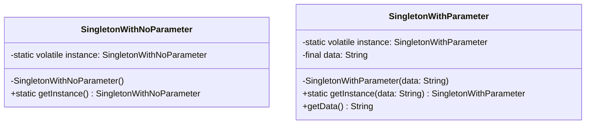
```mermaid
classDiagram
    class SingletonWithNoParameter {
        -static volatile instance: SingletonWithNoParameter
        -SingletonWithNoParameter()
        +static getInstance() SingletonWithNoParameter
    }
    class SingletonWithParameter {
        -static volatile instance: SingletonWithParameter
        -final data: String
        -SingletonWithParameter(data: String)
        +static getInstance(data: String) SingletonWithParameter
        +getData() String
    }
```

##### When to reach for it

Reach for it when a second instance would be a correctness bug, not just wasted memory, a second ParkingLot, a second IDGenerator handing out duplicate IDs, a second Logger writing to two different file handles. In an interview setting it's usually not worth spending the time on the double-checked locking ceremony unless the problem specifically calls for a shared instance, most of the time instantiating once in your Main/driver class and passing it around via constructor injection gets you the same guarantee for free.

##### The takeaway

If you're doing lazy double-checked locking, the volatile keyword is not optional, it's the only thing stopping a second thread from reading a half-built object. If you don't want to think about memory visibility at all, use an enum and let the JVM handle it.

#### Factory Method

I've seen the same if/else ladder for "which media player class do I instantiate" copy-pasted into three different callers in the same codebase, one of them missing the VLC branch entirely because whoever wrote it didn't know it existed. Factory Method exists so that ladder lives in exactly one place.

##### The problem

Client code shouldn't need to know the full list of concrete classes that implement an interface, and it definitely shouldn't have that decision logic duplicated everywhere a new instance is needed. When the type to construct is picked at runtime, based on a string, a config value, whatever, you want one method owning that decision.

##### How it's built

MediaPlayer is the product interface, one method, playSong(). WindowsMediaPlayer and VlcMediaPlayer are the two concrete implementations, each just prints which player is doing the playing.

MediaPlayerFactory.getMediaPlayer(String mediaPlayerType) is the whole pattern. It defines VLC_PLAYER and WINDOWS_PLAYER as public static final constants so callers aren't passing around raw string literals, normalizes the input with mediaPlayerType.toUpperCase() so "vlc", "VLC", and "Vlc" all resolve the same concrete class, and switches on the normalized value to return a new instance. Null input throws IllegalArgumentException immediately rather than letting a NullPointerException happen somewhere deeper in the switch. An unrecognized type throws the same exception with a message naming what was actually passed in, instead of silently returning null, which is the failure mode I've seen bite people who copy this pattern and get lazy about the default branch.

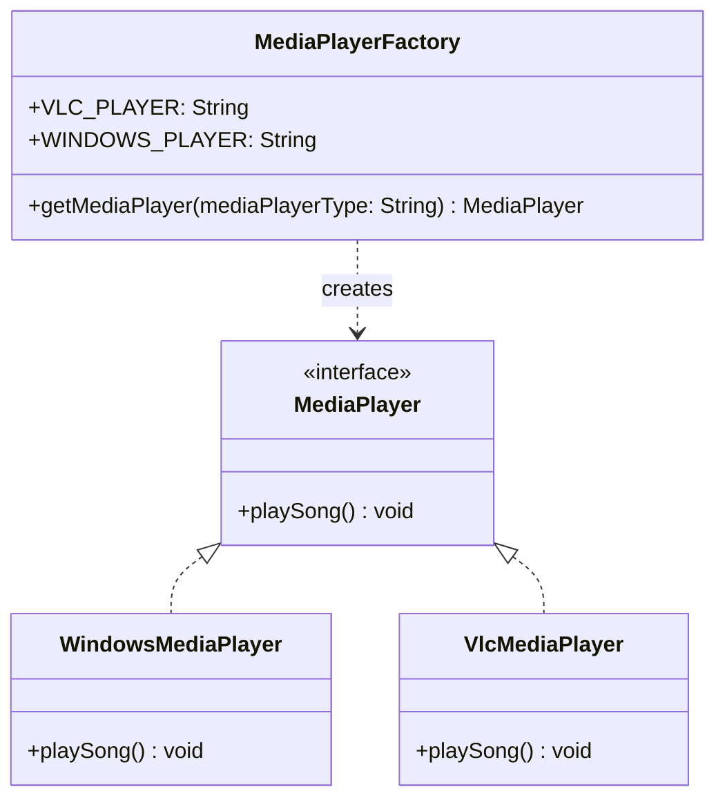
```mermaid
classDiagram
    class MediaPlayer {
        <<interface>>
        +playSong() void
    }
    class WindowsMediaPlayer {
        +playSong() void
    }
    class VlcMediaPlayer {
        +playSong() void
    }
    class MediaPlayerFactory {
        +VLC_PLAYER: String
        +WINDOWS_PLAYER: String
        +getMediaPlayer(mediaPlayerType: String) MediaPlayer
    }
    MediaPlayer <|.. WindowsMediaPlayer
    MediaPlayer <|.. VlcMediaPlayer
    MediaPlayerFactory ..> MediaPlayer : creates
```

##### When to reach for it

Any time you've got multiple classes behind one interface and the choice of which one to instantiate is a runtime decision, a type token, a config flag, a piece type in a chess engine, a notification channel. If adding a new implementation means touching more than the factory's switch statement plus the new class itself, the abstraction is leaking somewhere.

##### The takeaway

One method owns the "which concrete class" decision, everyone else programs against the interface. Adding a new player type means one new class and one new case label, nothing else in the codebase changes.

#### Abstract Factory

Picture pairing a VLC audio player with a Windows video player because two separate factory calls got made in two different places and nobody enforced they came from the same platform. Individually each call is correct, together they're a mismatched pair that behaves badly in ways that are annoying to trace back to "these two objects were never supposed to be used together." Abstract Factory is what stops that pairing from being possible in the first place.

##### The problem

Sometimes creating one object isn't the problem, creating a consistent family of objects is. If you pick "Windows" as your platform, every related object you construct after that, audio player, video player, whatever else belongs to that family, needs to actually be the Windows variant. Two separate Factory Method calls can't guarantee that, there's nothing stopping you from calling one factory for audio and a different one for video.

##### How it's built

There are two abstract products here, AudioPlayer (playSong()) and VideoPlayer (playVideo()), each with a Windows implementation and a VLC implementation, WindowsAudioPlayer/WindowsVideoPlayer and VlcAudioPlayer/VlcVideoPlayer.

The abstract class MediaFactory declares two creation methods, createAudioPlayer() and createVideoPlayer(), and doesn't implement either. WindowsMediaFactory extends it and implements both to return the Windows pair, VlcMediaFactory does the same for the VLC pair. That's the actual guarantee the pattern buys you: once you're holding a WindowsMediaFactory, every product it hands you is a Windows product, there is no code path where WindowsMediaFactory.createAudioPlayer() returns anything VLC-flavored.

MediaFactoryProducer.getFactory(String factoryType) sits one level above that, it's a factory that returns a factory, same normalize-then-switch shape as MediaPlayerFactory, same null and unknown-type guards throwing IllegalArgumentException. That's the layer client code actually talks to, pick a platform once, get back a MediaFactory, pull every related product through that one object.

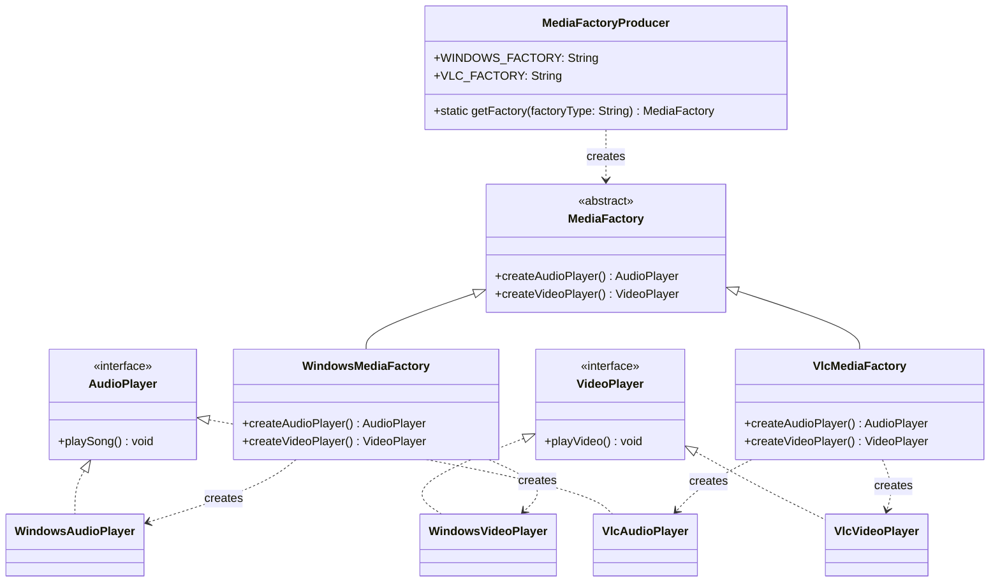
```mermaid
classDiagram
    class AudioPlayer {
        <<interface>>
        +playSong() void
    }
    class VideoPlayer {
        <<interface>>
        +playVideo() void
    }
    class WindowsAudioPlayer
    class WindowsVideoPlayer
    class VlcAudioPlayer
    class VlcVideoPlayer
    class MediaFactory {
        <<abstract>>
        +createAudioPlayer() AudioPlayer
        +createVideoPlayer() VideoPlayer
    }
    class WindowsMediaFactory {
        +createAudioPlayer() AudioPlayer
        +createVideoPlayer() VideoPlayer
    }
    class VlcMediaFactory {
        +createAudioPlayer() AudioPlayer
        +createVideoPlayer() VideoPlayer
    }
    class MediaFactoryProducer {
        +WINDOWS_FACTORY: String
        +VLC_FACTORY: String
        +static getFactory(factoryType: String) MediaFactory
    }
    AudioPlayer <|.. WindowsAudioPlayer
    AudioPlayer <|.. VlcAudioPlayer
    VideoPlayer <|.. WindowsVideoPlayer
    VideoPlayer <|.. VlcVideoPlayer
    MediaFactory <|-- WindowsMediaFactory
    MediaFactory <|-- VlcMediaFactory
    WindowsMediaFactory ..> WindowsAudioPlayer : creates
    WindowsMediaFactory ..> WindowsVideoPlayer : creates
    VlcMediaFactory ..> VlcAudioPlayer : creates
    VlcMediaFactory ..> VlcVideoPlayer : creates
    MediaFactoryProducer ..> MediaFactory : creates
```

##### When to reach for it

Reach for it when the products genuinely need to travel together, cross-platform UI toolkits (buttons and checkboxes that all need to be the same theme), driver families, anything where picking "provider A" for one piece of the family and "provider B" for another would be a bug, not a feature. If your factory only ever creates one kind of product, you don't need this, plain Factory Method covers it.

##### The takeaway

Abstract Factory buys you a guarantee that Factory Method alone can't, that everything created through one factory instance belongs to the same family. If nothing in your system actually requires that consistency, you're paying extra structure for nothing.

#### Builder

I've written the constructor with six optional parameters, most of them ints defaulting to zero, and watched a caller pass them in the wrong order because two of them were both ints and the IDE's parameter hints weren't enough to save them. Builder is the fix for that specific kind of bug.

##### The problem

Some objects have a mix of required and optional fields, and neither telescoping constructors (one overload per combination of optional params) nor a plain no-args constructor plus setters (which gives up immutability and lets the object exist half-configured) is a good answer. You want required fields enforced at compile time, optional fields easy to skip, and an object that can't be mutated once it exists.

##### How it's built

Vehicle has two required fields, engine and wheel, and one optional field, airbags. Its constructor is private and takes a VehicleBuilder, not raw values, so the only way to get a Vehicle is through the builder.

VehicleBuilder is a static nested class inside Vehicle. Its own constructor, VehicleBuilder(String engine, int wheel), takes exactly the required fields, there's no way to build a VehicleBuilder without them. setAirbags(int airbags) is the optional field's setter, and it returns this, that's what gives you the fluent chain, new VehicleBuilder("V8", 4).setAirbags(6).build(). build() hands the builder instance to Vehicle's private constructor and gets back an immutable Vehicle, no setters on Vehicle itself, once it's built it's built.

VehicleDirector is the optional layer on top, it exists for configurations you build often enough to name. constructSportsCar(builder) calls setAirbags(2) and build(), constructFamilyCar(builder) calls setAirbags(8) and build(). The director doesn't know anything about engine or wheel, those are already locked in by the time a builder gets passed to it, it only orchestrates the optional part. You don't need a director to use the builder, it's a convenience for repeatable recipes, not a required piece of the pattern.

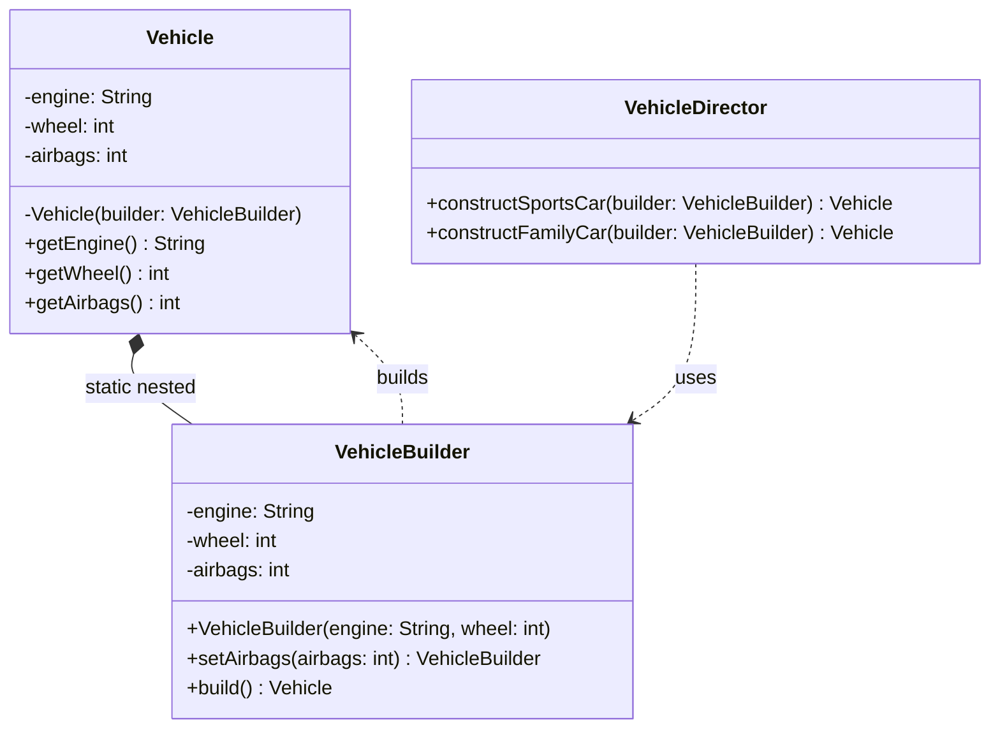
```mermaid
classDiagram
    class Vehicle {
        -engine: String
        -wheel: int
        -airbags: int
        -Vehicle(builder: VehicleBuilder)
        +getEngine() String
        +getWheel() int
        +getAirbags() int
    }
    class VehicleBuilder {
        -engine: String
        -wheel: int
        -airbags: int
        +VehicleBuilder(engine: String, wheel: int)
        +setAirbags(airbags: int) VehicleBuilder
        +build() Vehicle
    }
    class VehicleDirector {
        +constructSportsCar(builder: VehicleBuilder) Vehicle
        +constructFamilyCar(builder: VehicleBuilder) Vehicle
    }
    Vehicle *-- VehicleBuilder : static nested
    VehicleDirector ..> VehicleBuilder : uses
    VehicleBuilder ..> Vehicle : builds
```

##### When to reach for it

Any object with more than a couple of optional fields, or where the required/optional split actually matters for correctness. Pizza orders, ride requests, search queries, anything where you'd otherwise be writing three or four constructor overloads to cover the common combinations. Skip it for small objects, a class with two required fields and nothing optional doesn't need this ceremony, a normal constructor is fine.

##### The takeaway

The private constructor plus static nested builder is what actually enforces "required fields at compile time, optional fields whenever you want them." The director is a bonus for naming your common configurations, not the core of the pattern.

#### Prototype

The source code for this one is a little more interesting than the README lets on. It talks about Java's Cloneable interface and Object.clone() at length, but the actual VehiclePrototype implementation doesn't use either. It rolls its own copy constructors instead. That's worth noticing, because it sidesteps the exact problems the Cloneable notes complain about, the checked CloneNotSupportedException and the fact that Cloneable is a marker interface with no real contract behind it.

##### The problem

Building a new Car or Bus from scratch every time means running the full constructor path again, even when what you actually want is "the same as this one, but slightly different." And if you're handing callers a shared canonical instance instead, you risk one caller's mutation leaking into everyone else's copy.

##### How it's built

VehiclePrototype is the interface, two methods, cloneVehicle() and displayInfo(). Vehicle is an abstract class implementing it, holding the three shared fields, engine, wheels, color, with a regular constructor for building fresh and a second, protected copy constructor, Vehicle(Vehicle vehicle), that copies those three fields from an existing instance.

Car extends Vehicle and adds doors. Its copy constructor, private Car(Car car), calls super(car) to copy the shared fields, then copies doors itself. cloneVehicle() returns new Car(this), and its return type is Car, not Vehicle, that's a covariant return type, callers who already have a Car in hand get a Car back from clone, no downcast needed. Bus mirrors this exactly with capacity instead of doors.

Because engine, wheels, and color are a String and two ints, plain field copying in the copy constructor already gives you full independence between original and clone, there's no shared mutable state to worry about. That only holds because none of the fields here are mutable references. If Vehicle held something like a List<String> features, the copy constructor would need to explicitly build a new list, copying the reference alone would leave the clone and the original pointing at the same underlying list, and a mutation on one would show up on the other.

VehicleRegistry is the prototype catalog, a Map<String, VehiclePrototype> pre-loaded with STANDARD_CAR, SPORTS_CAR, CITY_BUS, SCHOOL_BUS. getPrototype(type) never hands back the stored prototype itself, it calls cloneVehicle() on it and returns that. That's the detail that makes the registry safe to share, callers can mutate the Vehicle they get back all they want (the test file does exactly this, setColor("Purple") on a fetched STANDARD_CAR), and the next caller who asks the registry for STANDARD_CAR still gets the original untouched configuration.

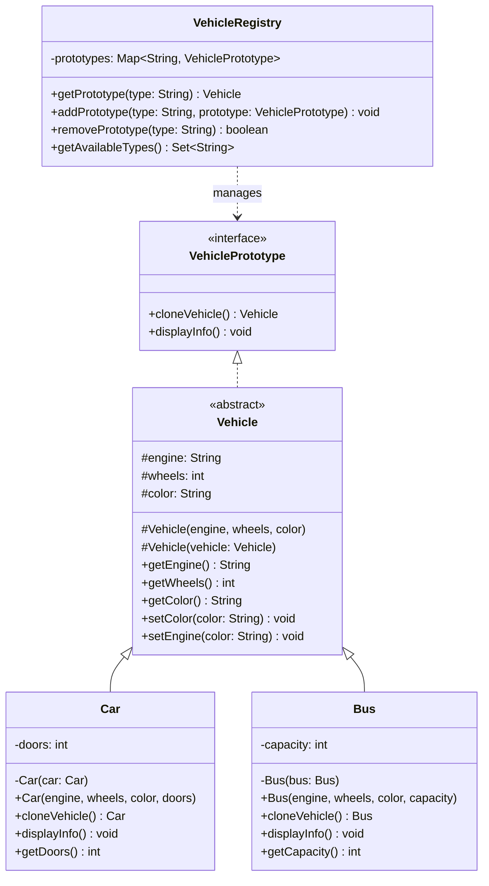
```mermaid
classDiagram
    class VehiclePrototype {
        <<interface>>
        +cloneVehicle() Vehicle
        +displayInfo() void
    }
    class Vehicle {
        <<abstract>>
        #engine: String
        #wheels: int
        #color: String
        #Vehicle(engine, wheels, color)
        #Vehicle(vehicle: Vehicle)
        +getEngine() String
        +getWheels() int
        +getColor() String
        +setColor(color: String) void
        +setEngine(color: String) void
    }
    class Car {
        -doors: int
        -Car(car: Car)
        +Car(engine, wheels, color, doors)
        +cloneVehicle() Car
        +displayInfo() void
        +getDoors() int
    }
    class Bus {
        -capacity: int
        -Bus(bus: Bus)
        +Bus(engine, wheels, color, capacity)
        +cloneVehicle() Bus
        +displayInfo() void
        +getCapacity() int
    }
    class VehicleRegistry {
        -prototypes: Map~String, VehiclePrototype~
        +getPrototype(type: String) Vehicle
        +addPrototype(type: String, prototype: VehiclePrototype) void
        +removePrototype(type: String) boolean
        +getAvailableTypes() Set~String~
    }
    VehiclePrototype <|.. Vehicle
    Vehicle <|-- Car
    Vehicle <|-- Bus
    VehicleRegistry ..> VehiclePrototype : manages
```

##### When to reach for it

Reach for it when you've got a small set of canonical configurations and need many independent copies of them, game piece prototypes, canned vehicle configs, template documents. It's also a reasonable answer when you want to hand out objects without exposing which concrete class backs them, callers work against VehiclePrototype and never need to know Car or Bus exists.

##### The takeaway

Copy constructors get you most of what Cloneable promises without the checked exception or the marker-interface awkwardness. Just remember that field-by-field copying is only safe for primitives and immutable references, mutable fields need to be copied explicitly or the clone and original end up sharing state.

#### Object Pool

The test file for this one fakes "expensive" with a 50 millisecond Thread.sleep() in the constructor, which is a stand-in for the real thing, a database handshake, a socket setup, whatever actually costs wall-clock time to build. The pool exists so you pay that cost once per object and then hand the same object out over and over instead of re-paying it on every request.

##### The problem

Some objects are genuinely expensive to construct and short-lived in how they're used, database connections being the standard example. Creating a fresh one per request and throwing it away afterward means paying the expensive part constantly and generating garbage the collector has to clean up. If the number of objects actually in use at any moment is small, a pool of pre-built, reusable ones is cheaper than constant creation and disposal.

##### How it's built

Reusable is the one-method contract, reset(). ExpensiveObject implements it, carries an inUse boolean, and its constructor does the simulated expensive work (the sleep) before printing that it's done. reset() just flips inUse back to false. doWork() checks inUse first and throws IllegalStateException if the object hasn't actually been acquired, which catches the specific bug of someone holding a reference to a pooled object they never checked out.

ObjectPool<T extends Reusable> holds two lists, available and inUse, plus an ObjectFactory<T>. acquire() checks available first, if it's empty it delegates to factory.create() for a new instance, otherwise it pops the last entry off available and reuses it, either way the object goes into inUse before it's handed back to the caller. release(T obj) does the reverse, removes it from inUse, calls reset() on it, and adds it to available. The reset() call inside release() is the part that's easy to forget when reimplementing this from memory, skip it and the next caller who acquires that object gets one with leftover state from whoever used it last.

ObjectFactory<T> exists for a specific reason that has nothing to do with elegance, Java generics can't do new T(), there's no way for ObjectPool<T> to construct a T directly. So the factory is how the pool learns what to build without knowing the concrete type itself, ExpensiveObjectFactory.create() just returns new ExpensiveObject(), and the pool calls that instead of a constructor it doesn't have access to.

One thing worth flagging since it's not addressed here: available and inUse are plain ArrayLists, and acquire()/release() aren't synchronized. That's fine for a single-threaded demo but not for concurrent callers, two threads racing to acquire from a pool with exactly one available object could both pull it or corrupt the list's internal state. A real pool needs that acquire-check-and-claim sequence protected, either a lock around it or a concurrent collection built for exactly this.

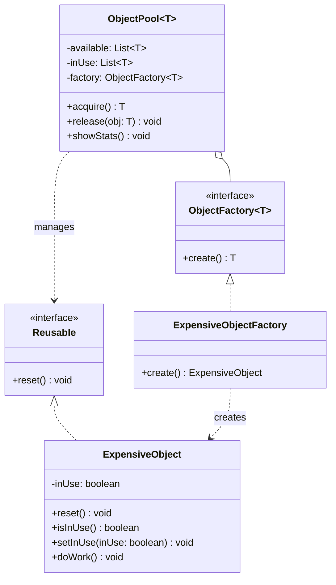
```mermaid
classDiagram
    class Reusable {
        <<interface>>
        +reset() void
    }
    class ExpensiveObject {
        -inUse: boolean
        +reset() void
        +isInUse() boolean
        +setInUse(inUse: boolean) void
        +doWork() void
    }
    class ObjectFactory~T~ {
        <<interface>>
        +create() T
    }
    class ExpensiveObjectFactory {
        +create() ExpensiveObject
    }
    class ObjectPool~T~ {
        -available: List~T~
        -inUse: List~T~
        -factory: ObjectFactory~T~
        +acquire() T
        +release(obj: T) void
        +showStats() void
    }
    Reusable <|.. ExpensiveObject
    ObjectFactory <|.. ExpensiveObjectFactory
    ObjectPool o-- ObjectFactory
    ObjectPool ..> Reusable : manages
    ExpensiveObjectFactory ..> ExpensiveObject : creates
```

##### When to reach for it

Database connection pools, thread pools, buffer pools, anything where construction cost is real and the object is safe to reset and reuse rather than being tied to one specific piece of state. Skip it if construction is cheap, you'll add lifecycle complexity (tracking available vs in-use, remembering to release) for no real benefit.

##### The takeaway

The two things that make this pattern actually work are reset() being mandatory on release and the factory existing to solve Java's "can't new a generic type" problem. Miss either one and you either leak state between users or you can't write the pool at all.

### Structural Patterns

How objects get wired into bigger structures without every wire tangling into every other wire. Adapters translate, decorators layer, facades hide, proxies stand in for the real thing. Eight patterns, all about composition, none of them about creation.

#### Adapter

If you've ever had to wire a legacy service into a codebase where none of the method names line up with what the new caller expects, this is for you. I've run into this more than once: some old internal library nobody wants to touch, exposing methods like `find()` and `click()`, and a new consumer that only knows how to call `get()` and `select()`. Nobody's rewriting the legacy side. So something has to sit in between.

##### The problem

You have two interfaces that do conceptually the same thing but don't share a method signature, and you can't (or won't) change either one. Rewriting the legacy class risks breaking whatever already depends on it. Rewriting the new consumer defeats the point of it being new. You need a translation layer, not a rewrite.

##### How it's built

The setup here is `WebInterface`, the target interface the client expects, declaring `get()` and `select()`. The legacy side is `OldWebInterface`, declaring `find()` and `click()`, implemented by `OldWebInterfaceImpl`. `WebInterfaceAdapter` implements `WebInterface` and holds a reference to an `OldWebInterface` (a field literally named `oldWebInterface`, set through the constructor). Its `get()` method doesn't do any work itself, it just calls `oldWebInterface.find()`. Its `select()` calls `oldWebInterface.click()`. That's the whole pattern: one class translating calls, nothing else.

This is the object adapter variant, composition over inheritance. The adapter holds the adaptee rather than extending it, which means it can wrap any implementation of `OldWebInterface` you hand it, not just one hardcoded subclass. The class adapter variant (extend the adaptee directly) exists too, but you give up the ability to swap implementations at runtime, and Java's single inheritance makes it a worse fit anyway since your adapter would burn its one shot at extending something.

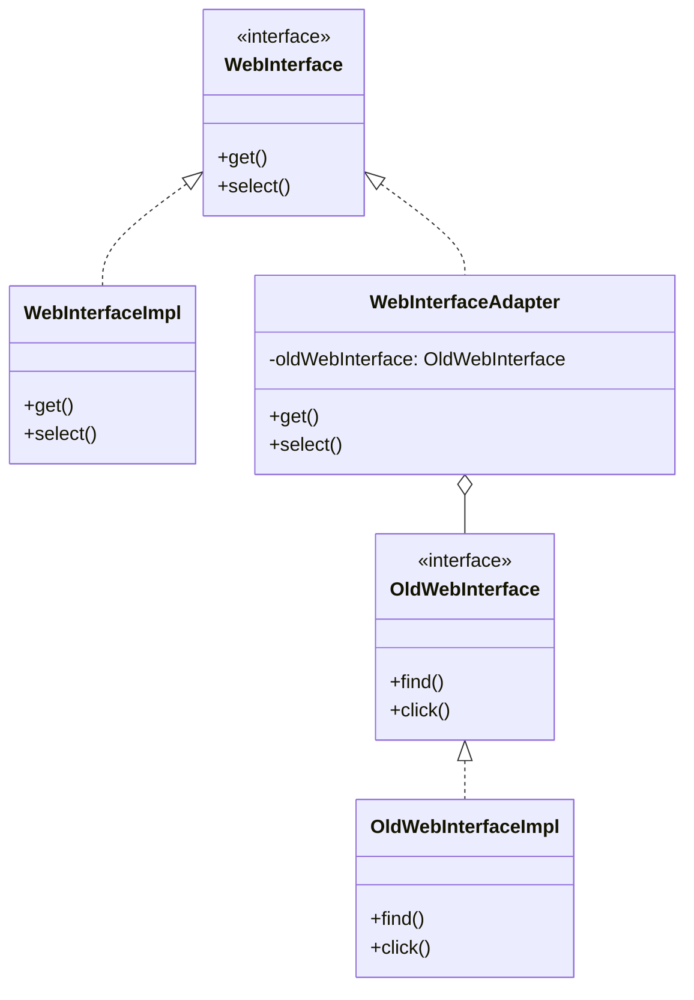
```mermaid
classDiagram
    class WebInterface {
        <<interface>>
        +get()
        +select()
    }
    class OldWebInterface {
        <<interface>>
        +find()
        +click()
    }
    class WebInterfaceImpl {
        +get()
        +select()
    }
    class OldWebInterfaceImpl {
        +find()
        +click()
    }
    class WebInterfaceAdapter {
        -oldWebInterface: OldWebInterface
        +get()
        +select()
    }
    WebInterface <|.. WebInterfaceImpl
    WebInterface <|.. WebInterfaceAdapter
    OldWebInterface <|.. OldWebInterfaceImpl
    WebInterfaceAdapter o-- OldWebInterface
```

##### When to reach for it

- You're integrating a third-party library or legacy service whose method names or call shape don't match what your code expects.
- You want the option to swap which legacy implementation gets wrapped, without touching the caller.
- You want the translation logic isolated in one place instead of scattered across every call site that talks to the old interface.

##### The takeaway

The adapter doesn't fix the old interface, it just hides the mismatch from everyone downstream. If you find yourself writing more than a thin pass-through in the adapter, you've probably drifted into doing real work there, and that work belongs somewhere else.

#### Bridge

If you've ever started sketching out a class hierarchy and realized halfway through that you're about to multiply two unrelated things together, this is for you. The vehicle workshop example here makes it concrete: four vehicle types, four workshop operations, and if you inherit your way through it you end up writing `CarProduce`, `CarAssemble`, `BikeProduce`, `BikeAssemble`, and so on until you've written sixteen classes for what's really two independent lists of four things each.

##### The problem

You've got two dimensions of variation that both need to grow independently. Every time inheritance is the tool you reach for in this situation, you get a class per combination, and every new vehicle type or every new workshop operation multiplies the class count instead of adding to it.

##### How it's built

`Workshop` is the implementor interface: `work()` and `getWorkshopType()`. `Produce`, `Assemble`, `Paint`, and `Inspect` are the concrete implementors, each just printing what it does and naming itself.

`Vehicle` is the abstraction, an abstract class holding two `Workshop` references as protected fields, `workshop1` and `workshop2`, set through the constructor. Its `manufacture()` method is a small template method: print a start message, call `performWorkshop1()`, call `performWorkshop2()`, print a completion message. Those two `performWorkshopN()` methods just delegate to `workshop1.work()` and `workshop2.work()`. `Vehicle` also declares `getVehicleType()` as abstract, so `Car`, `Bike`, `Truck`, and `Motorcycle` only need to implement that one method, they inherit everything else.

The key decision is that `Vehicle` holds `Workshop` by composition, not by extending some `CarWorkshop` base. Any vehicle can be constructed with any pair of workshops, `new Car(produce, assemble)` and `new Car(paint, inspect)` are both valid without adding a single class. The vehicle hierarchy and the workshop hierarchy know nothing about each other beyond the interface, so you can extend either one without touching the other. Add a `Bus` vehicle, it works with all four existing workshops immediately. Add a `Repair` workshop, all four existing vehicles can use it immediately.

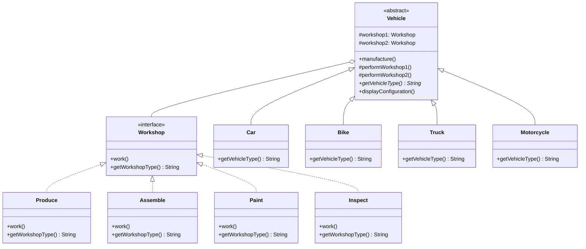
```mermaid
classDiagram
    class Workshop {
        <<interface>>
        +work()
        +getWorkshopType() String
    }
    class Produce {
        +work()
        +getWorkshopType() String
    }
    class Assemble {
        +work()
        +getWorkshopType() String
    }
    class Paint {
        +work()
        +getWorkshopType() String
    }
    class Inspect {
        +work()
        +getWorkshopType() String
    }
    class Vehicle {
        <<abstract>>
        #workshop1: Workshop
        #workshop2: Workshop
        +manufacture()
        #performWorkshop1()
        #performWorkshop2()
        +getVehicleType()* String
        +displayConfiguration()
    }
    class Car {
        +getVehicleType() String
    }
    class Bike {
        +getVehicleType() String
    }
    class Truck {
        +getVehicleType() String
    }
    class Motorcycle {
        +getVehicleType() String
    }
    Workshop <|.. Produce
    Workshop <|.. Assemble
    Workshop <|.. Paint
    Workshop <|.. Inspect
    Vehicle <|-- Car
    Vehicle <|-- Bike
    Vehicle <|-- Truck
    Vehicle <|-- Motorcycle
    Vehicle o-- Workshop
```

##### When to reach for it

- You have two hierarchies that both want to grow, and inheriting through both at once multiplies your class count.
- You want to pick or swap the implementation side at runtime, not bake it in at compile time.
- You're designing this upfront, this isn't a retrofit pattern, that's Adapter's job.

##### The takeaway

Bridge is what you reach for before the class explosion happens, not after. If you're already staring at a naming scheme like `CarProduce` and `BikeAssemble`, that's the signal you needed this two designs ago.

#### Composite

If you've ever written a `display()` or `delete()` method and then had to write a second, near-identical version for the folder case because a folder isn't a file, this is for you. The file system example nails the shape of it: a `Directory` can hold `File` objects and other `Directory` objects, and whoever's calling `display()` shouldn't have to care which one they're looking at.

##### The problem

You've got a tree of things, some are leaves, some are containers of other things, and you want to run the same operation over the whole tree without writing an `if (isDirectory)` check at every call site.

##### How it's built

`FileSystemItem` is the component interface: `getName()` and `display()`, plus two default methods, `add(FileSystemItem item)` and `remove(FileSystemItem item)`, both of which just throw `UnsupportedOperationException("Cannot add to a file")` (or the remove equivalent). That default-method trick is doing real work here: `File`, the leaf, never has to implement `add()` or `remove()` at all, it inherits the "no, you can't do that" behavior for free, and it fails loudly if someone tries anyway instead of silently doing nothing.

`File` is the leaf, holding `name` and `size`, its `display()` just prints itself. `Directory` is the composite, holding `name` and a `List<FileSystemItem> children`. Its `add()` and `remove()` mutate that list directly. Its `display()` prints itself and then loops over `children`, calling `child.display()` on each one, whether that child is a `File` or another `Directory`. That's the recursion: a `Directory`'s `display()` doesn't know or care how deep the tree under it goes, it just trusts each child to display itself correctly.

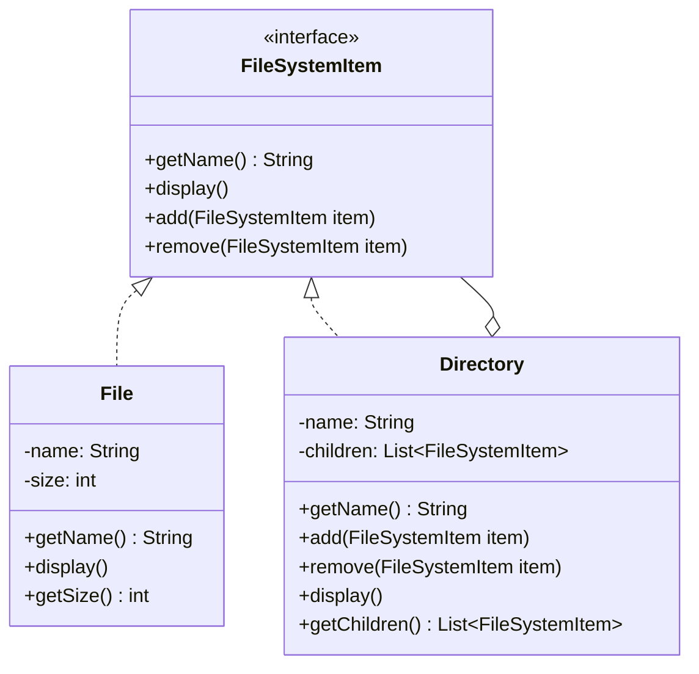
```mermaid
classDiagram
    class FileSystemItem {
        <<interface>>
        +getName() String
        +display()
        +add(FileSystemItem item)
        +remove(FileSystemItem item)
    }
    class File {
        -name: String
        -size: int
        +getName() String
        +display()
        +getSize() int
    }
    class Directory {
        -name: String
        -children: List~FileSystemItem~
        +getName() String
        +add(FileSystemItem item)
        +remove(FileSystemItem item)
        +display()
        +getChildren() List~FileSystemItem~
    }
    FileSystemItem <|.. File
    FileSystemItem <|.. Directory
    Directory o-- FileSystemItem
```

##### When to reach for it

- You have a genuine part-whole tree (files and directories, UI widgets and containers, org charts).
- The operations you're running (display, total size, search) are naturally recursive across the tree.
- You want callers to hold a single `FileSystemItem` reference and not branch on what's actually inside it.

##### The takeaway

The trick worth remembering isn't the tree structure, it's the default-method dodge that lets leaves opt out of container behavior without a wall of `if` checks or empty overrides. Get that part right and the recursion mostly writes itself.

#### Decorator

If you've ever added a fourth optional flag to a constructor and thought "I'm going to need a class for every combination of these," this is for you. The coffee example is the textbook case: milk, sugar, whipped cream, in any combination, and if you model that as subclasses you're writing `MilkSugarCoffee`, `MilkWhippedCoffee`, and it only gets worse as ingredients get added.

##### The problem

You want to add optional, combinable behavior to an object without hardcoding a subclass for every combination, and you want to be able to add new behaviors later without touching the ones that already exist.

##### How it's built

`Coffee` is the component interface: `getDesc()` and `getCost()`. `PlainCoffee` is the concrete component, returning `"Plain Coffee"` and `2.0`. `CoffeeDecorator` is the abstract decorator, it implements `Coffee` and holds a protected `Coffee coffee` field, set through its constructor. By default it just delegates, `getDesc()` returns `coffee.getDesc()`, `getCost()` returns `coffee.getCost()`, unchanged.

`MilkDecorator` and `SugarDecorator` extend `CoffeeDecorator` and override both methods to layer on their own bit before returning. `MilkDecorator.getDesc()` returns `coffee.getDesc() + ", Milk"`, `getCost()` returns `coffee.getCost() + 0.5`. `SugarDecorator` does the same with `", Sugar"` and `0.3`. Each decorator only knows about its own addition, it calls into whatever it's wrapping for the rest.

The part that makes this pattern actually work is that decorators wrap other decorators just as easily as they wrap the base component, because everything in the chain, `PlainCoffee` included, satisfies the same `Coffee` interface. `new SugarDecorator(new MilkDecorator(new PlainCoffee()))` builds a three-deep chain where each `getCost()` call cascades down to the bottom and sums back up on the way out. Stack the same decorator twice, `new MilkDecorator(new MilkDecorator(new PlainCoffee()))`, and you get double milk, because the pattern has no idea what "milk" means, it just knows how to wrap.

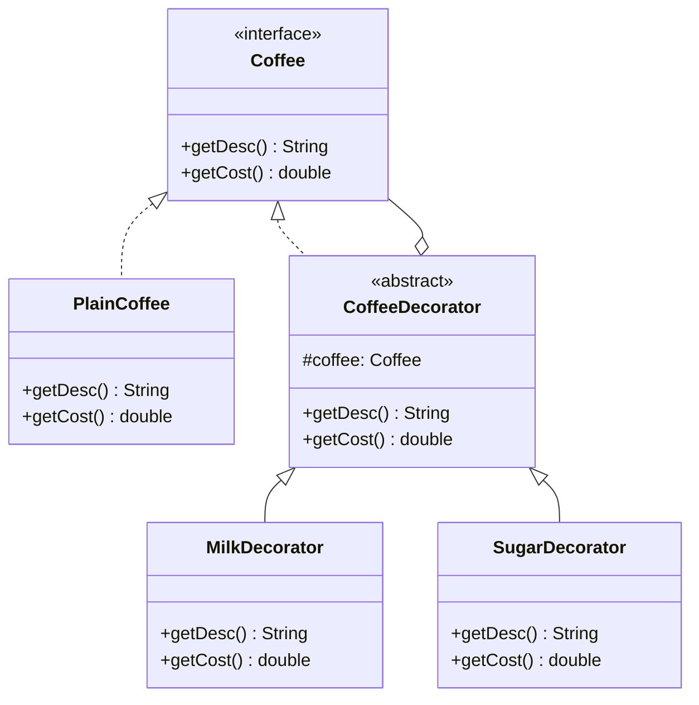
```mermaid
classDiagram
    class Coffee {
        <<interface>>
        +getDesc() String
        +getCost() double
    }
    class PlainCoffee {
        +getDesc() String
        +getCost() double
    }
    class CoffeeDecorator {
        <<abstract>>
        #coffee: Coffee
        +getDesc() String
        +getCost() double
    }
    class MilkDecorator {
        +getDesc() String
        +getCost() double
    }
    class SugarDecorator {
        +getDesc() String
        +getCost() double
    }
    Coffee <|.. PlainCoffee
    Coffee <|.. CoffeeDecorator
    CoffeeDecorator <|-- MilkDecorator
    CoffeeDecorator <|-- SugarDecorator
    CoffeeDecorator o-- Coffee
```

##### When to reach for it

- The behaviors you're adding are optional and combinable, not mutually exclusive states.
- You want to add a new behavior later (whipped cream) without touching `MilkDecorator` or `SugarDecorator`.
- Subclassing every combination would multiply out of control.

##### The takeaway

Each decorator should do exactly one small thing and delegate the rest. The moment a decorator starts checking what else is in the chain or reaching past its immediate `coffee` reference, you've broken the thing that made this useful in the first place.

#### Facade

If you've ever had to call three services in a specific order just to book a hotel room, and gotten it wrong once because you forgot to check availability before reserving, this is for you. That's the exact shape of the hotel example: `RoomBookingService`, `HousekeepingService`, `RestaurantService`, each fine on its own, miserable to coordinate correctly from outside.

##### The problem

A real operation touches multiple subsystems in a specific sequence, and every caller who wants to perform that operation has to know the sequence, the dependencies between the calls, and the error handling for each step. Duplicate that knowledge across enough call sites and a change to the sequence means hunting down every place that got it right (or wrong) independently.

##### How it's built

`HotelKeeper` is the facade. Its constructor creates and holds a `HousekeepingService`, a `RestaurantService`, and a `RoomBookingService`, all owned internally, the caller never sees them.

`bookRoom(int roomNumber)` is one method that does the whole sequence: call `roomBooking.checkAvailability(roomNumber)`, and only if that returns true, call `roomBooking.reserveRoom(roomNumber)`, then `housekeeping.cleanRoom(roomNumber)`, then `housekeeping.prepareRoom(roomNumber)`. The caller gets one method call. The ordering logic and the branch on availability live in exactly one place.

`orderRoomService(int roomNumber, String menuType, String foodItem)` does the same for the food side: it calls `getMenu(menuType)`, which is itself a small facade over a `Menu` interface (`VegMenu`, `NonVegMenu`, `MixedMenu`, each just printing their own `getMenu()`), then calls `restaurant.orderFood(foodItem)` and `restaurant.deliverFood(roomNumber, foodItem)`. The caller never touches `RestaurantService` or the `Menu` implementations directly, `HotelKeeper` is the only thing that knows they exist.

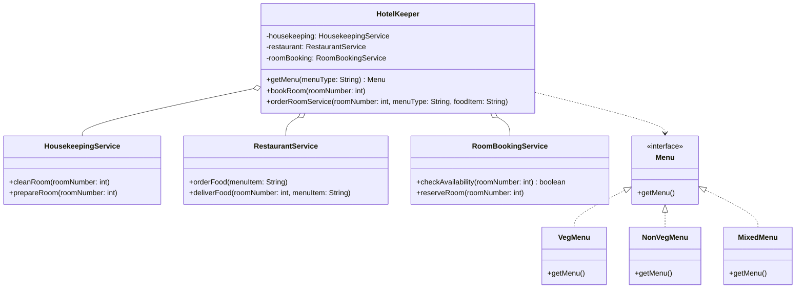
```mermaid
classDiagram
    class HotelKeeper {
        -housekeeping: HousekeepingService
        -restaurant: RestaurantService
        -roomBooking: RoomBookingService
        +getMenu(menuType: String) Menu
        +bookRoom(roomNumber: int)
        +orderRoomService(roomNumber: int, menuType: String, foodItem: String)
    }
    class HousekeepingService {
        +cleanRoom(roomNumber: int)
        +prepareRoom(roomNumber: int)
    }
    class RestaurantService {
        +orderFood(menuItem: String)
        +deliverFood(roomNumber: int, menuItem: String)
    }
    class RoomBookingService {
        +checkAvailability(roomNumber: int) boolean
        +reserveRoom(roomNumber: int)
    }
    class Menu {
        <<interface>>
        +getMenu()
    }
    class VegMenu {
        +getMenu()
    }
    class NonVegMenu {
        +getMenu()
    }
    class MixedMenu {
        +getMenu()
    }
    HotelKeeper o-- HousekeepingService
    HotelKeeper o-- RestaurantService
    HotelKeeper o-- RoomBookingService
    HotelKeeper ..> Menu
    Menu <|.. VegMenu
    Menu <|.. NonVegMenu
    Menu <|.. MixedMenu
```

##### When to reach for it

- A real-world operation needs several subsystem calls in a fixed order, and you don't want that order re-implemented at every call site.
- You want a single, narrow surface (`bookRoom`, `orderRoomService`) that hides which subsystems exist behind it.
- The subsystems themselves are fine, the problem is purely that coordinating them from outside is error-prone.

##### The takeaway

A facade doesn't replace the subsystem classes or simplify what they do, it just moves the coordination logic into one place instead of leaving it implicit in every caller's head. If two different call sites are calling your subsystem methods in a slightly different order, that's the smell that tells you a facade was missing.

#### Flyweight

If you've ever built something that renders thousands of icons and noticed most of them are the same image just sitting at a different position, this is for you. The file explorer example is exactly that: a thousand files, but only four file types and three folder colors, so there's no reason to load the same icon image a thousand times.

##### The problem

You need a large number of similar objects, and most of their state is actually identical across instances. Storing that identical state once per object is wasted memory that scales with object count instead of with the actual variety of data.

##### How it's built

`Icon` is the flyweight interface: `draw(int x, int y)`. Notice `x` and `y` are parameters, not fields, that's the extrinsic state, unique per usage, passed in at call time rather than stored on the flyweight.

`FileIcon` and `FolderIcon` are the concrete flyweights. `FileIcon` stores `type` and `image` as its intrinsic state, the constructor builds `image` once as `"Image for " + type + " files"`. `FolderIcon` stores `color` and `image` the same way. Both are the same for every instance representing the same `type` or `color`, which is exactly why they're safe to share.

`IconFactory` is the flyweight factory, holding a static `Map<String, Icon> iconCache`. `getFileIcon(String fileType)` builds a key like `"FILE_" + fileType.toUpperCase()`, checks the cache, and only calls `new FileIcon(fileType)` if that key isn't already there. `getFolderIcon(String color)` does the same with a `"FOLDER_"` prefix. Every subsequent call for the same type or color returns the identical cached instance rather than building a new one, you can see that directly in the test file, `IconFactory.getFileIcon("TXT")` called three times in a row returns the same object, same hash code, every time.

`FileSystemItem` is the context: it holds `name`, `x`, `y` (the extrinsic state, unique per item) and a reference to a shared `Icon`. Its `display()` method prints the name and calls `icon.draw(x, y)`, handing the extrinsic state to the flyweight at the moment it's needed. A thousand `FileSystemItem` instances can all point at the same handful of `Icon` objects.

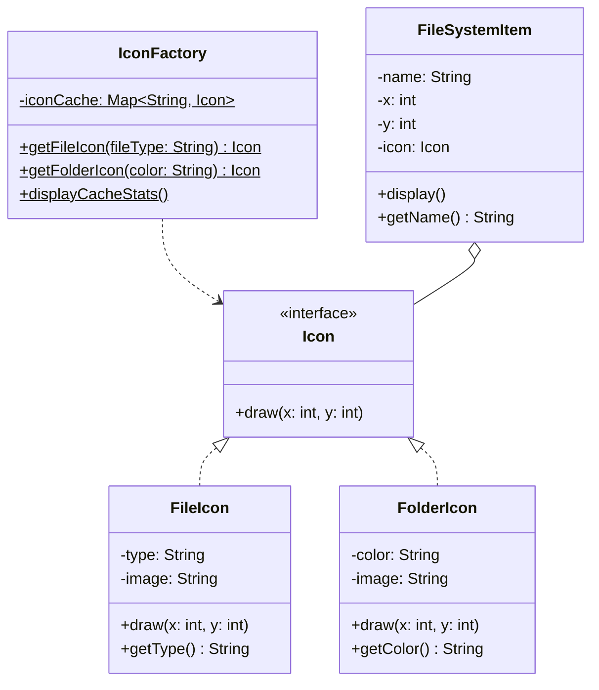
```mermaid
classDiagram
    class Icon {
        <<interface>>
        +draw(x: int, y: int)
    }
    class FileIcon {
        -type: String
        -image: String
        +draw(x: int, y: int)
        +getType() String
    }
    class FolderIcon {
        -color: String
        -image: String
        +draw(x: int, y: int)
        +getColor() String
    }
    class IconFactory {
        -iconCache: Map~String, Icon~$
        +getFileIcon(fileType: String)$ Icon
        +getFolderIcon(color: String)$ Icon
        +displayCacheStats()$
    }
    class FileSystemItem {
        -name: String
        -x: int
        -y: int
        -icon: Icon
        +display()
        +getName() String
    }
    Icon <|.. FileIcon
    Icon <|.. FolderIcon
    IconFactory ..> Icon
    FileSystemItem o-- Icon
```

##### When to reach for it

- You've got a large object count where most of the per-object state is actually identical across many instances.
- The identical portion is safely immutable, sharing it can't cause one caller's mutation to leak into another's.
- The unique-per-instance part (position, name, whatever) is small enough to hand in as a parameter instead of storing on the shared object.

##### The takeaway

The whole pattern hinges on correctly splitting state into intrinsic and extrinsic. Get that split wrong, put something that should be per-instance into the shared flyweight, and you've built a bug where one caller's data bleeds into another's, not a memory optimization.

#### Private Class Data

If you've ever handed out a setter on a class and then spent an afternoon tracking down which caller mutated a field it had no business touching, this is for you. The `Circle` example makes the fix boringly simple: once a `Circle` is constructed, nothing about it should be able to change out from under you.

##### The problem

Exposing internal state directly, whether through public fields or through setters, means any caller with a reference can mutate it. Once mutation is possible, "how did this object get into this state" stops being answerable by reading the constructor alone, you have to trace every place that ever touched it.

##### How it's built

`CircleData` holds `radius`, `color`, and `origin` as private fields, set once through the constructor, with only getters, `getRadius()`, `getColor()`, `getOrigin()`. No setters exist. Once a `CircleData` is built, it cannot change.

`Circle` holds a private `CircleData circleData` field and never exposes it. Its own methods work by reading from `circleData`, `getDiameter()` returns `circleData.getRadius() * 2`, `getCircumference()` returns `2 * Math.PI * circleData.getRadius()`. `displayCircle()` and `getCircleInfo()` both format their output by pulling values out through `circleData`'s getters, they never hand the `CircleData` object itself back to the caller. The same shape shows up again in the file with `DataClass` and `MainClass`, `DataClass` holds three attributes with getters only, `MainClass` holds a `DataClass data` field and exposes `displayInfo()` and `getFormattedData()` built entirely from reading `data`, never returning it.

The separation matters more than it looks: `Circle` is where the geometry logic lives, `CircleData` is where the storage lives, and the only way anything outside `Circle` learns a radius is by asking `Circle` a real question (give me the diameter) rather than reading the raw field.

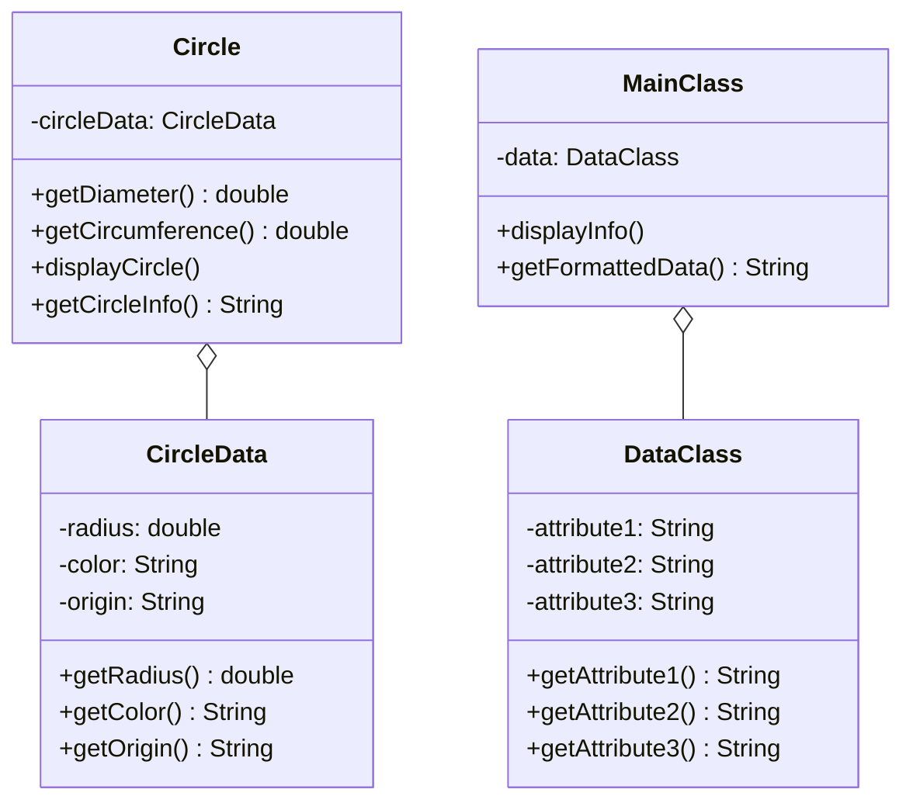
```mermaid
classDiagram
    class CircleData {
        -radius: double
        -color: String
        -origin: String
        +getRadius() double
        +getColor() String
        +getOrigin() String
    }
    class Circle {
        -circleData: CircleData
        +getDiameter() double
        +getCircumference() double
        +displayCircle()
        +getCircleInfo() String
    }
    class DataClass {
        -attribute1: String
        -attribute2: String
        -attribute3: String
        +getAttribute1() String
        +getAttribute2() String
        +getAttribute3() String
    }
    class MainClass {
        -data: DataClass
        +displayInfo()
        +getFormattedData() String
    }
    Circle o-- CircleData
    MainClass o-- DataClass
```

##### When to reach for it

- The object's state should be fixed at construction time and never touched again.
- You want to stop a class's own internal fields from being reachable by anything outside it, including its own subclasses reaching in directly.
- You're separating "how this data is stored" from "what this object does with it," so the two can change independently.

##### The takeaway

This isn't really a structural trick, it's a discipline: no setters on the data holder, no method that hands the data object itself back to a caller. If either of those slips in, you've quietly undone the whole point.

#### Proxy

If you've ever stared at a Spring `@Configuration` class, seen a `@Bean` method called from two other `@Bean` methods, and wondered why it doesn't just create two separate instances, this is for you. It doesn't, because you're never actually calling that method directly, you're calling a CGLIB-generated subclass of your configuration class that intercepts the call first.

##### The problem

Sometimes you want to control access to an object, whether that's delaying its creation until it's actually needed, checking whether it already exists before making another one, or adding a check before a call reaches it, and you want to do it without changing the real object's code or the caller's code.

##### How it's built

The core example here is small and it's worth working through directly. `Image` is the service interface: `display()`. `RealImage` implements it, and its constructor calls a private `loadImageFromDisk()` immediately, so constructing a `RealImage` does the expensive work right away, whether you needed it yet or not.

`ProxyImage` also implements `Image`. It holds a `filename` and a `realImage` field that starts out `null`. Its `display()` method checks `if (realImage == null)`, and only then does `realImage = new RealImage(filename)`, followed by `realImage.display()`. The expensive constructor never runs until the first `display()` call, and every call after that reuses the same `realImage` instead of reloading. The caller holds an `Image` reference either way and can't tell which one it's got just from the type.

That's a virtual proxy, lazy initialization plus a cached delegate. Spring's usage, covered in `SpringProxyUsage.md`, is the same idea applied to `@Configuration` classes: Spring generates a CGLIB subclass of your configuration class and routes every `@Bean` method call through it. When `userService()` and `orderService()` both call `databaseService()`, the call doesn't go straight to your method, it goes through the proxy first, which checks the Spring container for an existing bean of that type before deciding whether to actually invoke your method body. That's the same `if (realImage == null)` branch as `ProxyImage`, just implemented by a proxy the framework generates for you instead of one you wrote by hand, and it's why a `@Bean` method that "gets called three times" in your source only ever constructs one instance. Spring also leans on the JDK dynamic proxy variant (interface-based, used for `@Service` and `@Repository` beans) for the same interception idea, and uses proxies again for `@Transactional` and `@Cacheable`, wrapping the real method call with behavior that runs before or after it without the method itself knowing a proxy is involved.

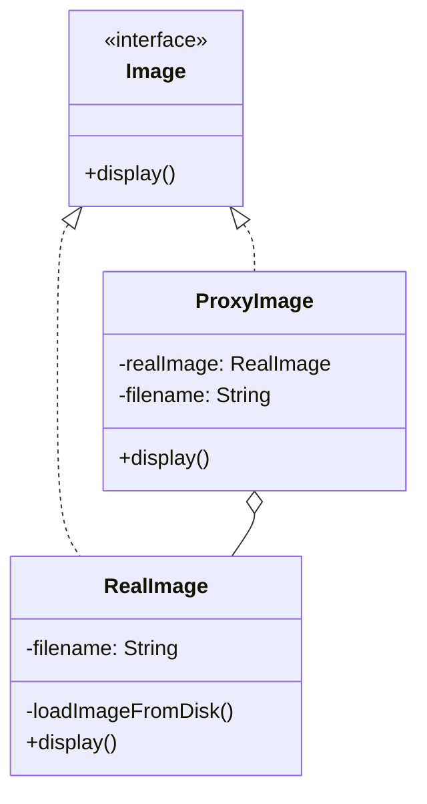
```mermaid
classDiagram
    class Image {
        <<interface>>
        +display()
    }
    class RealImage {
        -filename: String
        -loadImageFromDisk()
        +display()
    }
    class ProxyImage {
        -realImage: RealImage
        -filename: String
        +display()
    }
    Image <|.. RealImage
    Image <|.. ProxyImage
    ProxyImage o-- RealImage
```

##### When to reach for it

- The real object is expensive to construct and you want to defer that cost until it's actually used.
- You want caching, access checks, or logging wrapped around a call without touching the real class or the caller.
- You're working inside a framework that already does this for you (Spring beans, transactions, caching), and it helps to know a proxy is what's actually intercepting the call.

##### The takeaway

The proxy and the real object share the same interface on purpose, that's what lets the caller stay completely unaware of which one it's holding. If your proxy starts exposing methods the real object doesn't have, or the caller starts checking which one it got, the substitution has stopped being transparent and the pattern isn't doing its job anymore.

### Behavioral Patterns

How objects talk, delegate, and change behavior over time. The biggest bucket, twelve patterns, because there's more than one shape for objects to communicate in: chains, commands, states, strategies, and a handful of less common ones you'll still recognize the moment you've seen them once.

#### Chain of Responsibility

I once watched a login flow fail for a customer because one check in a five-step validation pipeline swallowed a bad case and just returned false, no explanation attached. Nobody upstream could tell which link in the chain had actually killed the request. That's the shape of almost every Chain of Responsibility bug: something in the middle ate it, and the chain itself doesn't say who.

##### The problem

You've got a request that needs to pass through a sequence of checks, and you don't want the caller writing an if/else ladder for each one, and you don't want any single checker to know about the others. `AuthService.login()` shouldn't need to know that user-exists comes before password comes before role-check, it should just hand the request to the first link and get back a yes or no.

##### How it's built

`AuthenticationRequest` carries username, password, email, and an `isAuthorized` flag that gets mutated as it travels. `BaseHandler` is the abstract base: a protected `nextHandler` field, `setNextHandler()`, an abstract `handle()`, and a shared protected `handleRequest(request, handlerName)` that does the actual work, call `canHandle()`, stop if it succeeds, forward to `nextHandler.handle()` if it doesn't. Every concrete handler's `handle()` is really a one-liner that calls `handleRequest()`, the only thing each subclass supplies is `canHandle()`. `UserExistsHandler` checks against a hardcoded list of valid usernames, `ValidPasswordHandler` checks length and looks up an expected password, `RoleCheckHandler` sets `request.setAuthorized(true)` on success, that's a handler mutating shared state as it passes through, which is exactly what this pattern lets you do since every handler receives the same request object. `AuthService.setupHandlerChain()` wires `userExistsHandler -> validPasswordHandler -> roleCheckHandler` with `setNextHandler()`, and `login()` just calls `handlerChain.handle(request)`. `addHandler()` walks to the tail and appends, so the whole chain composition happens at runtime, nothing hardcodes three handlers anywhere except the initial setup.

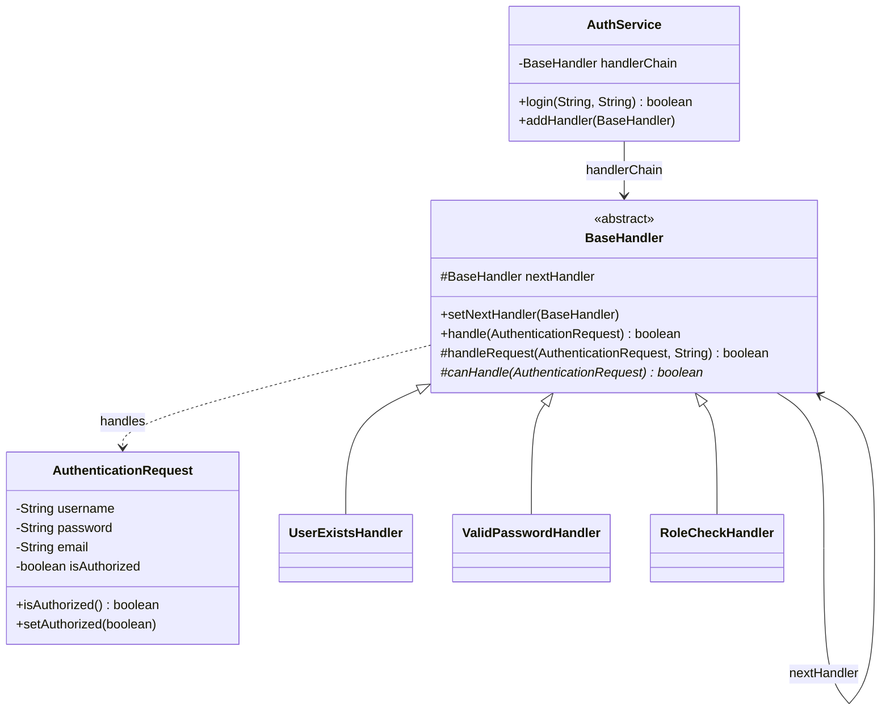
```mermaid
classDiagram
    class AuthenticationRequest {
        -String username
        -String password
        -String email
        -boolean isAuthorized
        +isAuthorized() boolean
        +setAuthorized(boolean)
    }
    class BaseHandler {
        <<abstract>>
        #BaseHandler nextHandler
        +setNextHandler(BaseHandler)
        +handle(AuthenticationRequest) boolean
        #handleRequest(AuthenticationRequest, String) boolean
        #canHandle(AuthenticationRequest)* boolean
    }
    class UserExistsHandler
    class ValidPasswordHandler
    class RoleCheckHandler
    class AuthService {
        -BaseHandler handlerChain
        +login(String, String) boolean
        +addHandler(BaseHandler)
    }
    BaseHandler <|-- UserExistsHandler
    BaseHandler <|-- ValidPasswordHandler
    BaseHandler <|-- RoleCheckHandler
    BaseHandler --> BaseHandler : nextHandler
    AuthService --> BaseHandler : handlerChain
    BaseHandler ..> AuthenticationRequest : handles
```

##### When to reach for it

Multi-step validation, approval workflows, middleware pipelines, anything where a request needs to try handler after handler until one of them takes it. One rule of thumb worth keeping: only reach for an actual linked chain when each handler consumes or escalates the request, like ATM cash denominations or a multi-level approval. If your "chain" is really just a flat list of independent rules being evaluated, a rule list run by an engine is simpler and you don't need the linked structure at all.

##### The takeaway

Chain of Responsibility decouples the sender from whichever handler ends up processing the request, but the cost is that the request no longer tells you, without logging, which handler actually stopped it. Log the handler name at every link, or you'll be grepping through several classes to find where a request quietly died.

#### Command

The first time I wrote a "remote control" style class without an undo stack, I ended up bolting a redo-state hack directly onto the invoker, because button presses were wired straight to receiver method calls with nothing in between. Command exists so you never have to retrofit that.

##### The problem

`Room` (the invoker) needs to trigger operations on `Light` and `Fan` objects without hardcoding which device or which operation lives in which slot, and it needs undo support without every receiver reimplementing its own undo logic.

##### How it's built

`ICommand` is the contract: `execute()`, `undo()`, `getDescription()`. `Light` is the receiver, holding `switchedOn` and `location`, with the real `switchOn()`/`switchOff()` logic. `SwitchLightOnCommand` and `SwitchLightOffCommand` each wrap a single `Light` reference and one receiver call, `undo()` is just the inverse call. `MacroCommand` holds a `List<ICommand>` and a `macroName`, `execute()` walks the list forward, `undo()` walks it backward, that ordering detail matters, undoing a macro correctly means reversing the sequence, not repeating it. `NoCommand` is the Null Object counterpart, used to pre-fill `Room`'s `commandSlots` array so `executeCommand()` never has to null-check an empty slot. `Room` is the invoker: a fixed-size `ICommand[]` for slots, a `Stack<ICommand> commandHistory` pushed to on every `executeCommand()`, and `undoLastCommand()` pops and calls `undo()`. `SmartHomeController` sits a level up, mapping room and light names to `Room`/`Light` instances and wiring commands through `setupRoomCommand()` based on a string action. Nowhere in `Room` does the code mention `Light` directly, it only ever touches `ICommand`, which is the entire point of the exercise.

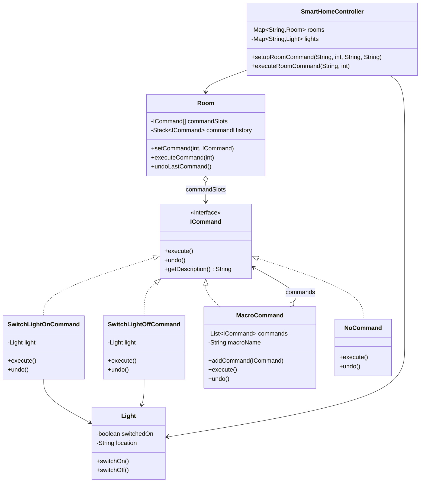
```mermaid
classDiagram
    class ICommand {
        <<interface>>
        +execute()
        +undo()
        +getDescription() String
    }
    class Light {
        -boolean switchedOn
        -String location
        +switchOn()
        +switchOff()
    }
    class SwitchLightOnCommand {
        -Light light
        +execute()
        +undo()
    }
    class SwitchLightOffCommand {
        -Light light
        +execute()
        +undo()
    }
    class MacroCommand {
        -List~ICommand~ commands
        -String macroName
        +addCommand(ICommand)
        +execute()
        +undo()
    }
    class NoCommand {
        +execute()
        +undo()
    }
    class Room {
        -ICommand[] commandSlots
        -Stack~ICommand~ commandHistory
        +setCommand(int, ICommand)
        +executeCommand(int)
        +undoLastCommand()
    }
    class SmartHomeController {
        -Map~String,Room~ rooms
        -Map~String,Light~ lights
        +setupRoomCommand(String, int, String, String)
        +executeRoomCommand(String, int)
    }
    ICommand <|.. SwitchLightOnCommand
    ICommand <|.. SwitchLightOffCommand
    ICommand <|.. MacroCommand
    ICommand <|.. NoCommand
    MacroCommand o--> ICommand : commands
    SwitchLightOnCommand --> Light
    SwitchLightOffCommand --> Light
    Room o--> ICommand : commandSlots
    SmartHomeController --> Room
    SmartHomeController --> Light
```

##### When to reach for it

Undo/redo, macro recording, queued or scheduled execution, or decoupling an invoker from a receiver it has no business knowing about directly.

##### The takeaway

Command's cost is one extra object per operation, and if you want undo, whatever state that operation needs to reverse itself. If you don't need queuing, logging, or undo, a direct method call is fine, don't wrap it in `ICommand` just to say you used the pattern.

#### Interpreter

I once wrote a tiny arithmetic evaluator for a pricing config field, something like "base + surge * 1.5", and the naive version was a growing switch statement over token types. Adding a new operator meant touching that same method again, every time. Interpreter's whole pitch is: stop doing that, give every grammar rule its own class.

##### The problem

You need to evaluate expressions built from a small grammar, numbers, variables, plus, minus, times, divide, and you want adding a new operator to mean adding a class, not editing an existing one.

##### How it's built

`Context` wraps a `Map<String, Integer>` for variables, `setVariable()`, `getVariable()`, `hasVariable()`. `AbstractExpression` is the one-method contract, `interpret(Context)` returns an int. `NumberExpression` and `VariableExpression` are the terminal nodes, a `NumberExpression` just returns its stored int, a `VariableExpression` looks itself up in the `Context` via `getVariable()`. `AddExpression`, `SubtractExpression`, `MultiplyExpression`, `DivideExpression` are the non-terminal nodes, each holding a `leftExpression` and `rightExpression`, and `interpret()` recursively calls `interpret()` on both sides before combining them. `DivideExpression` is the only one that has to think about failure, it throws `ArithmeticException` on a zero divisor before doing the division. Composing an expression is just nesting constructors: `(x + y) * (10 - 5)` becomes `new MultiplyExpression(new AddExpression(varX, varY), new SubtractExpression(num10, num5))`. There's no parser here, the tree is built by hand, a real implementation would need a tokenizer in front of this to go from a raw string to that tree.

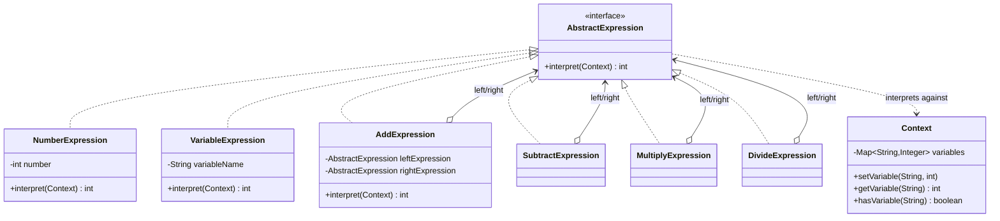
```mermaid
classDiagram
    class Context {
        -Map~String,Integer~ variables
        +setVariable(String, int)
        +getVariable(String) int
        +hasVariable(String) boolean
    }
    class AbstractExpression {
        <<interface>>
        +interpret(Context) int
    }
    class NumberExpression {
        -int number
        +interpret(Context) int
    }
    class VariableExpression {
        -String variableName
        +interpret(Context) int
    }
    class AddExpression {
        -AbstractExpression leftExpression
        -AbstractExpression rightExpression
        +interpret(Context) int
    }
    class SubtractExpression
    class MultiplyExpression
    class DivideExpression
    AbstractExpression <|.. NumberExpression
    AbstractExpression <|.. VariableExpression
    AbstractExpression <|.. AddExpression
    AbstractExpression <|.. SubtractExpression
    AbstractExpression <|.. MultiplyExpression
    AbstractExpression <|.. DivideExpression
    AddExpression o--> AbstractExpression : left/right
    SubtractExpression o--> AbstractExpression : left/right
    MultiplyExpression o--> AbstractExpression : left/right
    DivideExpression o--> AbstractExpression : left/right
    AbstractExpression ..> Context : interprets against
```

##### When to reach for it

Small, stable grammars: config languages, rule engines, places where you evaluate expressions far more often than you change the grammar. It's a different tool from Strategy (interchangeable algorithms, no tree) and from Composite (structural part-whole, no evaluation semantics attached), Interpreter is specifically about building and walking a tree that represents a language.

##### The takeaway

Don't reach for this past a handful of operators, each new grammar rule is a new class, and a deep expression tree means a deep call stack, that's a real limit, not a theoretical one. Past a certain grammar size you want a parser generator, not more expression classes.

#### Iterator

The first time I wrote a custom `Iterator` interface inside my own package, I got a compiler error that made no sense until I remembered `java.util.Iterator` exists too, and the unqualified name in my file resolved to mine instead of the JDK's. That's usually how people meet this pattern for the first time in Java, by accident, before they even realize they're using it constantly through the for-each loop.

##### The problem

`Company` owns a `List<Employee>` internally, and you don't want every caller reaching in and looping over that list directly, because then `Company` can never change its internal storage without breaking callers, and you can't have two independent traversal positions over the same collection without hand-rolled index tracking.

##### How it's built

`Iterator<T>` (yes, shadowing `java.util.Iterator` inside package `behavioral.iterator`) declares `hasNext()`, `next()`, `reset()`. `EmployeeIterator` implements it with a private `currentIndex` and a reference to the employee list, `hasNext()` is a bounds check, `next()` throws `NoSuchElementException` past the end, `reset()` zeroes `currentIndex` back to 0. `Aggregate<T>` is the other half, a one-method contract, `createIterator()`, that any collection-owning class implements. `Company implements Aggregate<Employee>`, and `createIterator()` just returns `new EmployeeIterator(employees)`. Because `Company` hands out a fresh `EmployeeIterator` each call, two callers doing `company.createIterator()` get independent position tracking over the same underlying list, that's the property the test file leans on directly when it advances two separate iterators side by side.

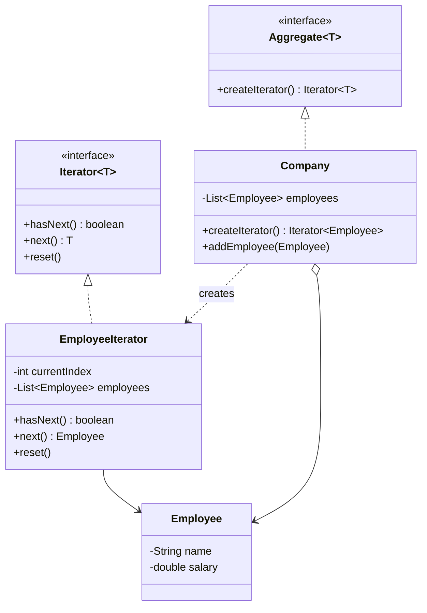
```mermaid
classDiagram
    class Iterator~T~ {
        <<interface>>
        +hasNext() boolean
        +next() T
        +reset()
    }
    class Aggregate~T~ {
        <<interface>>
        +createIterator() Iterator~T~
    }
    class EmployeeIterator {
        -int currentIndex
        -List~Employee~ employees
        +hasNext() boolean
        +next() Employee
        +reset()
    }
    class Company {
        -List~Employee~ employees
        +createIterator() Iterator~Employee~
        +addEmployee(Employee)
    }
    class Employee {
        -String name
        -double salary
    }
    Iterator <|.. EmployeeIterator
    Aggregate <|.. Company
    Company ..> EmployeeIterator : creates
    EmployeeIterator --> Employee
    Company o--> Employee
```

##### When to reach for it

Whenever a caller needs to walk a collection without knowing, or being allowed to know, its internal representation, or when you need multiple independent traversals over the same structure at once.

##### The takeaway

The pattern is mostly invisible once your language has built-in iteration protocols, Java's for-each, Python's generators, you're using Iterator constantly without ever writing the interface yourself. Write your own version, like `EmployeeIterator` here, only when the built-in one can't express what you need, resettable position, a non-standard order, something specific like that.

#### Mediator

Picture five components that all need to coordinate around one shared resource, a runway, say, and imagine wiring each one with a direct reference to every other one it might conflict with. That's the mess Mediator prevents, and air traffic control is the textbook example precisely because the alternative, planes coordinating with each other directly, is obviously insane once you say it out loud.

##### The problem

Multiple `Airplane` instances need to coordinate around a shared resource, the runway, but you don't want each `Airplane` holding references to every other `Airplane` it might conflict with, that's all-to-all coupling that gets worse with every aircraft you add.

##### How it's built

`IMediator` declares `execute()`, `executeA()`, `executeB()`, `notify(Component, String)`, `addComponent()`, `removeComponent()`. `Component` is the abstract base every participant extends, holding a protected `mediator` reference and `componentId`, its only real behavior is `notifyMediator(String)`, which forwards to `mediator.notify(this, message)`, so a `Component` never talks to another `Component`, only to the mediator. `Airplane extends Component` and adds `flightNumber`, `status`, `currentLocation`, its `executeA()`/`executeB()` are really `requestTakeOff()`/`requestLanding()` under the generic names the base class requires, each one calls `notifyMediator()` with a request string like `"TAKEOFF_REQUEST"`. `AirTrafficControlTower implements IMediator` and is where all the actual coordination logic lives: a `List<Component>`, a `List<Airplane>`, a `runwayAvailable` boolean, and `currentRunwayUser` tracking who's holding the shared resource. `notify()` is the single entry point, it switches on the request string inside `handleAirplaneRequest()` (`"TAKEOFF_REQUEST"`, `"LANDING_REQUEST"`, `"TAKEOFF_COMPLETE"`, `"LANDING_COMPLETE"`) and grants or denies based on `runwayAvailable`, calling back into `airplane.receivePermission()` to tell the aircraft what happened. Every cross-aircraft interaction, "runway occupied, wait," "runway free, proceed," passes through this one class instead of through direct references between planes.

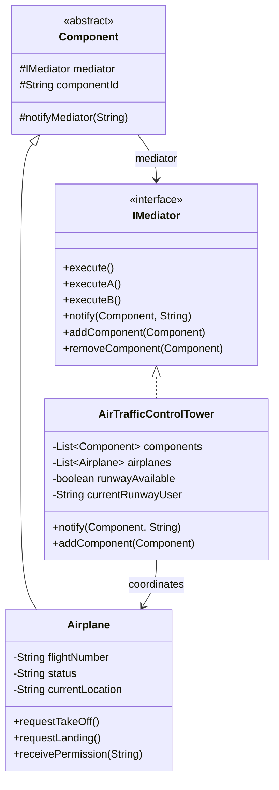
```mermaid
classDiagram
    class IMediator {
        <<interface>>
        +execute()
        +executeA()
        +executeB()
        +notify(Component, String)
        +addComponent(Component)
        +removeComponent(Component)
    }
    class Component {
        <<abstract>>
        #IMediator mediator
        #String componentId
        #notifyMediator(String)
    }
    class Airplane {
        -String flightNumber
        -String status
        -String currentLocation
        +requestTakeOff()
        +requestLanding()
        +receivePermission(String)
    }
    class AirTrafficControlTower {
        -List~Component~ components
        -List~Airplane~ airplanes
        -boolean runwayAvailable
        -String currentRunwayUser
        +notify(Component, String)
        +addComponent(Component)
    }
    Component <|-- Airplane
    IMediator <|.. AirTrafficControlTower
    Component --> IMediator : mediator
    AirTrafficControlTower --> Airplane : coordinates
```

##### When to reach for it

Many-to-many communication where the coordination logic itself is the hard part, not any single component's own behavior. If you just need one-to-many notifications with no arbitration involved, that's Observer, don't reach for the heavier pattern by default.

##### The takeaway

The mediator ends up as the one class that knows everything, which is the whole point, but it also means all your coordination bugs live in one place instead of scattered across every component. That's usually a good trade, just watch that the mediator doesn't quietly grow business logic that has nothing to do with coordination.

#### Memento

Every undo button you've ever clicked in a text editor is this pattern, and the detail people miss when they build their own is that whatever's holding your history isn't allowed to see your document's internals while it stores them, it just holds an opaque snapshot and hands it back later.

##### The problem

`TextEditor` needs undo/redo, which means saving snapshots of `TextArea`'s state before every edit, but `TextArea` shouldn't have to expose its internal fields publicly just so something else can stash and later restore them, that would trade encapsulation for a history feature.

##### How it's built

`Memento` is the snapshot: a final `text` field and `version`, with a package-private constructor and a package-private `getSavedText()`, so only classes inside `behavioral.memento` (in practice, only `TextArea`) can construct one or read its raw contents, everything else only ever sees `getMementoInfo()` (a version plus character count) or `toString()`. `TextArea` is the originator, `createMemento()` packages current text and version into a new `Memento`, `restore(Memento)` unpacks one back into its own fields. `CareTaker` holds a `Stack<Memento> mementoHistory` and a `maxHistorySize`, `addMemento()` evicts the oldest entry once the stack is full, `getMemento()` pops the most recent one. `TextEditor` wires two separate `CareTaker` instances, `undoCareTaker` and `redoCareTaker`, every mutating call (`writeText`, `appendText`, `insertText`, `clearText`) first calls `saveCurrentState()`, which pushes onto `undoCareTaker` and clears the redo history, because taking a new action after an undo should invalidate whatever you could have redone. `undo()` pushes the current state onto `redoCareTaker` before restoring the previous one from `undoCareTaker`, `redo()` does the mirror image, and that's the entire two-stack undo/redo mechanism.

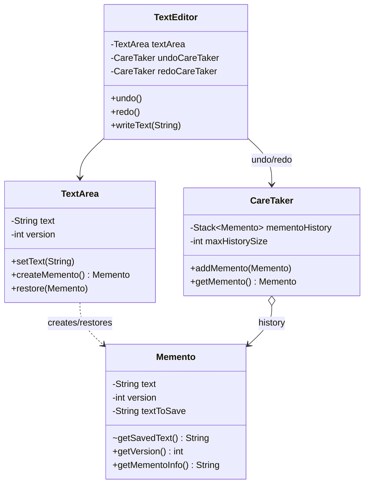
```mermaid
classDiagram
    class Memento {
        -String text
        -int version
        -String textToSave
        ~getSavedText() String
        +getVersion() int
        +getMementoInfo() String
    }
    class TextArea {
        -String text
        -int version
        +setText(String)
        +createMemento() Memento
        +restore(Memento)
    }
    class CareTaker {
        -Stack~Memento~ mementoHistory
        -int maxHistorySize
        +addMemento(Memento)
        +getMemento() Memento
    }
    class TextEditor {
        -TextArea textArea
        -CareTaker undoCareTaker
        -CareTaker redoCareTaker
        +undo()
        +redo()
        +writeText(String)
    }
    TextArea ..> Memento : creates/restores
    CareTaker o--> Memento : history
    TextEditor --> TextArea
    TextEditor --> CareTaker : undo/redo
```

##### When to reach for it

Any feature that needs to roll back to a prior state, undo/redo in an editor, rollback in a transaction, save-game snapshots. If state is cheap to snapshot, this is a clean fit, if state is large, think about how expensive each `Memento` actually is before you're pushing hundreds of them onto a stack.

##### The takeaway

Memento buys you encapsulation-preserving history at the cost of memory, every saved state is a full snapshot, not a diff. Cap your `CareTaker`'s history size the way this implementation does with `maxHistorySize`, an unbounded undo stack is a memory leak with extra steps.

#### Null Object

I've lost count of how many `NullPointerException`s I've traced back to an optional dependency, a logger, a notifier, something that's fine to skip, that someone forgot to null-check three call sites deep. Null Object's fix is almost insultingly simple: make "nothing" a real object instead of the absence of one.

##### The problem

`Application` takes an `AbstractLogger`, but logging is genuinely optional in some configurations, and you don't want `performOperation()`, or any other method, doing a null check before every single log call, that check would end up repeated everywhere the logger gets used.

##### How it's built

`AbstractLogger` is a one-method abstract class, `log(String)`. `ConsoleLogger` and `FileLogger` are the real implementations doing actual work. `NullLogger extends AbstractLogger` too, its `log()` body is empty, a legitimate implementation of the contract that just does nothing. `LoggerFactory.getLogger(String type)` is the single place that decides what you get back, if `type` is null or doesn't match `"CONSOLE"`/`"FILE"`/`"NULL"` it falls through to `new NullLogger()`, so the factory never hands back an actual null reference. `Application`'s constructor still guards with a ternary, `logger != null ? logger : new NullLogger()`, covering the case where someone bypasses the factory and passes null directly, so the null-safety is enforced at two levels, factory and consumer, belt and suspenders. Everywhere else in `Application`, `logger.log(...)` runs with zero null checks, because there's no null logger reachable through this code path anymore.

```mermaid
classDiagram
    class AbstractLogger {
        <<abstract>>
        +log(String)*
    }
    class ConsoleLogger {
        +log(String)
    }
    class FileLogger {
        -String filename
        +log(String)
    }
    class NullLogger {
        +log(String)
    }
    class LoggerFactory {
        +getLogger(String) AbstractLogger
    }
    class Application {
        -AbstractLogger logger
        +performOperation(String)
        +setLogger(AbstractLogger)
    }
    AbstractLogger <|-- ConsoleLogger
    AbstractLogger <|-- FileLogger
    AbstractLogger <|-- NullLogger
    LoggerFactory ..> AbstractLogger : creates
    Application --> AbstractLogger : logger
```

##### When to reach for it

Optional collaborators, objects your code calls but which are allowed to legitimately do nothing, logging, notifications, analytics hooks, anywhere a no-op is a valid business outcome rather than an error condition.

##### The takeaway

Don't use Null Object to swallow error states, it's for "this collaborator is legitimately absent," not "something went wrong and I don't want to deal with it." If the null case should actually surface an error somewhere, a no-op object just hides the bug quietly instead of failing loudly.

#### Observer

The bug I remember here isn't a crash, it's a silence, a subscriber that stopped getting notified because nobody unsubscribed it properly and it just sat there, or the opposite, an event that fired and nobody downstream noticed because the listener never got registered in the first place. Observer bugs are almost always about the subscription list, not the notification logic.

##### The problem

`Publisher` needs to tell an arbitrary, changing set of interested parties when something happens, without hardcoding which parties those are, and without those parties needing to poll for changes.

##### How it's built

`EventListener` is a one-method interface, `update()`, no parameters, which is worth noticing: the design bakes each listener's context into its constructor rather than into the event payload, `EmailMsgListener` takes an `email` string at construction, `MobileAppListener` takes a `deviceId`, so `update()` already has everything it needs, it doesn't need the event to hand it anything. `Publisher` holds a `List<EventListener> subscribers`, `subscribe()`/`unsubscribe()` add or remove from that list, `notifySubscribers()` loops over it calling `update()` on every entry. `ConcreteSubscriber extends Publisher` directly rather than composing one, `performAction()` is the trigger, it does whatever the "event" actually is and then calls `notifySubscribers()` to fan out. Because subscribe/unsubscribe just mutate a list, registration is fully dynamic at runtime, the test file shows this directly: unsubscribe `emailListener1`, fire the event again, only the remaining listeners get called.

```mermaid
classDiagram
    class EventListener {
        <<interface>>
        +update()
    }
    class Publisher {
        -List~EventListener~ subscribers
        +subscribe(EventListener)
        +unsubscribe(EventListener)
        +notifySubscribers()
    }
    class EmailMsgListener {
        -String email
        +update()
    }
    class MobileAppListener {
        -String deviceId
        +update()
    }
    class ConcreteSubscriber {
        -String name
        +performAction()
    }
    Publisher <|-- ConcreteSubscriber
    EventListener <|.. EmailMsgListener
    EventListener <|.. MobileAppListener
    Publisher o--> EventListener : subscribers
```

##### When to reach for it

One-to-many notification where the "one" doesn't need to know who's listening or how many there are, config change broadcasts, UI event systems, anything shaped like publish/subscribe.

##### The takeaway

The most common way this pattern breaks in production isn't the notify loop, it's forgetting to unsubscribe. A listener that outlives its usefulness but stays in the list is a memory leak and a source of notifications firing into dead code. If your listeners have a shorter lifetime than the publisher, make sure something calls unsubscribe when they're done.

#### State

The tell that you need State instead of a pile of booleans is when you catch yourself writing "if locked and not off, do X, but if off do nothing, unless." Phone lock/unlock/power logic is the cleanest version of this I've seen: three states, six actions, and every action means something different depending on which state you're in.

##### The problem

`Phone`'s behavior for the same six actions, `onHome`, `onOffOn`, `lock`, `home`, `unlock`, `turnOn`, is completely different depending on whether the phone is locked, ready, or off, and encoding that as conditionals inside `Phone` itself means every new state adds a branch to every single method.

##### How it's built

`State` is an abstract class holding a protected `Phone` reference and six abstract methods, one per action, so every concrete state has to answer all six, there's no partial implementation. `LockedState.unlock()` calls `phone.setState(new ReadyState(phone))` and returns a message, that's the actual transition: a state doesn't just describe behavior, it also decides the next state by constructing it and handing it to `phone.setState()`. `ReadyState.lock()` does the mirror transition into `LockedState`. `OffState.turnOn()` (and `onOffOn()`) both move into `ReadyState`, and note that `onHome()`/`lock()`/`home()`/`unlock()` on `OffState` all just return "can't do that, phone is off" strings without any state change, plenty of these six actions are simply invalid in a given state, and that's expressed as "do nothing but say why," not as an exception. `Phone` is the context, holding a single `State` field, and every one of its own public methods is a one-line delegation, `state.onHome()`, `state.lock()`, and so on, `Phone` never contains an if/else about what state it's in, it just asks the current state object. The file also sketches an alternative `IState`/`ConcreteState` shape with a settable context, worth noting only because "state holds a back-reference to its context" is the recurring shape, not the specific method names.

```mermaid
classDiagram
    class State {
        <<abstract>>
        #Phone phone
        +onHome() String
        +onOffOn() String
        +lock() String
        +home() String
        +unlock() String
        +turnOn() String
    }
    class LockedState
    class ReadyState
    class OffState
    class Phone {
        -State state
        +setState(State)
        +getCurrentState() String
        +onHome() String
        +lock() String
    }
    State <|-- LockedState
    State <|-- ReadyState
    State <|-- OffState
    State --> Phone : phone
    Phone --> State : state
```

##### When to reach for it

Any entity whose valid operations, and their outcomes, depend on which stage of a lifecycle it's currently in: vending machines, elevators, order status, connection states. If the behavior differs per state rather than per client-chosen algorithm, that's State, not Strategy.

##### The takeaway

Watch for state explosion. Three states and six methods, like this example, is fine, but a state machine with a dozen states each implementing a dozen methods gets unwieldy fast. If most transitions and behaviors are actually shared and only one or two methods differ, you might be overpaying for a full `State` object per state.

#### Strategy

Every payments codebase I've touched eventually needs a second payment method, and the ones that started with a big if/else on a string end up rewriting that same if/else in three more places by the time a fourth method shows up. Strategy's whole job is making sure that growth costs you a new class, not a new branch in five existing ones.

##### The problem

`PaymentService` needs to process an order using whichever payment method the client picked, PayPal, credit card, whatever comes next, without `processOrder()` itself knowing anything about how a given method actually validates or charges.

##### How it's built

`PaymentStrategy` is the contract: `collectPaymentDetails()`, `validate()`, `pay(int)`. `PaymentByPayPal` and `PaymentByCreditCard` both implement it with their own fields (`email`/`password` for PayPal, `cardNumber`/`expiryDate`/`cvv`/`cardHolderName` for the card), and both route `pay()` through their own `validate()` first, so validation logic lives with the strategy that owns the fields it's validating, not in some shared `PaymentService` method. `PaymentService` is the context, holding a single `PaymentStrategy` field, `setStrategy()` swaps it, `processOrder()` calls `collectPaymentDetails()` then `pay()` on whatever strategy is currently set, with zero knowledge of PayPal or credit cards. `Client.makePayment(String, int)` is where selection actually happens, a switch on the payment method string constructs the right `PaymentStrategy` and hands it to `paymentService.setStrategy()` before calling `processOrder()`, that switch is the one place in the whole system that has to know all the concrete strategy types, everything downstream only sees the interface. The file also keeps a bare-bones `IStrategy`/`ConcreteStrategy` pair around as a simpler illustration of the same shape without the payment-specific methods.

```mermaid
classDiagram
    class PaymentStrategy {
        <<interface>>
        +collectPaymentDetails()
        +validate() boolean
        +pay(int)
    }
    class PaymentByPayPal {
        -String email
        -String password
        +collectPaymentDetails()
        +validate() boolean
        +pay(int)
    }
    class PaymentByCreditCard {
        -String cardNumber
        -String expiryDate
        -String cvv
        +collectPaymentDetails()
        +validate() boolean
        +pay(int)
    }
    class PaymentService {
        -PaymentStrategy strategy
        +setStrategy(PaymentStrategy)
        +processOrder(int)
    }
    class Client {
        -PaymentService paymentService
        +makePayment(String, int)
    }
    PaymentStrategy <|.. PaymentByPayPal
    PaymentStrategy <|.. PaymentByCreditCard
    PaymentService --> PaymentStrategy : strategy
    Client --> PaymentService
    Client ..> PaymentStrategy : selects
```

##### When to reach for it

Whenever you need to swap an algorithm at runtime and the algorithms genuinely differ in behavior, not just in values. Strategy generally comes in three shapes: a comparator cascade (rank candidates), a first-success cascade (try each until one works), or a contributor list (combine results from all of them). This example is closer to "client picks exactly one," which is a valid, simpler use of the same interface.

##### The takeaway

If your "strategies" only differ by which numbers they plug into the same formula, you don't need Strategy, you need a config table. Reach for the interface only when the actual logic changes between implementations, not just the inputs.

#### Template Method

I've rewritten the same "load config, load assets, connect network" skeleton across several loader classes before, log line for log line, before noticing only the middle of each step was actually different. Template Method exists so you write that skeleton exactly once.

##### The problem

`Loader1`, `Loader2`, `CloudLoader`, and `DebugLoader` all share the same overall loading sequence, three steps in a fixed order with a header and footer log around them, but each one's actual step logic differs, and you don't want that shared skeleton copy-pasted four times with only the middle changed.

##### How it's built

`BaseGameLoader.load()` is declared `final`, deliberately, it's the one method nobody gets to override. It prints a header using `getLoaderType()`, calls `step1()`, `step2()`, `step3()` in that fixed order, then prints a footer. `step1`/`step2`/`step3` are abstract, every subclass must supply them, that's the part of the algorithm that has to vary. `getLoaderType()` and `shouldLogProgress()` are hook methods, they have default implementations on `BaseGameLoader` but subclasses can override them, `Loader2` overrides `shouldLogProgress()` to return false because it doesn't want verbose logging, `DebugLoader` overrides it to explicitly return true, `Loader1` and `CloudLoader` just inherit the default. `logProgress(String)` is a concrete helper on the base class that checks `shouldLogProgress()` before printing, so hook methods aren't just decoration, they actually gate behavior inside a method the subclass never touches directly. Each concrete loader, `Loader1` (database-flavored), `Loader2` (filesystem-flavored, quiet), `CloudLoader` (cloud auth and sync), `DebugLoader` (verbose, always logs), implements the three abstract steps with completely different content but goes through the exact same `load()` sequence, which is the guarantee this pattern sells: the order can never drift between loaders because it isn't any individual loader's to control.

```mermaid
classDiagram
    class BaseGameLoader {
        <<abstract>>
        +load()
        #step1()*
        #step2()*
        #step3()*
        #getLoaderType() String
        #shouldLogProgress() boolean
        #logProgress(String)
    }
    class Loader1 {
        #step1()
        #step2()
        #step3()
    }
    class Loader2 {
        #shouldLogProgress() boolean
    }
    class CloudLoader
    class DebugLoader {
        #shouldLogProgress() boolean
    }
    BaseGameLoader <|-- Loader1
    BaseGameLoader <|-- Loader2
    BaseGameLoader <|-- CloudLoader
    BaseGameLoader <|-- DebugLoader
```

##### When to reach for it

A family of classes that share the same overall algorithm shape but differ in a handful of steps: ETL pipelines, framework lifecycle hooks, test setup and teardown. If the variation is closer to "swap the whole algorithm" than "override a couple of steps in a fixed skeleton," you probably want Strategy (composition) instead of Template Method (inheritance).

##### The takeaway

Template Method locks the algorithm's shape down using inheritance, which means every loader is permanently tied to `BaseGameLoader`, you can't swap the skeleton itself at runtime the way you could swap a Strategy. That's fine when the skeleton really is fixed, it's a liability the moment you discover you need two different skeletons.

#### Visitor

The first time I needed to add a new report across `Bank`, `Company`, and `Restaurant` classes that already existed, say a marketing-campaign generator, I didn't want to touch any of those three classes to bolt on another method each. Visitor is what lets you add that operation from the outside, at the cost of a mechanic that trips up almost everyone the first time they read it: double dispatch.

##### The problem

`Bank`, `Company`, and `Restaurant` need several unrelated operations run against them, tax assessment, insurance messaging, financial analysis, audits, and you don't want each of those bolted directly onto the element classes as more and more methods pile up on `Bank`/`Company`/`Restaurant` every time someone invents a new report.

##### How it's built

`IElement` declares one method, `accept(IVisitor)`, and `Bank`/`Company`/`Restaurant` all implement it identically in shape, `visitor.visitBank(this)` (or `visitCompany`/`visitRestaurant` respectively). `IVisitor` declares one method per element type, `visitBank(Bank)`, `visitCompany(Company)`, `visitRestaurant(Restaurant)`. That `accept()`/`visitX()` pair is the double dispatch: calling `element.accept(visitor)` first dispatches on `element`'s runtime type (which `accept()` implementation runs), and inside that method, `visitor.visitBank(this)` dispatches a second time on `visitor`'s runtime type, so the method that actually executes depends on both types at once, not just one, which is exactly why there's no `instanceof` anywhere in this code. `TaxAssessmentVisitor`, `InsuranceMessagingVisitor`, `FinancialAnalysisVisitor`, and `AuditVisitor` are four completely different operations implementing the same `IVisitor` contract, `TaxAssessmentVisitor.visitBank()` taxes deposits-minus-loans at 25%, `visitCompany()` taxes profit at 30%, `visitRestaurant()` taxes annualized daily profit at 20%, three different formulas, one visitor, no changes to `Bank`/`Company`/`Restaurant` needed to add it. `FinancialSystem` is the object structure, a `List<IElement>`, `acceptVisitor(IVisitor)` just loops calling `institution.accept(visitor)` on everything it holds, that's the single fan-out point for any visitor you write. The test file's `CreditUnion` class shows the pattern's real cost directly: it's a new `IElement`, but `IVisitor`'s interface has no `visitCreditUnion()` method, so `CreditUnion.accept()` can't dispatch anywhere, it just prints that it can't. Adding a new element type means touching every existing visitor, not just adding one class.

```mermaid
classDiagram
    class IElement {
        <<interface>>
        +accept(IVisitor)
    }
    class IVisitor {
        <<interface>>
        +visitBank(Bank)
        +visitCompany(Company)
        +visitRestaurant(Restaurant)
    }
    class Bank {
        -String bankName
        -double totalDeposits
        -double totalLoans
        +accept(IVisitor)
    }
    class Company {
        -String companyName
        -double revenue
        -double expenses
        +accept(IVisitor)
    }
    class Restaurant {
        -String restaurantName
        -double dailyRevenue
        +accept(IVisitor)
    }
    class TaxAssessmentVisitor {
        +visitBank(Bank)
        +visitCompany(Company)
        +visitRestaurant(Restaurant)
    }
    class InsuranceMessagingVisitor
    class FinancialAnalysisVisitor
    class AuditVisitor
    class FinancialSystem {
        -List~IElement~ institutions
        +addInstitution(IElement)
        +acceptVisitor(IVisitor)
    }
    IElement <|.. Bank
    IElement <|.. Company
    IElement <|.. Restaurant
    IVisitor <|.. TaxAssessmentVisitor
    IVisitor <|.. InsuranceMessagingVisitor
    IVisitor <|.. FinancialAnalysisVisitor
    IVisitor <|.. AuditVisitor
    FinancialSystem o--> IElement : institutions
    Bank ..> IVisitor : accept dispatches to
    Company ..> IVisitor : accept dispatches to
    Restaurant ..> IVisitor : accept dispatches to
```

##### When to reach for it

A stable set of element types that rarely changes, but a growing set of unrelated operations you want to run against them: compilers walking an AST, document exporters, reporting across a fixed set of domain objects. If new element types show up more often than new operations, invert your thinking, Visitor is the wrong shape, you'll be touching every visitor on every new element.

##### The takeaway

Visitor trades "adding an operation is free" for "adding an element type is expensive," it's a deliberate bet on which axis of change is more likely in your domain. Know which axis actually moves before you commit to it, guessing wrong means rewriting every visitor class you've already written.

[← Back to Interview Prep](/interview)
