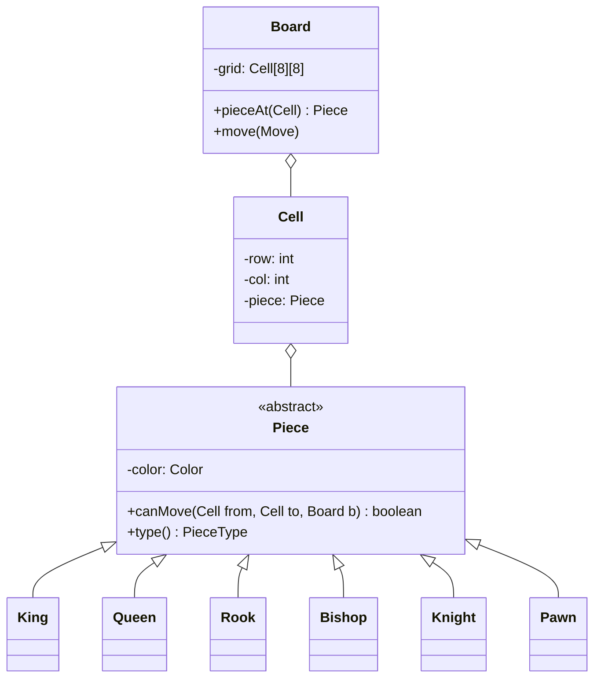

This is the "design chess" question, and it's a trap dressed as a party trick. Everyone knows the rules of chess, so candidates think the hard part is behind them and the win is just typing it out. Then the clock runs and they're forty minutes into a `Game` class with a `boolean isValidMove()` that's a 200-line switch on piece type, en passant half-implemented, castling forgotten, and no king-in-check logic anywhere. The interviewer isn't asking you to write Stockfish. In 60 minutes you cannot write a full FIDE engine and you shouldn't try, that's the scope trap and it sinks more people here than anything else. What's actually being probed is smaller: can you model per-piece move legality cleanly instead of one giant switch, and can you keep the game and turn state honest. Get those two and the rest is a board and a loop.

Let me walk it the way the [framework post](/interview/low-level-design/lld-framework/) says to: scope, entities and invariants, the variation axis, then the game state and a short concurrency pass.

## The problem

Lock the scope out loud before you write a line. An 8x8 board, the six piece types, and these operations:

- **Validate a move**: given a from-cell and a to-cell, is this legal for the piece sitting there, right now, for the player whose turn it is.
- **Make a move**: apply a validated move, capture if the destination holds an enemy piece, then hand the turn to the other player.
- **Detect check and checkmate** at a basic level: after a move, is the opponent's king attacked, and does the opponent have any legal reply.

Say what's out of scope, this is where you buy back your 60 minutes: no AI opponent, no move scoring, no clocks, no persistence or networking. And be explicit that the fiddly FIDE special cases (en passant, castling, pawn promotion, threefold repetition) are extensions I'll mention but not build unless there's time. Naming them shows you know they exist, deferring them shows judgment. In-memory, a `Main` that plays a few moves, no controllers.

## Entities and invariants

Nouns become classes. A `Board` owns an 8x8 grid of `Cell`s, a `Cell` knows its coordinates and may hold one `Piece`. `Piece` is abstract with six subclasses, `King`, `Queen`, `Rook`, `Bishop`, `Knight`, `Pawn`, each carrying a `Color`. A `Player` owns a color. A `Move` records the from-cell, the to-cell, the piece moved, and any piece captured. A `Game` ties it together: the board, the two players, whose turn it is, and a status. Two enums carry the fixed-value adjectives: `Color` (WHITE, BLACK) and `PieceType` (KING, QUEEN, ROOK, BISHOP, KNIGHT, PAWN).

Now the invariants, the part people skip, because they are what your validation and your turn loop are actually defending:

- **A cell holds at most one piece.** The grid is the single source of truth for where everything is, no piece and no separate list disagrees with it.
- **A move must be legal for that piece's movement rule AND must not leave your own king in check.** This is the one that catches people. A rook can slide to a square, but if sliding it exposes your king, the move is illegal even though the rook's own rule says yes. Legality is two gates, not one.
- **Turns strictly alternate.** White, black, white. A move by the player who isn't on turn is rejected before anything else runs.

Models carry behavior, not just getters. `Piece.canMove(from, to, board)` knows its own movement geometry, `Board.pieceAt(cell)` answers for the grid, `Move.isCapture()` answers for itself. Constructor injection everywhere, nothing does `new` on a rule inside the game loop.



## Where the variation lives

Two axes vary here and they're different in kind, so keep them apart.

The first is per-piece movement, the thing that differs between a rook and a knight. This is polymorphism, plain and simple. Each `Piece` subclass implements `canMove` with its own geometry, a rook checks same-row-or-same-column, a bishop checks equal row and column deltas, a knight checks the L. The alternative, one `MoveValidator` with a `switch (piece.type())`, is the anti-pattern the whole question is built to expose: every new piece variant (fairy chess, a custom mode) means reopening and editing that switch, and the switch grows into the unreadable blob I described up top. Strategy-per-piece beats a switch on type because a new piece is a new class and nothing existing gets touched. Use a small `PieceFactory` to stamp out the back rank so the setup code isn't twelve `new` calls in a row.

The second axis is move validation, and this is the [rule-chain angle](/interview/low-level-design/patterns/rule-chain-variation/). Whether a move is legal isn't one question, it's an ordered list of checks that all have to pass: is the piece the current player's? does the piece's own rule allow the shape of the move? is the path between from and to clear (for sliders)? is the destination free or an enemy? and finally, does the move leave my own king in check? That's a flat `List<MoveRule>` evaluated in order, fail-fast, first failure ends it. A rule list beats nested ifs because the ifs bury the ordering and the short-circuit inside one method, and adding a rule means surgery in the middle of it, with a list you append a class and the engine loop is untouched. It's shape (b) from the rule-chain playbook: dumb single-check rules, an engine that owns iteration.

```java
// models/pieces/Piece.java, geometry lives on the piece, not in a switch
public abstract class Piece {
    protected final Color color;
    protected Piece(Color color) { this.color = color; }
    public abstract boolean canMove(Cell from, Cell to, Board board);
    public abstract PieceType type();
    public Color color() { return color; }
}

// models/pieces/Rook.java, one implementation, no reference to any other piece
public class Rook extends Piece {
    public Rook(Color color) { super(color); }
    @Override public boolean canMove(Cell from, Cell to, Board board) {
        return from.row() == to.row() || from.col() == to.col();   // straight lines only
    }
    @Override public PieceType type() { return PieceType.ROOK; }
}

// strategies/rules/MoveRule.java, one check, a reason on failure
public interface MoveRule {
    RuleResult check(Move move, Board board, Color turn);
}

// strategies/rules/MoveValidator.java, engine owns the order and the fail-fast
public class MoveValidator {
    private final List<MoveRule> rules;   // constructor-injected, order IS the policy
    public MoveValidator(List<MoveRule> rules) { this.rules = rules; }

    public RuleResult validate(Move move, Board board, Color turn) {
        for (MoveRule rule : rules) {
            RuleResult r = rule.check(move, board, turn);
            if (!r.passed()) return r;    // first failure wins, carries the reason
        }
        return RuleResult.ok();
    }
}
```

The rule order matters and you state it as an invariant: cheap ownership and geometry checks run before the expensive king-in-check check, because the last rule has to simulate the move on a copy of the board and re-scan for attackers, and you don't want to pay that on a move that already failed the piece's own geometry. The king-safety rule is the one that plays the move, asks "is my king attacked now," and rolls back. Say that out loud, it's the whole reason legality is two gates.

## Turn and game state

Keep this brief, the game object is thin. `Game` holds the board, the two players, whose color is on turn, and a `GameStatus` enum: `ACTIVE`, `CHECK`, `CHECKMATE`, `STALEMATE`. The turn loop is: reject the move if it's not this color's turn (that's the alternation invariant, checked before validation even runs), run the move through the `MoveValidator`, apply it to the board on success, then recompute status against the opponent. If the opponent's king is attacked and they have no legal reply, it's `CHECKMATE`. If they're not attacked but have no legal reply, `STALEMATE`. Attacked with a reply, `CHECK`. Otherwise back to `ACTIVE` and the turn flips. Checkmate detection reuses the validator you already wrote: generate the opponent's candidate moves, and if every one fails the king-safety rule, there's no escape.

## Concurrency

Be honest here, and honesty scores. Chess is almost always a local two-player game, one board, one thread, moves happen one at a time by construction because the turn alternates. So I'd say plainly: single-threaded, no locks, the alternation invariant already serializes everything. Reaching for `ConcurrentHashMap` on the board would be pattern theater, and the interviewer clocks that.

The one scenario where concurrency shows up is a server mediating an online game, two clients submitting moves over a socket. Even then the fix is small: one lock per `Game` so the two players' moves serialize, and here's the point, out-of-turn moves are rejected by the turn state, not by the lock. The lock stops two moves from interleaving mid-apply and corrupting the grid; the alternation check stops black from moving on white's turn. Different mechanisms for different jobs. One `Game`, one lock, and the state does the rest. Scoping it that honestly, instead of sprinkling atomics everywhere, is the senior signal.

## The takeaway

Chess rewards restraint the same way the parking lot does. It's a small model with real behavior on the pieces, one invariant that's easy to state and easy to forget (legal for the piece AND doesn't expose your king), and one giant switch you refuse to write. Put the geometry on the pieces, put validation in an ordered rule list, keep the game object thin, and don't try to build an engine. To add a new variant piece you write a new `Piece` subclass and register it in the factory, nothing else changes. To add a new rule, castling legality, en passant, promotion, you write a new `MoveRule` and drop it in the list at the right position. That's the sentence you close the round on.

[← Back to Rule-Chain Variation Playbook](/interview/low-level-design/patterns/rule-chain-variation)
