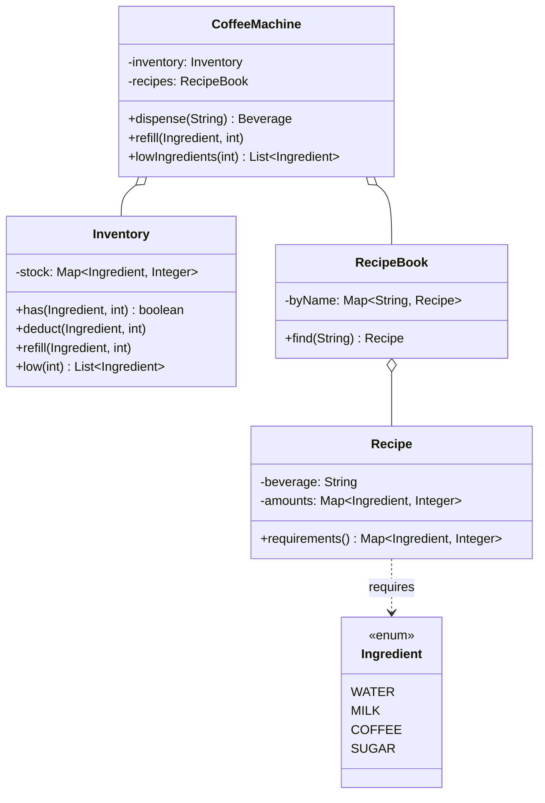

This is the "design a coffee vending machine" question, and it looks so much like its cousin the [vending machine](/interview/low-level-design/problems/vending-machine/) that candidates reach for the same toolbox and pick the wrong tool. The vending machine is a lifecycle problem, the same button does different work depending on which state the machine is in, so it wants State classes. The coffee machine is not that. The buttons don't change meaning, every beverage brews the exact same way. What changes between a latte and a black coffee is a set of numbers: how much water, how much milk, how much coffee, how much sugar. The real test here is whether you see that beverages are recipes, recipes are data, and the brew logic is one algorithm you parameterize by a recipe table instead of writing a `makeLatte()` and a `makeEspresso()` and a `makeCappuccino()`.

Get that one call right and the whole design collapses into something small. Get it wrong and you write a method per drink, and when the interviewer says "now add a mocha" you write a fourth method, and you've just demonstrated the exact anti-pattern the question exists to catch.

Let me walk it the [framework](/interview/low-level-design/lld-framework/) way: scope, entities and invariants, the variation axis, then a concurrency pass.

## The problem

Lock the scope out loud before writing anything. A handful of operations, no more:

- **Dispense a beverage**: pick one of N beverages, and if the machine holds enough of every ingredient the recipe needs, brew it and deduct the ingredients.
- **Refill an ingredient**: top up water, milk, coffee, or sugar.
- **Report low ingredients**: list the ingredients sitting below some threshold so someone knows to refill.

Explicitly out of scope, and say so: payment and coin handling (that's the vending machine's problem, keep it out so the recipe story stays clean), the physical heating and pouring hardware, per-cup customization like "extra shot," multiple outlets brewing in parallel beyond the shared inventory, and any persistence. In-memory, one machine, a `Main` that runs the scenario, no controllers. Concurrency matters because a real machine has several outlets pulling from one shared tank, so I'll assume yes.

## Entities and invariants

Nouns become classes. A `CoffeeMachine` owns an `Inventory` and a `RecipeBook`. `Ingredient` is an enum with the fixed set (`WATER`, `MILK`, `COFFEE`, `SUGAR`). The `Inventory` wraps a `Map<Ingredient, Integer>` of how much of each ingredient is on hand, and it gets real behavior: `has(ingredient, amount)`, `deduct(ingredient, amount)`, `refill(ingredient, amount)`, `low(threshold)`. A `Recipe` is the important one, it's a beverage name plus the `Map<Ingredient, Integer>` it requires, and that map is the entire definition of the drink. The `RecipeBook` holds `Map<String, Recipe>` keyed by beverage name.

Notice what's missing: there is no `Latte` class, no `Espresso` class, no `Beverage` subclass hierarchy. A beverage is a row in the recipe book. That absence is the design.

Now the invariants, because they drive both the guards and the locks:

1. **Dispense only if every required ingredient has enough on hand.** Not most, every. If the recipe wants 50 water, 30 milk, 20 coffee and the milk is short, the whole brew is refused. This is the availability precondition.
2. **On dispense, deduct exactly the recipe amounts, all-or-nothing.** You never deduct water and coffee, then discover milk was short and leave the tank in a half-consumed state. Either every ingredient comes down together or nothing moves. A half-brewed deduction is the bug this design exists to prevent.
3. **Inventory never goes negative.** Falls out of the first two if they hold, but state it, because it's the thing your concurrency pass has to actually protect.

Models carry behavior, not just getters. `Inventory.has(ing, amt)` answers for itself, `Recipe.requirements()` hands back its own map, the machine asks the inventory questions rather than reaching into a raw map. Constructor injection everywhere, the `RecipeBook` and `Inventory` are handed to the `CoffeeMachine` at construction.



## Why this is data-driven

Here's the judgment call that scores, say it out loud. The beverages are a config table, `Map<String, Recipe>`, where each recipe is itself a `Map<Ingredient, Integer>`. Seed it in `Main`:

```java
// recipes are DATA. new drink = new row, not new code.
Map<String, Recipe> table = Map.of(
    "espresso",     new Recipe("espresso",     Map.of(WATER, 30, COFFEE, 20)),
    "latte",        new Recipe("latte",        Map.of(WATER, 50, MILK, 40, COFFEE, 20, SUGAR, 10)),
    "black_coffee", new Recipe("black_coffee", Map.of(WATER, 60, COFFEE, 25))
);
RecipeBook book = RecipeBook.of(table.values());   // validates amounts > 0, ingredients known
```

The brew method is identical for every drink. It doesn't know or care whether it's pouring a latte or a black coffee, it reads the recipe, checks availability, deducts, and returns the beverage:

```java
public boolean canMake(String beverage) {
    Recipe r = recipes.find(beverage);              // throws UnknownBeverageException if absent
    return r.requirements().entrySet().stream()
            .allMatch(e -> inventory.has(e.getKey(), e.getValue()));
}

public Beverage dispense(String beverage) {
    Recipe r = recipes.find(beverage);
    // invariant 1: check EVERY ingredient before touching any
    for (var e : r.requirements().entrySet())
        if (!inventory.has(e.getKey(), e.getValue()))
            throw new InsufficientIngredientException(e.getKey());
    // invariant 2: passed the full check, now deduct all of them
    for (var e : r.requirements().entrySet())
        inventory.deduct(e.getKey(), e.getValue());
    return new Beverage(beverage);
}
```

That's the whole engine. One `check` loop, one `deduct` loop, works for three beverages or thirty. Contrast the method-per-drink anti-pattern: a `makeLatte()` that hardcodes `deduct(WATER, 50); deduct(MILK, 40)...`, a `makeEspresso()` next to it, a `switch (beverage)` routing to them. Every new drink is a new method and an edit to the switch, and the availability-check logic gets copy-pasted into each one, so the day you fix a bug in the check you fix it in three places or miss one. The data-driven version has one code path, and it never grows.

## The variation axis

Name the axis, because correctly declining Strategy and State is the same signal as correctly placing them. The thing that varies in this problem is the **data**, the recipes and their ingredient amounts, not an algorithm. There is no pluggable "brew strategy," every beverage runs the same check-deduct-pour. There is no lifecycle with per-state rules, the machine doesn't behave differently mid-brew the way the vending machine does mid-dispense. So I'm not reaching for Strategy and I'm not reaching for State. I'm modeling the variation as a config table, and the extension pitch becomes "new beverage equals one recipe row, zero new code."

That's the [Data-Driven Variation Playbook](/interview/low-level-design/patterns/data-driven-variation/) in its purest form. Recipes are rung 1-to-2 data and they stay there forever, a mocha is never a new algorithm, it's a different `Map<Ingredient, Integer>`. The one place behavior could enter is the out-of-stock policy, fail-fast versus wait-for-refill, that's a rule and would earn a strategy if the interviewer asks for it. But the recipes themselves, never. Draw that line out loud, it's exactly the distinction being probed.

## Making it thread-safe

Now the explicit pass, "let me make this thread-safe." A real machine has multiple outlets pulling from one shared tank, so picture two dispenses hitting at once, both wanting a latte, and only enough milk in the tank for one. Thread A runs its check loop and every ingredient passes. Thread B runs its check loop at the same time and every ingredient also passes, because A hasn't deducted yet. Now both proceed to deduct, and the milk goes negative, or you've poured two lattes from ingredients enough for one. That's a classic check-then-act race, and here it's worse than single-key because the check spans multiple ingredients.

Restate the invariant at risk: dispense deducts exactly the recipe amounts, all-or-nothing, and inventory never goes negative. The smallest sequence that must be atomic is the entire check-all-ingredients then deduct-all-ingredients for one brew. It is not a single map key, `putIfAbsent` on one ingredient can't help you, because the condition spans every ingredient the recipe touches. The check and the deduct must be one indivisible transaction over the shared inventory.

The correct first move, and I'd say it out loud, is one lock on the machine for the whole dispense transaction, a single `synchronized` on `dispense` or one `ReentrantLock` guarding the check-and-deduct:

```java
private final Object tank = new Object();

public Beverage dispense(String beverage) {
    Recipe r = recipes.find(beverage);
    synchronized (tank) {                       // check + deduct is ONE atomic transaction
        for (var e : r.requirements().entrySet())
            if (!inventory.has(e.getKey(), e.getValue()))
                throw new InsufficientIngredientException(e.getKey());
        for (var e : r.requirements().entrySet())
            inventory.deduct(e.getKey(), e.getValue());
    }
    return new Beverage(beverage);
}
```

"This serializes dispenses on one machine, which is correct, and refill takes the same lock so a top-up can't interleave with a half-checked brew." If the interviewer pushes on throughput, so that two outlets can brew different drinks at once, the finer answer is a lock per ingredient, acquired in a fixed sorted order (say the enum's `ordinal`) to avoid deadlock, so a latte and a black coffee that share only water contend on just water. I'd name that option but only build it if asked, because per-ingredient locking complicates the all-or-nothing guarantee, you now hold several locks across the transaction, for a gain that only matters at high outlet counts. The recipe book is immutable after construction, so it needs no lock at all, readers run free.

## The takeaway

The coffee machine looks like the vending machine and rewards the opposite instinct. Don't model beverages as classes or states, model them as recipes in a table and write one brew algorithm that reads the table. Defend the two invariants, every ingredient checked before any is deducted, and the whole check-deduct guarded as one atomic transaction, and the design holds under concurrent outlets. To add a mocha or a flat white, you add one row to the recipe book and change no code, that's the sentence you close the round on.

[← Back to Data-Driven Variation Playbook](/interview/low-level-design/patterns/data-driven-variation)
