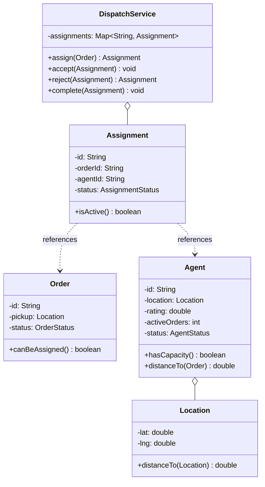

This is the "assign a delivery agent to an order" question, the dispatch slice of Swiggy or DoorDash boiled down to what fits on a whiteboard in an hour. An order finishes cooking, the system has to hand it to the best available rider, the rider accepts or bails, and if he bails you reassign. Candidates hear "food delivery" and start sketching restaurants, menus, carts, payments, the whole app, and forty minutes later they've modeled everything except the one thing the round is about. The interviewer is probing exactly two things: can you put the assignment algorithm behind an interface because it's the thing that changes, and can you stop two ready orders from grabbing the same agent. If you've done the ride-sharing matching problem this will feel familiar, and it should, dispatch and matching are the same shape wearing different nouns.

Let me walk it the way the [framework post](/interview/low-level-design/lld-framework/) lays out: scope, entities and invariants, the variation axis, then a concurrency pass.

## The problem

Lock the scope out loud before writing anything. The core operations are small:

- **Assign an agent to a ready order**: pick the best available agent, claim him, create an assignment.
- **Agent accepts**: the tentative assignment becomes confirmed, the order goes out for delivery.
- **Agent rejects (or times out)**: release the agent, mark the assignment dead, reassign the order to the next best agent.
- **Complete the delivery**: close the assignment, free the agent back to available.

Explicitly out of scope, and say it: restaurant and menu modeling, cart and checkout, payments, the actual GPS routing and ETA math, push notifications, surge economics, and any HTTP or database. In-memory maps, a `Main` that runs the scenario, no controllers. You've shown you scope before you code, which is half the mid-to-senior gap right there.

## Entities and invariants

Nouns become classes. An `Order` becomes ready and needs a rider. An `Agent` has a location, a rating, a count of how many orders he's actively carrying, and a status. An `Assignment` is the link between one order and one agent with its own little lifecycle. A `Location` is just lat/long with a distance method on it. Two enums carry the fixed-value adjectives: `AgentStatus` (AVAILABLE, BUSY, OFFLINE) and `OrderStatus` (READY, ASSIGNED, OUT_FOR_DELIVERY, DELIVERED).

Now the invariants, because they drive both the validation and the locks:

- **An agent carries at most N active orders.** For the simplest version N is 1 and an assigned agent is BUSY, full stop. Real dispatch batches, so I'd model it as a bounded count and say so, but the invariant is the same either way: never hand an agent past his cap. This is the one the concurrency pass has to protect. Two orders on an agent who can hold one is the bug the whole design exists to prevent.
- **An order has at most one active assignment.** A rejected or completed assignment is dead, but at any moment exactly zero or one is live. Assign the same order twice and you've got two riders converging on one bag of noodles.
- **An assignment's agent is occupied for exactly the assignment's active lifetime.** Create the assignment and the agent's load goes up, kill it and his load comes back down, no window where the books say he's free but a live assignment still points at him.

Models carry behavior, not just getters. `Agent.hasCapacity()` knows its own cap, `Agent.distanceTo(order)` defers to `Location`, `Assignment.isActive()` answers for itself, `Order.canBeAssigned()` checks its own status. Constructor injection everywhere, nothing does `new` on a strategy inside the service.



## The variation axis

The follow-up is already loaded: "now assign the nearest agent," "now prefer the rider with the fewest orders on his plate," "now weight by rating so your best people get the volume." That's one question, which agent gets this order, with plausible answers that differ in logic, not just numbers. Textbook Strategy. So the pick goes behind an `AssignmentStrategy` interface on day one, before the interviewer asks.

Keep the strategy pure, candidates in, decision out, no repositories inside it. The service queries who's available and hands the snapshot in:

```java
// strategies/assignment/AssignmentStrategy.java, interface gets the good name
public interface AssignmentStrategy {
    Optional<Agent> pick(List<Agent> available, Order order);   // pure: candidates in, decision out
}

// strategies/assignment/NearestAgent.java, stateless: nothing to hold
public class NearestAgent implements AssignmentStrategy {
    @Override public Optional<Agent> pick(List<Agent> available, Order order) {
        return available.stream()
                .min(Comparator.comparingDouble(a -> a.distanceTo(order)));
    }
}

// strategies/assignment/FewestActiveOrders.java, comparator cascade: load, then distance as tiebreak
public class FewestActiveOrders implements AssignmentStrategy {
    @Override public Optional<Agent> pick(List<Agent> available, Order order) {
        return available.stream()
                .min(Comparator.comparingInt(Agent::activeOrders)
                        .thenComparingDouble(a -> a.distanceTo(order)));
    }
}
```

That second one is worth narrating out loud: it's a comparator cascade, fewest orders first, distance as the tiebreak, and a `BestRating` variant is just another comparator in the chain. Saying "this is a comparator cascade, not a chain of responsibility" is a free senior signal, the two get conflated constantly. If you wanted rating then distance then load, that's three `thenComparing` calls and zero changes to the service.

One axis, one interface. Don't let anyone talk you into a fat `DispatchStrategy` that also decides pricing or batching, keep those separate axes separate or every new pick order drags the unrelated logic along for the ride.

## Making it thread-safe

Now the explicit pass: "let me make this thread-safe." Restate the invariant actually at risk, an agent carries at most N active orders, and find the smallest sequence that must be atomic. Two orders become ready at the same instant. Both call `assign`. The strategy runs against a snapshot of available agents, and if the snapshot is the same for both, both pick the same nearest rider, both create an assignment, and now one guy has two orders he can't both carry. Nothing threw. The books just quietly lie.

The fix is pick-then-claim, the same move as the parking lot's spot claim and ride-sharing's driver claim. The strategy's pick is allowed to be stale, that's fine, but the claim that bumps the agent's load has to be atomic and conditional. Hold agents in a `ConcurrentHashMap<String, Agent>` and do the claim inside `compute()` on that one agent's key, which runs the check-and-set atomically:

```java
// pick-then-claim: strategy picks from a snapshot, the claim is atomic and conditional
Agent claim(Order order) {
    while (true) {
        List<Agent> snapshot = availableSnapshot();          // may be stale the instant it returns
        Agent pick = strategy.pick(snapshot, order)
                .orElseThrow(() -> new NoAgentAvailableException(order.id()));

        boolean won = agents.get(pick.id()).tryReserve();     // atomic CAS on that agent's load
        if (won) return pick;
        // lost the race, someone reserved him first, drop him and re-pick
    }
}
```

`tryReserve()` is the whole game: inside it, check `hasCapacity()`, and if there's room bump `activeOrders` and flip to BUSY when the cap is hit, all as one atomic step guarded per agent. The loser of the race doesn't block and doesn't lock the pool, he drops that candidate and re-picks from a fresh snapshot. You never lock the whole agent pool around the selection, that serializes the hottest path in the system and murders throughput for a race you can cover with a per-key CAS. Narrate exactly that: "picking is check-then-act on a single agent, so `compute()` on his entry covers the cap invariant, and I re-pick on a lost claim instead of locking the fleet."

Rejection is the same primitive run backward. When an agent rejects or times out, `tryRelease()` atomically drops his load and frees him, then the order loops straight back into `claim` for the next best rider. The assignment map is `ConcurrentHashMap` too, and swapping an order's active assignment from dead to new is a single-key write. No multi-key lock anywhere in the design, which is exactly why it scales.

## The takeaway

Delivery dispatch rewards knowing what the question actually is. It's a small model with real behavior, one capacity invariant to defend, and one algorithm you know the interviewer will ask you to swap. Get the agent claim atomic so two orders can't double-book a rider, keep the pick behind `AssignmentStrategy`, and the design holds up to every follow-up they throw at it. To add nearest-agent, fewest-orders, best-rating, or some weighted blend of all three, you write one new class implementing `AssignmentStrategy` and nothing else moves. That's the sentence you close the round on.

[← Back to Strategy Variation Playbook](/interview/low-level-design/patterns/strategy-variation)
