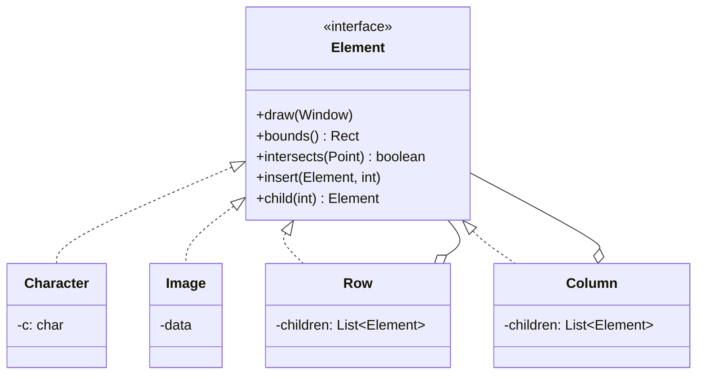
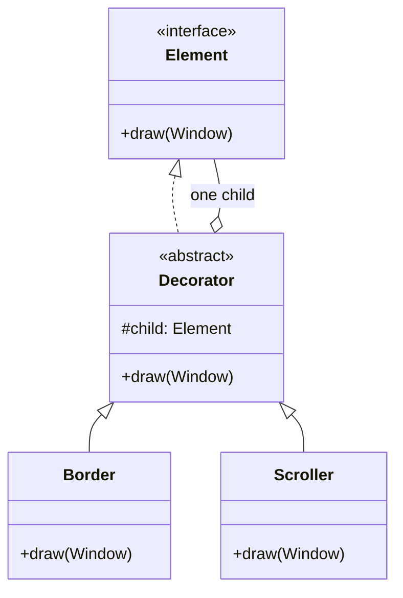

Most pattern lists teach you one at a time, one toy example each, and never show you the thing that actually happens in practice: a single real design pulls in five of them at once, each answering a different pressure, and they have to sit next to each other without fighting. A WYSIWYG document editor, roughly the thing you're reading this in, is the cleanest example of that I know. Walk the requirements one at a time and a pattern falls out of each. This is the "design a rich-text editor" / "design Google Docs" question, and the win isn't naming patterns, it's showing why each one is forced.

Here's the editor: text and images laid out into lines, lines into columns, columns into a page, a border and scroll bars around the editing area, running on more than one OS with more than one native look. We'll take the requirements in the order the design actually forces them.

## 1. The document is a tree → Composite

Start with the representation, because it decides everything downstream. A document is characters, sure, but it's also images, and lines, and columns, and the whole page, and a user wants to select a table as one thing, not as 400 loose characters. So the model has to hold single elements and groups of elements and let you treat them the same way: draw yourself, tell me how much space you take, tell me whether this click landed on you.

The move is recursive composition: one `Element` interface (call it a glyph if you like, same idea), implemented by leaves (a character, an image) and by containers (a row, a column) that hold a list of children. A container's `draw()` just loops its children and calls `draw()` on each, with no idea whether a given child is one character or another 300-deep subtree, it trusts each child to draw itself. That's [Composite](/interview/low-level-design/design-patterns/composite), and what makes it pull its weight here isn't the tree, it's that text and graphics go through the exact same interface, so nothing downstream, formatting, hit-testing, selection, ever has to branch on "is this text or a picture."

## 2. Formatting has to be swappable → Strategy

Now build a *particular* layout out of that structure: break the run of characters into lines, lines into columns, honoring margins and spacing. That's an algorithm, linebreaking, and it's the messy kind: there's a fast-and-ugly version (greedy, one pass) and a slow-and-pretty version (whole-paragraph, the one TeX uses), and a WYSIWYG editor genuinely wants both, fast while you type, pretty on demand.

The mistake is baking that algorithm into the tree, a `Column` that knows how to break its own lines. Do that and every algorithm change means surgery on the structure classes, and every new element type risks breaking the layout code. Instead pull the algorithm into its own object, a "compositor," and hand the tree a reference to it. The tree calls `compositor.compose()`; the compositor walks the children and inserts rows and columns per its own rules. That's [Strategy](/interview/low-level-design/design-patterns/strategy), and this is the version worth internalizing beyond "client picks a payment method": **you're prying a complex algorithm loose from the data structure it runs over, so the two change on independent axes.** Add a new compositor without touching a single element class; add a new element type without touching a compositor.

## 3. Border and scroll bars → Decorator

The editing area needs a border drawn around it and scroll bars wrapped around it, and those are exactly the kind of thing that comes and goes as the UI evolves. Reach for inheritance and you get `BorderedColumn`, then `ScrollableColumn`, then `BorderedScrollableColumn`, and the class count doubles every time someone thinks of a new bit of chrome. Dead end.

Instead make the border an object that *wraps* one element and is itself an element, same interface, one child. Its `draw()` calls the wrapped element's `draw()` and then draws the border on top; to everyone else it's just another element, indistinguishable from the thing it wraps. Stack a scroller around that and you've composed the behavior at runtime with zero new combination classes. That's [Decorator](/interview/low-level-design/design-patterns/decorator), and here's the connection that earns points in an interview: **a decorator is really a single-child Composite.** Same "the wrapper shares the wrapped thing's interface" trick, except a Composite holds *many* children to model a part-whole tree, while a Decorator holds *exactly one* and exists to add a layer of behavior before or after forwarding. Same shape, opposite intent.

At runtime the whole thing is just a stack: `border → scroller → column → rows → characters`, each layer holding the next, every one of them an `Element`.

## 4. Multiple look-and-feels → Abstract Factory

Ship on Motif, on Mac, on Windows, and the buttons, menus, and scroll bars have to match the host's native look. The trap is `new MotifButton()` sprinkled through the code, because now every widget construction site is somewhere you have to find and change to port, and miss one and you get a Motif menu sitting in the middle of a Mac app.

You need two guarantees: never name a concrete widget class at a construction site, and get a *consistent family* every time, no accidentally pairing a Mac scroll bar with a Motif button. Both come from handing widget creation to a factory object: an abstract `WidgetFactory` with `createButton()`, `createScrollBar()`, `createMenu()`, and one concrete factory per look, `MotifFactory`, `MacFactory`. Pick the factory once, at startup, even off an env var or config string, then pull every widget through that one object and they're all guaranteed same-family. That's [Abstract Factory](/interview/low-level-design/design-patterns/abstract-factory), and that family guarantee is the whole reason it beats plain Factory Method here. (That single factory is usually a Singleton, since there's exactly one live look-and-feel.)

## 5. Multiple window systems → Bridge

Last requirement: run on more than one window system, each with its own incompatible API for drawing and managing windows. This *looks* like another Abstract Factory job, and it's worth knowing why it isn't. Abstract Factory assumed you controlled the product classes and could give them a shared interface. Here you don't, the window classes come from different vendors and share nothing. So the move is different: define your own `Window` abstraction (the kinds of window *you* care about, application, icon, dialog) and a separate `WindowImpl` interface (the platform operations, draw a line, raise, iconify), have every `Window` hold a `WindowImpl`, and forward the platform-specific bits to it.

That's [Bridge](/interview/low-level-design/design-patterns/bridge), two hierarchies, window kinds and platform implementations, growing on independent axes and joined by composition instead of an n×m inheritance mess. The one design judgment worth narrating out loud: your `WindowImpl` interface can't be the *intersection* of all platforms (you'd lose everything but the lowest common denominator) or the *union* (huge, and it churns every time a vendor ships an update), so you aim deliberately for the middle, the operations you actually use.

## Why this is the case study to know

Five requirements, five patterns, and not one was chosen because it was clever, each was the forced answer to a specific pressure:

| Pressure | Pattern |
|---|---|
| Treat single elements and groups uniformly | Composite |
| Swap a complex algorithm without touching the structure | Strategy |
| Add combinable chrome without a subclass per combination | Decorator |
| Get a consistent family of widgets, never a mismatched pair | Abstract Factory |
| Slide incompatible platforms under one abstraction | Bridge |

That's the lesson the pattern lists bury: you don't decorate a design with patterns, you feel a pressure and reach for the one thing that relieves it, and in a system of any size several of them end up living next to each other. If an interviewer asks you to design an editor, a diagramming tool, a spreadsheet, anything with a visual tree and a rendering pipeline, this is the spine of the answer.

[← Back to Low Level Design](/interview/low-level-design/)
