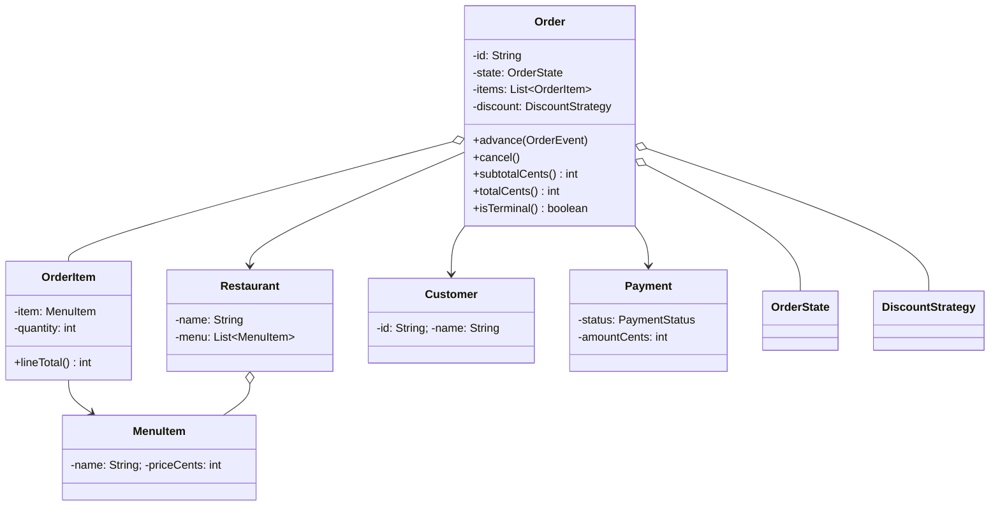
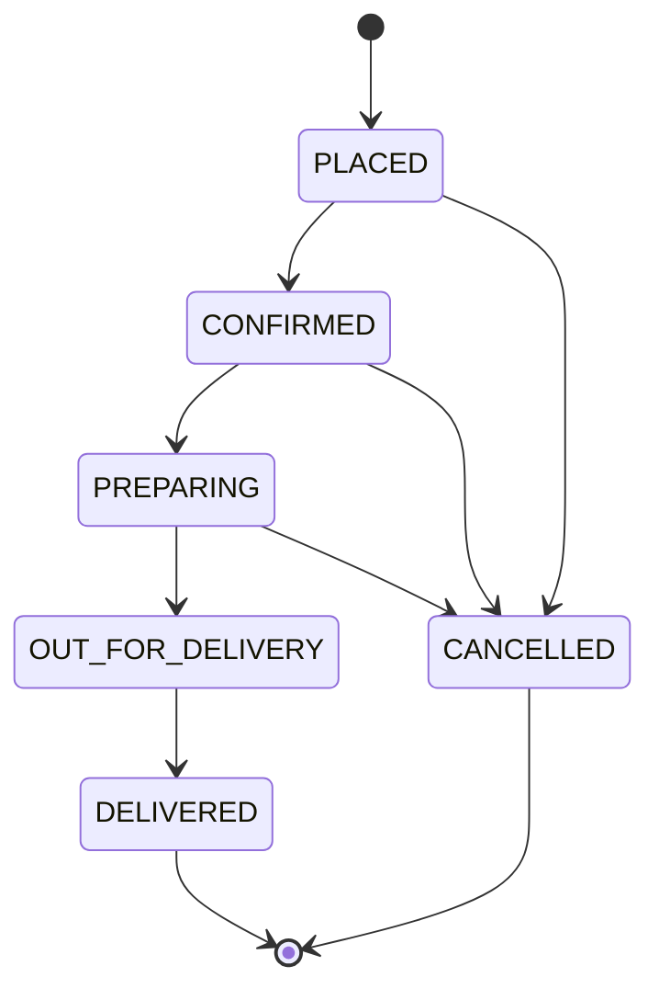

This is the "design a food-delivery order" question, the Swiggy or DoorDash one, and it lures people the same way every time. The prompt sounds like plumbing: a customer places an order, the restaurant confirms it, someone delivers it, take the money on the way. Candidates hear four verbs and reach for an `Order` class with a `status` field they flip with a setter, and they're done in ten minutes and wrong the whole time. What the interviewer is actually watching for is whether you treat the order's lifecycle as a set of rules, not a string you can overwrite. Can you confirm an order that's already been delivered? Can you cancel one that's out on a bike halfway across town? The honest answer is no, and the design has to make those "no"s structural instead of hoping the caller behaves.

Let me walk it the way the [framework post](/interview/low-level-design/lld-framework/) lays out: scope, entities and invariants, the variation axis, then a concurrency pass.

## The problem

Lock the scope out loud before you touch a keyboard. Four operations carry the whole thing:

- **placeOrder(customer, restaurant, items)**: build an order from a cart, price it, and enter the lifecycle.
- **advance(order, event)**: move the order one legal step, confirm, start preparing, hand to delivery, mark delivered.
- **applyDiscount(order, code)**: knock a coupon or a percentage off the bill before it's placed.
- **cancel(order)**: bail out, but only while bailing is still allowed.

Explicitly out of scope, and say it: how a delivery agent actually gets picked (that's its own matching problem, [Delivery Agent Assignment](/interview/low-level-design/problems/delivery-agent-assignment/) has its own page), real payment gateways, restaurant onboarding, live GPS tracking, ratings, and any HTTP or database. In-memory maps, a `Main` that runs the scenario, no controllers. You've shown you scope before you code, which is half the battle at senior level.

## Entities and invariants

Nouns become classes. A `Customer` places orders. A `Restaurant` owns a menu of `MenuItem`s (name, price in cents). An `Order` belongs to one customer and one restaurant and holds a list of `OrderItem`s, each an item plus a quantity, so the line total is the item price times count. `Payment` records what was charged against the order. Two enums carry the fixed-value adjectives: `OrderStatus` (PLACED, CONFIRMED, PREPARING, OUT_FOR_DELIVERY, DELIVERED, CANCELLED) and `PaymentStatus` (PENDING, PAID, REFUNDED).

Now the invariants, because on this problem they are the whole design and not a footnote:

1. **The lifecycle only advances through legal transitions.** The order of stages is PLACED → CONFIRMED → PREPARING → OUT_FOR_DELIVERY → DELIVERED, no skipping, no going backward. You cannot mark an order DELIVERED while it's still PREPARING, and you cannot re-confirm one that's already out for delivery.
2. **CANCELLED is only reachable before OUT_FOR_DELIVERY.** Once food is on a bike, the customer eats the cost, that's the business rule, so cancel is legal from PLACED, CONFIRMED, and PREPARING, and rejected from everything after.
3. **DELIVERED and CANCELLED are terminal.** Nothing leaves them. An event landing on a terminal order is an error, not a no-op, or you'll hide double-delivery bugs.

Models carry behavior, not just getters. `OrderItem.lineTotal()` computes its own subtotal, `Order.subtotalCents()` sums the lines, `Order.isTerminal()` answers for itself. Constructor injection everywhere, nothing calls `new` on a strategy inside a service.



And the lifecycle itself, worth drawing so the interviewer sees the shape you're about to enforce in code:



Notice the CANCELLED arrows stop at PREPARING, that gap is invariant 2 made visible, and once the interviewer sees it on the board they know exactly what you're defending.

## The variation axis

Here's the judgment call to make out loud, because it's the one that scores. The primary variation in this problem lives in the order's **states**. The legal answer to "can I do this now?" depends entirely on where the order currently sits, and that's the [State Variation Playbook](/interview/low-level-design/patterns/state-variation/)'s home turf. Each state knows which events it accepts and which it rejects: a PLACED order accepts confirm and cancel, an OUT_FOR_DELIVERY order accepts only deliver, a DELIVERED order accepts nothing.

Say why State beats the obvious enum-plus-switch. The switch version puts a `switch (status)` inside `advance()` and another inside `cancel()`, and every method has to re-list all six statuses and remember which transitions are legal from each. Add a stage, say a REFUNDED path, and you reopen every method and pray you covered the new case in each; miss one and you've got a silent illegal transition. State classes flip that: one class per state, each owning exactly what that moment permits, and illegal calls get rejected by type instead of by a forgotten `else`.

Model it as an interface where every state answers the same two events, and returns the next state (or throws if the move is illegal):

```java
interface OrderState {
    OrderState advance(Order order, OrderEvent event);   // one legal step forward
    OrderState cancel(Order order);                      // or reject
    OrderStatus status();
}
```

The context, the `Order`, owns the `state` field, states return the next state, and the order assigns it. States stay stateless so they can be shared singletons:

```java
final class PlacedState implements OrderState {
    static final PlacedState INSTANCE = new PlacedState();

    public OrderState advance(Order order, OrderEvent event) {
        if (event != OrderEvent.CONFIRM)
            throw new IllegalStateTransitionException(status(), event);
        return ConfirmedState.INSTANCE;         // PLACED -> CONFIRMED
    }
    public OrderState cancel(Order order) {
        order.markRefundable();                 // nothing shipped, refund is clean
        return CancelledState.INSTANCE;         // cancel legal before OUT_FOR_DELIVERY
    }
    public OrderStatus status() { return OrderStatus.PLACED; }
}

final class OutForDeliveryState implements OrderState {
    static final OutForDeliveryState INSTANCE = new OutForDeliveryState();

    public OrderState advance(Order order, OrderEvent event) {
        if (event != OrderEvent.DELIVER)
            throw new IllegalStateTransitionException(status(), event);
        return DeliveredState.INSTANCE;         // the only move left
    }
    public OrderState cancel(Order order) {
        throw new IllegalStateException("food is already out for delivery, cannot cancel");
    }
    public OrderStatus status() { return OrderStatus.OUT_FOR_DELIVERY; }
}
```

`DeliveredState` and `CancelledState` reject both events, they're terminal, and that rejection is invariant 3 living in exactly one place. The guard that used to be a scattered `if (status != X) throw` is now the type of the object itself: an `OutForDeliveryState` simply has no code path that cancels, so the illegal move is unrepresentable rather than merely checked.

There's a second variation axis, and naming it earns points even if you don't build it: **pricing and discounts**. How much comes off the bill is a swappable algorithm, flat coupon, percentage off, free-delivery waiver, first-order deal, and that's textbook Strategy, not State. So `DiscountStrategy` is a legitimate second interface:

```java
interface DiscountStrategy {
    int discountCents(Order order);             // pure: order in, amount off out
}

final class PercentageDiscount implements DiscountStrategy {
    private final int percent;
    public PercentageDiscount(int percent) { this.percent = percent; }
    public int discountCents(Order order) {
        return order.subtotalCents() * percent / 100;
    }
}
```

Keep the two axes separate, State for the lifecycle, Strategy for the money, and never fold them into one fat `OrderStrategy`. The lifecycle is primary here because it's where the invariants and the illegal moves live; the discount is a clean seam you mention, then build only if there's time.

## Making it thread-safe

Now the explicit pass: "let me make this thread-safe." One order gets pushed around by more than one actor. The customer might hit cancel from the app, the restaurant marks it confirmed from their tablet, the delivery agent's device fires the out-for-delivery event, and in the interviewer's test harness those are three threads touching the same `Order`. Restate the invariant at risk: the lifecycle only advances through legal transitions, and a transition is read-current-state, validate-the-event, write-next-state, three steps that have to be one atomic move.

Narrate the race, because that's where the points are. The customer's cancel thread reads the state and sees PREPARING, so cancel looks legal. At the same instant the agent's thread reads PREPARING too and advances to OUT_FOR_DELIVERY, writing the new state. Now the cancel thread, still holding its stale read, proceeds to write CANCELLED over an order a courier already picked up. Nothing threw. You've refunded a customer whose food is on a doorstep. That's a check-then-act race, the read and the write are separate steps and the agent's write slipped between them.

The fix is the smallest atomic boundary that covers the whole transition, and on a single order that's a per-order lock. Give each `Order` a `ReentrantLock` (or make the transition method `synchronized` on the order), and take it around the entire read-validate-write sequence:

```java
final class Order {
    private final ReentrantLock lock = new ReentrantLock();
    private OrderState state = PlacedState.INSTANCE;

    void advance(OrderEvent event) {
        lock.lock();
        try {
            this.state = state.advance(this, event);   // check + validate + write, atomic
        } finally {
            lock.unlock();
        }
    }
    void cancel() {
        lock.lock();
        try {
            this.state = state.cancel(this);
        } finally {
            lock.unlock();
        }
    }
}
```

Now the losing thread runs its transition only after the winner's write commits, so it re-reads the real current state. The cancel thread, entering after the agent's advance landed, sees OUT_FOR_DELIVERY, and `OutForDeliveryState.cancel()` throws exactly as the business rule demands. The lock is per order, not global, so a thousand different orders still transition in parallel and only events against the same order serialize, which matches reality anyway since one physical order really is a single thing moving through one pipeline. Say that out loud: "the atomic boundary is one order's transition, so I lock per order, not across the whole system." And keep side effects, sending the confirmation SMS, notifying the restaurant, outside the lock and after the state write commits, or a listener that calls back into the order deadlocks on the lock you're still holding.

## The takeaway

The food-delivery order looks like CRUD and it absolutely is not. It's a lifecycle with per-state rules, one primary invariant (only legal transitions, cancel only before the food ships), and a clean pricing seam off to the side. Model the states as classes so illegal moves are unrepresentable rather than checked, keep the discount behind its own Strategy interface, and wrap each order's transition in a per-order lock so two actors can't both win.

The extensibility pitch falls right out of that structure. A new lifecycle stage, say an AWAITING_PICKUP step between preparing and delivery, is a new `OrderState` class and two edited transitions, the other states never open. A new promotion, festival pricing, a loyalty tier, free delivery over a threshold, is a new `DiscountStrategy` and nothing else moves. Open for extension, closed for modification, because the variation sits exactly where it actually lives.

[← Back to State Variation Playbook](/interview/low-level-design/patterns/state-variation)
