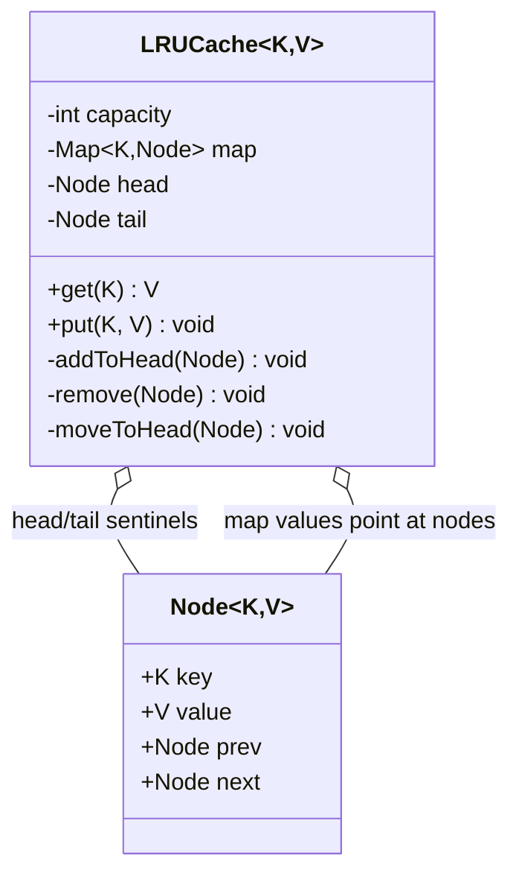

This is the "design an LRU cache" question, and it trips people up in a way the pattern-heavy problems don't. There's no Strategy to place, no State machine, no clever swap to name that earns you points. You walk in looking for the pattern and there isn't one, the data structure is the whole answer. I've watched candidates burn ten minutes wrapping a repository and a service interface around what should be forty lines, because their instinct is "LLD means patterns" and they can't sit with a problem that just wants a correct structure.

What the interviewer is actually testing here is narrow and deep: can you pick a structure that hits O(1) on both operations, and can you keep its invariants intact while it mutates under you. The O(1) on both is the trap. Most people can get one of them for free and quietly let the other slide to O(n), and if you don't restate the bound out loud you won't even notice you did it.

## The problem

Three things, and a fixed capacity:

- `get(key)` returns the value if present, and marks that key as most recently used.
- `put(key, value)` inserts or updates the key, marks it most recently used, and if the cache is now over capacity, evicts the single least recently used entry.
- Both operations must run in O(1).

Out of scope, and say so out loud: no TTL expiry, no persistence, no size-in-bytes accounting, no pluggable eviction policy yet (that's the follow-up, we'll get there). Fixed integer capacity, evict exactly one entry when we overflow, done.

## Why the data structure is the whole answer

Start from the bound, because the bound picks the structure for you. You need O(1) lookup by key, and you need O(1) "who is the least recently used." No single common structure gives you both.

A plain `HashMap<K, V>` gives you the O(1) lookup, sure. But it has no notion of order, so when you overflow and need the LRU entry to evict, you'd have to scan every entry tracking timestamps, that's O(n). Dead on the bound.

A plain doubly linked list, ordered by recency with the most-recent at the head, gives you O(1) eviction (the tail is always your victim) and O(1) reordering (unlink a node, relink it at the head). But it has no lookup, to find the node for a given key you walk the list, O(n) again. Dead on the bound from the other side.

So you use both, pointed at the same nodes. A `HashMap<K, Node>` where the key maps not to the value but to the actual list node, and a doubly linked list holding those same nodes in recency order, head is most-recently-used, tail is the eviction target. The map answers "where is this key's node" in O(1); the list answers "reorder this node" and "who's the victim" in O(1). The invariant that ties them together, and the one thing a bug will violate: the map and the list always hold exactly the same set of nodes. Evict from one and forget the other and you've got a ghost entry that poisons the cache.



The head and tail are sentinel nodes, dummy nodes that always exist so you never write a null check for "is this the first/last real node." Every real node lives strictly between them. It's a small thing that removes an entire class of edge-case bugs.

## The operations

`get(key)`: look up the node in the map. Miss, return null (or throw, your call). Hit, unlink the node from wherever it sits and relink it right behind the head, because touching a key makes it the most recent, then return its value. Notice that a read reorders the list. Hold that thought, it comes back to bite us in the concurrency section.

`put(key, value)`: if the key already exists, update the node's value and move it to the head. If it's new, make a node, add it at the head, put it in the map. Then check size: if we're over capacity, grab the node at the tail (`tail.prev`, since tail is a sentinel), unlink it, and remove its key from the map. That last step, removing from the map too, is where the invariant lives or dies.

```java
class LRUCache<K, V> {

    private static final class Node<K, V> {
        final K key;
        V value;
        Node<K, V> prev, next;
        Node(K key, V value) { this.key = key; this.value = value; }
    }

    private final int capacity;
    private final Map<K, Node<K, V>> map = new HashMap<>();
    private final Node<K, V> head = new Node<>(null, null);   // sentinel
    private final Node<K, V> tail = new Node<>(null, null);   // sentinel

    LRUCache(int capacity) {
        if (capacity <= 0) throw new IllegalArgumentException("capacity must be positive");
        this.capacity = capacity;
        head.next = tail;
        tail.prev = head;
    }

    public V get(K key) {
        Node<K, V> node = map.get(key);
        if (node == null) return null;
        moveToHead(node);
        return node.value;
    }

    public void put(K key, V value) {
        Node<K, V> node = map.get(key);
        if (node != null) {
            node.value = value;
            moveToHead(node);
            return;
        }
        Node<K, V> fresh = new Node<>(key, value);
        map.put(key, fresh);
        addToHead(fresh);
        if (map.size() > capacity) {
            Node<K, V> lru = tail.prev;
            remove(lru);
            map.remove(lru.key);
        }
    }

    private void addToHead(Node<K, V> n) {
        n.prev = head;
        n.next = head.next;
        head.next.prev = n;
        head.next = n;
    }

    private void remove(Node<K, V> n) {
        n.prev.next = n.next;
        n.next.prev = n.prev;
    }

    private void moveToHead(Node<K, V> n) {
        remove(n);
        addToHead(n);
    }
}
```

Constructor injection of the capacity, models with real behavior, no service or repository scaffolding, because there's nothing to inject and nothing to swap. That restraint is itself the signal. Wrapping this in a `CacheRepository` interface tells the interviewer you pattern-match on the word "LLD" instead of reading the problem.

## The variation axis

Here's the follow-up you can almost set your watch by: "now make the eviction policy pluggable, what if I want LFU instead of LRU?" This is the interviewer moving the problem out of the structure-driven category and into a Strategy one. The recency logic (move-to-head, evict-the-tail) stops being hardcoded and goes behind an `EvictionPolicy` interface, and the cache holds a reference to whichever policy you inject. LRU becomes one implementation, LFU another, and the cache class stops caring which.

That's a different design with a genuine variation package, and it's worth walking through on its own rather than cramming it in here. I did that in [Pluggable Eviction Cache](/interview/low-level-design/problems/pluggable-eviction-cache). The move for the interview is to name this fork before they ask: "today it's plain LRU and the structure is the answer, but if you want the policy swappable that's where an EvictionPolicy Strategy goes, and the map-plus-list machinery becomes the LRU implementation of it."

## Making it thread-safe

This is where the LRU problem earns its reputation, and where the trap is genuinely subtle. Your first instinct on a read-heavy cache is a `ReadWriteLock`: let all the readers in concurrently, only serialize the writers. It's the standard read-heavy answer, and here it's wrong.

The reason is the thing I told you to hold onto: `get()` mutates the list. Every read moves a node to the head. So a read is a write, it's touching the shared `prev`/`next` pointers that another thread's read is also touching, and if you let two `get()` calls run "concurrently" under a read lock they'll corrupt the linked list, two threads relinking the same neighbors and losing nodes. The read lock's entire premise, "reads don't modify shared state," is false for an LRU cache.

So state the invariants first, the way the framework says: `map.size() <= capacity`, and the map and the list always hold the same node set, and the list order always reflects true recency. Every one of those spans both structures and every operation, including `get`, writes across both. The smallest atomic boundary is therefore the whole operation. That leaves you two honest answers, and the senior move is to present them as a fork rather than pick silently:

**V1, exact.** A single `ReentrantLock` (or just `synchronized` on each method) around both `get` and `put`. Correct, dead simple, and it respects every invariant exactly. Its cost is that it serializes all access, one lock for the whole cache, no concurrency at all. Say that out loud: "this is correct but it funnels every reader and writer through one lock." Under time pressure this is a completely legitimate first move and I'd write it first.

**V2, sharded for throughput.** If they push on throughput, shard the cache into N independent segments, each its own map-plus-list-plus-lock, and route a key to its shard by `hash(key) % N`. Now unrelated keys don't contend, you get roughly N-way concurrency, and each shard keeps its invariants under its own lock. The honest caveat you must say: the LRU is now per-shard, not global. You evict the least-recently-used within a shard, not across the whole cache, so it's an approximation of true global LRU. That's the trade you're making, and being able to name exactly which invariant you relaxed (global recency order) and what you bought (throughput) is the whole point of the answer. It's the same design Redis and friends reach for in practice, they don't do exact global LRU either, they approximate.

What you do not do is reach for the read lock and move on. If you catch yourself about to say "ReadWriteLock, reads are cheap," stop and remember that here the reads aren't reads.

## The takeaway

The LRU cache is the cleanest example of a problem where the data structure is the answer and adding patterns actively costs you. Get the map-plus-doubly-linked-list right, keep the map and list provably in agreement, hit O(1) on both operations, and you've passed the core of it. The interviewer's follow-ups are predictable: pluggable eviction pushes you toward a Strategy (a genuinely different design), and thread-safety pushes you toward the one-lock-versus-sharding fork with the invariant you relaxed named out loud. Keep the public API clean and the structure private, and both of those extensions land without rewriting what you already built.

[← Back to Structure-Driven Problems Playbook](/interview/low-level-design/patterns/structure-driven)
