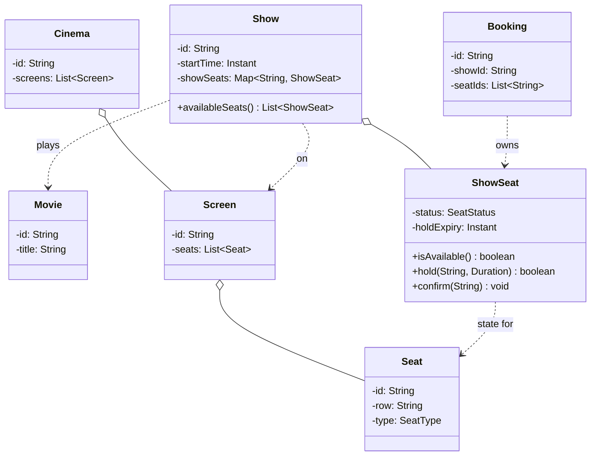

This is the "design BookMyShow" question, sometimes dressed up as Fandango or Ticketmaster, and it fools people the same way the parking lot does. It looks like a booking CRUD, list some shows, pick some seats, take some money, and candidates start writing a `BookingService` with `bookSeats()` and think the hard part was remembering to compute a total. It wasn't. The hard part is that a user books five seats at once, and two users can be reaching for an overlapping set of those five at the same instant. The whole design exists to make sure at most one of them wins each seat, all five together, all or nothing. Get that atomic and keep pricing behind an interface, the rest is data plumbing.

Let me walk it the way the [framework post](/interview/low-level-design/lld-framework/) lays out: scope, entities and invariants, the variation axis, then a concurrency pass.

## The problem

Lock the scope out loud before touching the keyboard. The core operations are a short list:

- **Browse shows for a movie**: given a movie, list the shows playing it, across screens and time slots.
- **See seat availability**: for a chosen show, which seats are open right now.
- **Hold then book a set of seats**: the user selects N seats, we hold them briefly, then confirm into a booking.
- **Price the selection**: compute what those seats cost for that show.

Explicitly out of scope, and say it: the payment gateway itself (we model "confirm" as the boundary, not the card charge), refunds and cancellations, discovery and search ranking, notifications, and any HTTP or persistence. In-memory maps, a `Main` that runs the scenario, no controllers. Saying what you skip and why is a senior tell, so spend the ten seconds.

## Entities and invariants

Nouns become classes. A `Movie` is just the film. A `Cinema` owns one or more `Screen`s, a `Screen` has a fixed physical layout of `Seat`s (row, number, seat type). A `Show` is a specific `Movie` playing on a specific `Screen` at a specific start time, that's the join everyone forgets to model as its own entity. The seats are physical and shared across every show on that screen, so per-show seat state can't live on the `Seat` itself. That's what `ShowSeat` is for: the availability of one seat, for one show. A `Booking` records the seats a user confirmed for a show.

Two enums carry the fixed-value adjectives. `SeatType` (REGULAR, PREMIUM, RECLINER) drives pricing. `SeatStatus` (AVAILABLE, HELD, BOOKED) is the lifecycle of a `ShowSeat`, and it's the thing the concurrency pass has to defend.

Now the invariants, because they drive both validation and the locks later:

- **A `ShowSeat` is booked by at most one `Booking`.** This is the one everything hinges on. Two bookings owning seat F7 for the 9pm show is the bug the design is built to prevent.
- **A hold is temporary and expires.** A seat goes AVAILABLE to HELD when a user selects it, and if they don't confirm within the TTL it snaps back to AVAILABLE on its own. No selecting a seat and squatting on it forever.
- **A booking is all-or-nothing across its seats.** If a user asks for five seats and we can only secure four, the booking fails and those four go back to AVAILABLE. No partial booking, ever.

Models carry behavior, not just getters. `ShowSeat.isAvailable()` answers for itself, `ShowSeat.hold(userId, ttl)` and `ShowSeat.confirm(bookingId)` know their own transitions, `Show.availableSeats()` filters its own map. Constructor injection everywhere, nothing does `new` on a strategy inside a service.



## The variation axis

The follow-up is coming and you know its shape: "now charge more for premium seats," "now add a weekend surcharge," "now peak-hour pricing for the 9pm show." Pricing is the algorithm most likely to change, so it goes behind a `PricingStrategy` interface, day one, before the interviewer asks. Same question ("what does this seat cost for this show?"), different logic per policy, and per the [Strategy playbook](/interview/low-level-design/patterns/strategy-variation/) that variation is a verb on the service, not the identity of a `Show`.

Pricing here is a contributor shape: base price by seat type, plus surcharges that stack. That maps cleanly to composing strategies, a base plus a decorating surcharge, each pure, inputs in and decision out:

```java
// strategies/pricing/PricingStrategy.java, interface gets the good name
public interface PricingStrategy {
    Money priceFor(ShowSeat seat, Show show);   // pure: inputs in, decision out
}

// strategies/pricing/BasePricing.java, stateless: final fields only
public class BasePricing implements PricingStrategy {
    private final Map<SeatType, Money> rateCard;
    public BasePricing(Map<SeatType, Money> rateCard) { this.rateCard = rateCard; }
    @Override public Money priceFor(ShowSeat seat, Show show) {
        return rateCard.get(seat.type());
    }
}

// strategies/pricing/WeekendSurcharge.java, composes the base policy
public class WeekendSurcharge implements PricingStrategy {
    private final PricingStrategy base;
    private final double multiplier;
    public WeekendSurcharge(PricingStrategy base, double multiplier) {
        this.base = base; this.multiplier = multiplier;
    }
    @Override public Money priceFor(ShowSeat seat, Show show) {
        Money b = base.priceFor(seat, show);
        boolean weekend = isWeekend(show.startTime());
        return weekend ? b.times(multiplier) : b;
    }
}
```

The service sums `priceFor` across the selected seats, that's the whole booking total. There's a second Strategy axis hiding in seat allocation, the "give me the best 3 seats together" auto-suggest, center-first or fill-from-back or spread-the-party. That's genuinely swappable too, so `SeatAllocationStrategy` is a legitimate second interface. Keep it separate from `PricingStrategy`, never fold both into one fat `ShowStrategy`, or every new pricing variant would drag allocation along for the ride. Name the second axis out loud, build it only if you have time or the interviewer asks.

## Making it thread-safe

Now the explicit pass: "let me make this thread-safe." Restate the invariant that's at risk, a `ShowSeat` is booked by at most one booking, and notice the shape is different from the parking lot. There the claim was single-key, one car, one spot. Here a booking spans N seats and the invariant is multi-entity: either all N flip from AVAILABLE to HELD together, or none do. That distinction is the entire point of the question.

Single-key atomics don't cover it. A `putIfAbsent` or `compute()` on one seat is atomic for that seat alone. Do it in a loop over five seats and you've got five independent atomic ops, not one atomic booking. Two users each grab three of the five, both loops half-succeed, and now neither can complete but both are holding seats. Nothing threw, the seats are just wedged. So I need atomicity across the whole set, and there are two clean ways to get it.

**Option one, lock the seats in sorted order.** Give every `ShowSeat` its own `ReentrantLock`. To book a set, sort the selected seat IDs, acquire all their locks in that global order, check every one is AVAILABLE, flip them all to HELD, release. Sorting is what buys deadlock freedom: two threads wanting seats {F5, F7} and {F7, F5} both lock F5 before F7, so one waits instead of the pair deadlocking. Say that sentence out loud, "I acquire per-seat locks in a globally consistent order," it's the senior signal the interviewer is listening for.

```java
// book a set atomically: locks acquired in sorted-id order, deadlock-free
Booking book(String showId, List<String> seatIds, String userId) {
    List<ShowSeat> seats = show(showId).seatsFor(seatIds);
    seats.sort(comparingBySeatId());
    seats.forEach(s -> s.lock().lock());
    try {
        if (!seats.stream().allMatch(ShowSeat::isAvailable))
            throw new SeatsUnavailableException(seatIds);   // all-or-nothing
        seats.forEach(s -> s.markHeld(userId, holdTtl));
        return bookings.confirm(showId, seatIds, userId);
    } finally {
        seats.forEach(s -> s.lock().unlock());
    }
}
```

**Option two, CAS each seat and roll back on partial failure.** Keep the per-seat status in an atomic and try to flip each from AVAILABLE to HELD with a compare-and-set. Walk the list, and the moment one CAS fails (someone else got there), stop and undo every seat you already flipped back to AVAILABLE, then fail the booking. No locks held across the whole set, but you pay for it with rollback bookkeeping and a retryable failure. I'd lead with option one in an interview because the all-or-nothing reads directly off the sorted-lock block, and reach for CAS only if asked about lock-free approaches.

Either way, booking is hold-then-confirm, not a single flip. The user holds the seats (HELD with a `holdExpiry` a couple minutes out), goes off to pay, and confirms. If they never confirm, the hold has to expire so the seats free up, otherwise an abandoned checkout locks F7 forever and breaks the availability invariant. Two ways to expire, and I'd name both: a lazy check, where any read treats a HELD seat past its `holdExpiry` as AVAILABLE, or an active sweeper on a `DelayQueue` that flips expired holds back on a timer. Lazy is less code and usually enough for the round, mention the sweeper as the cleaner production answer.

The catalog itself, the map of shows and their `ShowSeat`s, lives in a `ConcurrentHashMap` so lookups stay lock-free while the per-seat locks guard the actual state changes. The point to narrate: the map's thread-safety protects the lookup, the seat locks protect the invariant, those are two different jobs.

## The takeaway

Movie booking looks like the parking lot and then isn't, and the difference is the whole interview. One seat is single-key check-then-act, five seats booked together is a multi-entity invariant, and if you reach for `putIfAbsent` in a loop you'll double-book under load and not notice until someone shows you the two tickets for F7. Lock the selected seats in sorted order, keep the hold-then-confirm with a TTL so abandoned carts free their seats, and put pricing behind `PricingStrategy`. To add a peak-hour surcharge or a loyalty discount, you write one new class implementing `PricingStrategy` and nothing else moves, that's the sentence you close the round on.

[← Back to Strategy Variation Playbook](/interview/low-level-design/patterns/strategy-variation)
