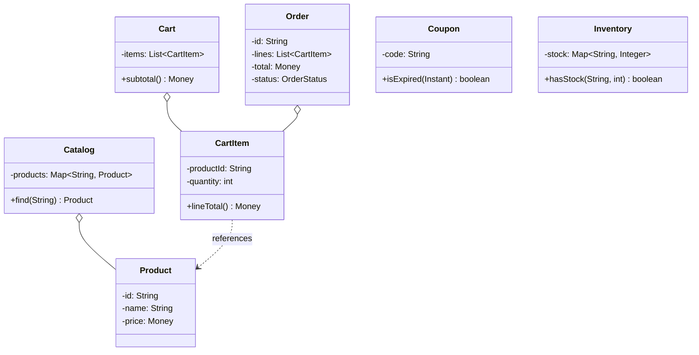

This is the "design an e-commerce checkout" question, the Amazon-lite one where you browse a catalog, drop things in a cart, slap a coupon on it, and place an order. Candidates hear "shopping" and start drawing a `ProductService`, a `CartService`, an `OrderService`, twelve methods across the three, and they drown in CRUD before they've said anything worth listening to. The interviewer doesn't care that you can add and remove items from a map. What they're probing is narrower: checkout is a pipeline of pricing and eligibility rules that run in a defined order (is the coupon expired, does the cart clear the minimum, apply the percent off, apply the flat threshold discount), and there's exactly one nasty race, two shoppers checking out the last unit at the same time. Get the rule pipeline extensible and the stock decrement atomic, and the rest is bookkeeping.

Let me walk it the way the [framework post](/interview/low-level-design/lld-framework/) lays out: scope, entities and invariants, the variation axis, then a concurrency pass.

## The problem

Lock the scope out loud before you write a line. Four core operations:

- **Browse the catalog**: list products, look one up by id. Read-only, cheap.
- **Add / remove items in a cart**: a cart holds line items, each a product plus a quantity.
- **Apply a coupon or discount**: attach a coupon code to the cart, valid or rejected with a reason.
- **Checkout**: reserve stock for every line, run the pricing pipeline to compute the final total, place the order.

Explicitly out of scope, and say it: payment gateways, addresses and shipping, tax jurisdictions, order fulfilment and returns, search and recommendations, user auth, and any HTTP or persistence. In-memory maps, a `Main` that runs the scenario, no controllers. You've shown you scope before you code, the interviewer relaxes.

## Entities and invariants

Nouns become classes. A `Catalog` owns `Product`s, a `Cart` owns `CartItem`s (each a product id plus a quantity), an `Order` is the frozen result of a checkout, a `Coupon` carries its eligibility and its discount, and `Inventory` tracks available units per product. Two enums carry the fixed-value adjectives: `OrderStatus` (PLACED, CANCELLED) and `DiscountType` (PERCENT, FLAT) if you want the coupon to self-describe.

Now the invariants, because they drive both validation and the locks later:

- **You can't order more units than are in stock.** This is the one the concurrency pass has to defend. Two orders draining the last unit is the bug the whole design exists to prevent, an oversell.
- **Cart total equals the sum of the line items minus the applied discounts.** No mystery money, the total is a pure function of the lines and the rules that fired.
- **A coupon applies only if its eligibility rules pass.** An expired code or a cart under the minimum contributes zero, and the rejection carries a reason, not a silent no-op.

Models carry behavior, not just getters. `CartItem.lineTotal()` knows its own price times quantity, `Cart.subtotal()` folds its lines, `Coupon.isExpired(now)` answers for itself, `Inventory.hasStock(productId, qty)` reads its own counts. Constructor injection everywhere, nothing does `new` on a rule inside a service.



## The variation axis

The follow-up is coming and you already know its shape: "now add a festive 10 percent off," "now buy-two-get-one," "now free shipping over 500," "now stack a loyalty discount under the coupon." Every one of those is a new pricing or eligibility rule that runs during checkout, in order. So checkout is a chain of rules, and per the [Rule-Chain playbook](/interview/low-level-design/patterns/rule-chain-variation/) the default is a flat rule LIST evaluated by an engine, not a linked Chain of Responsibility. These rules don't consume or escalate the request, every rule sees the same cart facts and each contributes to the running price. That's shape (b), a contributor list, say it out loud.

A `PricingRule` interface, two rules, and a `CheckoutEngine` that runs the list and accumulates:

```java
// rules/PricingRule.java, the interface gets the good name
public interface PricingRule {
    // pure: reads the context, returns its adjustment (zero if it doesn't apply)
    Money apply(PricingContext ctx);
}

// rules/PercentOffCoupon.java, eligibility gate + percent discount
public class PercentOffCoupon implements PricingRule {
    private final String code;
    private final int percent;
    public PercentOffCoupon(String code, int percent) {
        this.code = code; this.percent = percent;
    }
    @Override public Money apply(PricingContext ctx) {
        Coupon c = ctx.coupon();
        if (c == null || !c.code().equals(code) || c.isExpired(ctx.now())) {
            return Money.ZERO;                     // not eligible, contributes nothing
        }
        return ctx.runningTotal().times(percent).divide(100).negate();
    }
}

// rules/FlatOverThreshold.java, e.g. 50 off when the cart clears 500
public class FlatOverThreshold implements PricingRule {
    private final Money threshold;
    private final Money flatOff;
    public FlatOverThreshold(Money threshold, Money flatOff) {
        this.threshold = threshold; this.flatOff = flatOff;
    }
    @Override public Money apply(PricingContext ctx) {
        return ctx.runningTotal().isAtLeast(threshold) ? flatOff.negate() : Money.ZERO;
    }
}

// services/CheckoutEngine.java, owns iteration and ordering
public class CheckoutEngine {
    private final List<PricingRule> rules;          // order IS the pipeline
    public CheckoutEngine(List<PricingRule> rules) { this.rules = rules; }

    public Money finalTotal(Cart cart, Coupon coupon, Instant now) {
        Money running = cart.subtotal();
        for (PricingRule rule : rules) {
            PricingContext ctx = new PricingContext(cart, coupon, now, running);
            running = running.plus(rule.apply(ctx));
        }
        return running.max(Money.ZERO);             // never bill a negative
    }
}
```

Why a rule list beats a wall of nested ifs: the ifs bury ordering inside one method, every new promo is a surgical edit to `finalTotal`, and you can't reorder or disable a promo without touching working code. With a list plus an engine, the engine owns iteration, ordering is just list order, and a new promo is a new class appended to the list. The pricing method never changes. That's Open/Closed doing real work.

When would you escalate to linked handlers, the classic Chain of Responsibility with a `next` pointer? Only when a rule actually consumes or escalates the request, when the remainder of the work travels down the chain. Splitting a payment across gift-card balance then card then wallet is that shape, each handler eats part of the amount and passes the remainder on. Checkout pricing isn't that, every rule reads the same cart and contributes independently, so linking them would be plumbing for nothing. Name the distinction, decline the link, move on.

## Making it thread-safe

Now the explicit pass: "let me make this thread-safe." Restate the invariant that's actually at risk, you can't order more units than are in stock, and find the smallest sequence that must be atomic. It's check-then-act on a single key: read the stock for a product (is it at least `qty`?), then write it (decrement by `qty`). Two threads both read "1 left," both decide they can take it, both decrement, and now the count is -1 and you've sold the same unit twice. Nothing threw, the books just quietly lie, and a customer gets a cancellation email.

This is single-key, so you don't lock the whole inventory, you need atomicity per product id. Hold the stock in a `ConcurrentHashMap<String, Integer>` and do the check-and-decrement inside `compute()`, which runs your read and write atomically for that one key:

```java
// reserve: check-then-act on a single product key, atomic via compute()
boolean reserve(String productId, int qty) {
    // returns false if it couldn't (rejects the checkout), true if it claimed the units
    Integer[] claimed = { null };
    stock.compute(productId, (id, available) -> {
        if (available == null || available < qty) return available;   // no change, refuse
        claimed[0] = available - qty;
        return claimed[0];                                            // claim atomically
    });
    return claimed[0] != null;
}
```

The lambda inside `compute()` is the whole invariant: it only decrements when `available >= qty`, otherwise it leaves the count untouched and the caller rejects the checkout with an out-of-stock error. No spot in time where two threads both see the last unit as claimable, the map serializes writers per key for you. Narrate exactly that: "reserving stock is check-then-act on a single key, so `compute()` on the product covers the never-oversell invariant, and I reject the checkout on a failed reserve rather than locking the whole inventory."

One honest wrinkle for the multi-line cart: a checkout reserves several products, and if the third line fails after the first two succeeded you have to release what you took, a compensating decrement back up. That's not a distributed transaction, it's a best-effort rollback in memory, say so and move on. And pricing runs after every reserve succeeds, on frozen quantities, so the rules never race the stock.

## The takeaway

Online shopping rewards the same restraint the parking lot does. It's a small model with real behavior, one invariant that genuinely matters (never oversell), and one algorithm you know is going to grow (the pricing pipeline). Get the stock reserve atomic with a single-key `compute()`, keep the promos behind a `PricingRule` list that an engine walks in order, and the design holds under every follow-up they throw. To add a new sale, a loyalty tier, or a stacking coupon, you write one new class implementing `PricingRule` and append it to the list, the checkout code doesn't change. That's the sentence you close the round on.

[← Back to Rule-Chain Variation Playbook](/interview/low-level-design/patterns/rule-chain-variation)
